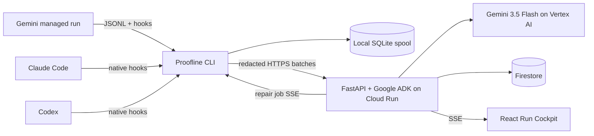

# Proofline — Hackathon Implementation Plan

Target artifact: `IMPLEMENTATION_PLAN.md`

## 1. Summary

Build **Proofline**, a provenance-aware coding companion for long-running agents:

> Every agent-made line has a reason, evidence, an owner, and a safe repair path.

The product will:

1. Capture observable work from Gemini CLI, Claude Code, and Codex through native hooks.
2. Connect goals, decisions, file versions, relationship changes, tests, feedback, and approvals.
3. Turn explicit corrections into proposed “Memory PRs.”
4. Evaluate each proposed lesson before human approval.
5. Inject approved lessons into later agent sessions.
6. Mark dependent work suspect when a requirement or lesson becomes invalid.
7. Repair only the affected branch in an isolated Git worktree.

Submit to **The Collaborative Partner** track. The differentiator is visible, reversible adaptation—not agent observability.

### Locked scope

- Solo build.
- Python 3.13 backend/CLI and React TypeScript frontend.
- Gemini is the full managed path.
- Claude and Codex receive credible capture/context adapters, not feature parity.
- Python repositories receive deterministic import-relationship analysis.
- Browser cockpit is primary; terminal sidecar is secondary.
- One Cloud Run service, Firestore, Google ADK, and Gemini 3.5 Flash.
- Working name remains **Proofline** through submission.

### Golden success criteria

- A selected code hunk reveals its complete proof path in one action.
- Explicit feedback becomes a scoped candidate lesson with evidence.
- The lesson cannot activate without evaluation and human approval.
- A later Gemini run visibly invokes the approved lesson and avoids the earlier correction.
- Changing an upstream requirement marks only dependent files/tests suspect.
- A repair run changes no unrelated files and passes the configured tests.
- Ten consecutive golden-path runs succeed before recording.

---

## 2. Product Experience

### Browser: Run Cockpit

The Cloud Run-hosted React application opens on a run summary, not a global graph.

It contains four views:

1. **Run Cockpit**
   - Current goal, agent, branch, status, files changed, tests, and pending decisions.
   - Collapsed semantic activity; raw tool calls hidden by default.
   - “What changed?”, “What is verified?”, and “What needs me?” must be answerable within ten seconds.

2. **Change Lens**
   - Central diff/hunk viewer.
   - Fixed proof rail:

   ```text
   Goal → Task → Gemini → Tool → Changed hunk → Test → Human approval
   ```

   - Right inspector shows evidence, timestamps, agent/model, previous version, and edge basis.

3. **Memory PR**
   - Originating feedback.
   - Proposed rule.
   - Repository/path/task scope.
   - Positive and negative applicability cases.
   - A/B worktree result.
   - Approve, reject, edit-as-successor, or revoke actions.

4. **Blast Radius**
   - Added and removed relationships.
   - Definitely affected versus suggested impacts.
   - Old and proposed file versions.
   - Repair allowlist and expected validations.
   - “N of M nodes repaired; remainder preserved.”

Use `@xyflow/react` with fixed semantic columns and stable node positions:

```text
Intent | Work | Change | Verification | Decision / Memory
```

Vertical position represents time. Default to the selected proof path and no more than 25 visible nodes. Provide an equivalent ordered HTML tree/table for keyboard and screen-reader access.

Edge appearance must distinguish:

- `observed`: Git, hook, command, or test evidence.
- `static`: Python import analysis.
- `declared`: explicitly recorded by the agent.
- `confirmed`: human-reviewed semantic relation.
- `inferred`: Gemini suggestion, never presented as fact.

Only confirmed/static required edges automatically propagate invalidation. Declared edges require review; inferred edges remain optional suggestions.

### Terminal companion

Do not replace Gemini, Claude, or Codex’s native interface. `proofline watch` runs in a second pane using Rich Live, with `--plain` and `NO_COLOR` fallbacks.

```text
╭ Proofline · RUN 42 · gemini · 6/7 verified ──────────────────╮
│ NOW   verifier → tests/test_rate_limit.py                     │
├ Work ────────────┬ Changes ──────────────┬ Proof / review ────┤
│ ✓ clarify        │ ✓ limiter.py +42      │ ! policy changed   │
│ ✓ implement      │ ✓ config.py +2        │ 3 affected nodes   │
│ ◉ verify         │ ✓ tests.py +31        │ approval required  │
╰───────────────────────────────────────────────────────────────╯
```

Public commands:

```text
proofline init
proofline doctor
proofline run --agent gemini -- "<task>"
proofline watch
proofline status
proofline why app/auth/limiter.py:42
proofline impact requirement:security-policy
proofline open
```

Hooks print only one short completion summary and an OSC-8 browser link. They never take over the agent’s keyboard.

### Golden demo scenario

Use a bundled Python fixture containing:

- `SECURITY.md`
- `app/config.py`
- `app/auth/limiter.py`
- `tests/test_rate_limit.py`
- `docs/security.md`

Story:

1. Gemini implements “five login attempts per fifteen minutes.”
2. The user corrects the workflow: auth changes require security tests and approval.
3. Proofline proposes and evaluates that rule.
4. The user approves it.
5. A later auth task invokes the rule and pauses for approval without another correction.
6. `SECURITY.md` changes to three attempts per ten minutes.
7. Proofline identifies the affected configuration, limiter, tests, and documentation.
8. Gemini repairs those files in an isolated worktree; unrelated files remain byte-identical.

### Four-minute video

- **0:00–0:20:** unexplained agent diff and the trust problem.
- **0:20–0:50:** Gemini beside `proofline watch`.
- **0:50–1:20:** select one hunk and show its proof rail.
- **1:20–1:50:** anchored feedback creates an evaluated Memory PR.
- **1:50–2:15:** approve it; start a later task and show invocation.
- **2:15–2:45:** change the requirement and reveal the blast radius.
- **2:45–3:20:** approve bounded repair; show passing tests and preserved work.
- **3:20–3:45:** hash verification, Cloud Run URL, Firestore, and redaction boundary.
- **3:45–4:00:** repeat the one-sentence value proposition.

Preload the original long run. Execute only the short invocation and repair branch live.

---

## 3. Architecture and Interfaces

### System design



Official documentation confirms all three named CLIs expose lifecycle/tool hooks, so use hooks instead of parsing terminal output or unstable transcripts: [Gemini hooks](https://geminicli.com/docs/hooks/reference/), [Claude hooks](https://code.claude.com/docs/en/hooks), [Codex hooks](https://learn.chatgpt.com/docs/hooks).

Codex App Server remains out of the golden path because it is experimental. Gemini’s documented streaming JSON mode powers managed runs; Claude and Codex adapters use hooks only for the submission.

### Local CLI and capture

Use a single Python package with these internal entrypoints:

- `hook`: receives vendor JSON on stdin, normalizes it, writes SQLite, and immediately returns valid vendor output.
- `sync`: batches unsent events to Cloud Run and refreshes the local approved-lesson cache.
- `mcp`: exposes semantic tools to managed Gemini runs.
- `runner`: launches Gemini in an isolated Git worktree and consumes structured JSONL.

Hooks never make network requests. Target p95 hook latency below 50 ms and always fail open for telemetry errors.

Source precedence:

```text
native hook > managed JSONL stream > OpenTelemetry > Git-only inference
```

Do not parse Codex/Gemini private transcript formats. Do not scrape ANSI terminal output.

At run start:

1. Record HEAD, branch, status, tracked working-tree snapshot, and untracked-path hashes.
2. For managed runs, create a clean isolated Git worktree and inject `PROOFLINE_RUN_ID`.
3. Load no more than five approved matching adaptations.
4. Launch pinned Gemini CLI with structured JSON output.

At run end:

1. Produce a rename-aware Git diff and pre/post blob hashes.
2. Parse Python imports using `ast`.
3. Emit added/removed dependency edges.
4. Run the configured test command.
5. Upload redacted summaries and explicit opt-in hunk excerpts.
6. Keep full raw prompts/tool output local by default.

Use `git stash create` for a non-destructive tracked working-tree snapshot, falling back to HEAD when clean. In attached dirty worktrees, untracked attribution is labeled inferred. Managed runs use clean worktrees and provide full attribution.

### MCP tools

Expose only four tools:

- `record_decision(summary, evidence_locators, target_paths)`
- `link_evidence(source_locator, target_locator, relation)`
- `query_adaptations(task, paths)`
- `explain_change(target_locator)`

MCP records explicit semantic events and retrieves context; it is not treated as a passive observation bus. MCP cannot approve, activate, revoke, or expand tool permissions.

### Cloud service

Deploy one multi-stage container:

- Node 22 builds the React/Vite frontend.
- Python 3.13 runs FastAPI, Google ADK, and the static frontend.
- Cloud Run region and Firestore location: `us-central1`.
- Cloud Run scales to zero with maximum one instance during judging.
- Firestore is accessible only through the service account.
- Browser live updates use Server-Sent Events plus a durable history endpoint.

Use one Google ADK root `LlmAgent` with `gemini-3.5-flash` through Vertex AI. It performs structured candidate generation, scope criticism, explanation, and repair-prompt composition. Deterministic application code owns lifecycle transitions, graph traversal, authorization, and evaluation gates. ADK supports callbacks and Cloud Run deployment; Gemini 3.5 Flash is a stable agentic/coding model. [ADK callbacks](https://adk.dev/callbacks/), [ADK Cloud Run deployment](https://adk.dev/deploy/cloud-run/), [Gemini 3.5 Flash](https://ai.google.dev/gemini-api/docs/models/gemini-3.5-flash)

### Canonical event contract

```json
{
  "schema_version": 1,
  "event_id": "uuid",
  "idempotency_key": "sha256",
  "workspace_id": "w_123",
  "run_id": "r_123",
  "parent_run_id": null,
  "vendor": "gemini",
  "surface": "managed_jsonl",
  "session_id": "vendor-session",
  "turn_id": "vendor-turn",
  "type": "tool.completed",
  "actor": "agent",
  "tool": "write_file",
  "paths": ["app/auth/limiter.py"],
  "status": "ok",
  "basis": "observed",
  "repo_snapshot": "git-object-or-head",
  "payload": {},
  "payload_hash": "sha256",
  "occurred_at": "RFC3339"
}
```

Each run uses an append-only SHA-256 hash chain. Firestore transactions assign sequence numbers, reject duplicate idempotency keys, append the event, and update the run projection atomically.

Core node kinds:

- goal
- task
- tool call
- artifact/file/hunk version
- validation
- feedback
- adaptation
- approval
- invocation

Core semantic edges:

- produced
- depends_on
- validates
- learned_from
- applies_to
- invoked_in
- approved_by
- supersedes

### Adaptation contract

```json
{
  "adaptation_id": "a_123",
  "revision": 1,
  "state": "awaiting_approval",
  "kind": "preference",
  "rule": "Auth changes require security tests and human approval.",
  "scope": {
    "repo_id": "demo-auth",
    "path_globs": ["app/auth/**"],
    "task_tags": ["authentication", "security"]
  },
  "evidence_ids": ["feedback_12", "run_42"],
  "eval_id": "eval_7",
  "owner": "user",
  "supersedes_id": null,
  "expires_at": null
}
```

Lifecycle:

```text
PROPOSED → EVALUATING → AWAITING_APPROVAL → ACTIVE
                    ↘ REJECTED                ↘ NEEDS_REVIEW
                                                  ↘ SUPERSEDED
```

Rules:

- Gemini proposes but never activates.
- Human approval is mandatory.
- Active rule text is immutable; edits create successor revisions.
- Negative feedback tied to an invocation moves the rule to `NEEDS_REVIEW`.
- Expired, rejected, stale, or superseded rules are never injected.
- Adaptations may alter procedure or presentation, never authorization or tool permissions.
- Tool/web output cannot directly create an adaptation.
- Retrieval uses repository ID, task tags, and path globs; no embeddings or vector database.

### Candidate evaluation

For the hackathon fixture, evaluate each candidate with:

1. One real paired worktree run:
   - Same commit, prompt, Gemini version, and test command.
   - Control receives no candidate.
   - Treatment receives the candidate.
2. One positive applicability case.
3. One negative/counterexample case.

Promotion requires:

- Treatment tests pass.
- Required security test exists.
- Forbidden direct dependency is absent.
- No unrelated files changed.
- Positive case invokes the rule.
- Negative case does not.
- Human approves after viewing the scorecard.

Cache the evaluation result for the demo; do not rerun six model calls during recording.

### Invalidation and repair

Invalidation traversal runs application-side BFS over required semantic edges.

- Static/confirmed edges produce definite suspect nodes.
- Declared edges produce review-needed nodes.
- Inferred edges produce suggestions only.
- Historical events are never rewritten.
- A claim remains valid if another valid required support remains.

Repair creates a new isolated worktree and receives:

- Changed requirement.
- Explicit affected-node list.
- Allowed file paths.
- Relevant approved adaptations.
- Required test command.

Reject the repair result if its diff touches files outside the allowlist or tests fail. Preserve old versions and link replacements with `supersedes`. Do not automatically merge the repair into the user’s original worktree during the hackathon.

### HTTP API

- `POST /v1/events:batch`
- `GET /v1/runs/{id}`
- `GET /v1/runs/{id}/events?after=`
- `GET /v1/stream?run_id=`
- `GET /v1/graph?focus=&depth=2`
- `POST /v1/feedback`
- `POST /v1/adaptations/{id}/decision`
- `POST /v1/evidence/{id}/invalidate`
- `POST /v1/repairs/{id}/approve`
- `GET /v1/runs/{id}/verify`

All mutations require a scoped bearer token and idempotency key. Decisions also require `expected_revision`.

The hosted site exposes a sanitized, read-only fixture workspace. Ingestion and approval remain authenticated. Interactive judging instructions run the local CLI against the hosted service.

---

## 4. Implementation Schedule

| Date | Deliverable | Exit condition |
|---|---|---|
| **Aug 11** | Save this plan as `IMPLEMENTATION_PLAN.md`; install Google Cloud CLI and Gemini CLI; request credits; create Devpost draft; pin Python 3.13, Node 22, Gemini/Claude/Codex versions. | `proofline doctor` prerequisites are known; Cloud project and Firestore region are selected. |
| **Aug 12–14** | Scaffold Python package, React app, Docker build, Cloud Run service, Firestore event append, SQLite spool, and SSE. | One synthetic event travels terminal → SQLite → Cloud Run → Firestore → browser. |
| **Aug 15–17** | Gemini managed runner, native Gemini hooks, Git worktree isolation, diff/blob capture, Python import analysis, and MCP semantic events. | One Gemini task produces a real proof rail from requirement to hunk to test. |
| **Aug 18–20** | Feedback anchoring, ADK candidate generation, adaptation lifecycle, approval UI, deterministic retrieval, and next-run injection. | Approved feedback visibly changes a later Gemini run. |
| **Aug 21–22** | Invalidation traversal, definite/suggested impact separation, bounded repair worktree, and before/after versions. | Requirement change repairs only allowlisted files and passes tests. |
| **Aug 23** | Paired-worktree evaluation and three-case scorecard. | Candidate shows control/treatment outcome and counterexample behavior. |
| **Aug 24** | Rich terminal watcher, `why`, `impact`, deep links, and plain-output mode. | Works beside Gemini at `80×24` and with `NO_COLOR`. |
| **Aug 25** | Claude and Codex hook adapters using saved official payload fixtures; scope freeze. | Each adapter normalizes session/tool/file events; no parity claim. |
| **Aug 26–27** | Idempotency, reconnect, hash verification, redaction, payload limits, accessibility, outsider testing, and demo reset. | Ten consecutive golden-path runs and two successful outsider walkthroughs. |
| **Aug 28** | Code freeze, README, architecture diagram, public fixture, deployment proof, Devpost text, and credit deadline check. | No new features after noon. |
| **Aug 29** | Record and caption the final 3:35–3:50 video. | Public video verified logged out. |
| **Aug 30** | Full submission, security, URL, installation, and reproducibility audit. | Fresh machine/browser checklist passes. |
| **Aug 31, noon PT** | Submit. | Receipt saved with five-hour emergency margin. |

### Cut order if behind

Cut in this order:

1. Generic/Copilot support.
2. Managed Claude or Codex launchers.
3. Interactive terminal controls; retain read-only `watch`.
4. Global map and animations.
5. Relationship analysis beyond Python imports.
6. Three evaluation cases down to one real A/B case plus one negative applicability check.
7. Public interactive demo creation; retain sanitized read-only hosted fixture.

Never cut:

- Complete hunk proof path.
- Explicit feedback and human approval.
- Later-run lesson invocation.
- Requirement invalidation and bounded repair.
- Redaction before cloud persistence.
- Gemini, ADK, Cloud Run, and Firestore.
- Reliable four-minute demo.

---

## 5. Verification and Assumptions

### Automated tests

- Hook fixtures normalize correctly for Gemini, Claude, and Codex.
- Duplicate/out-of-order events remain idempotent.
- Event hash-chain verification detects modification.
- Git snapshots handle clean, dirty, renamed, deleted, and untracked files.
- Python import edges produce correct added/removed relationship deltas.
- Redaction removes API keys, bearer tokens, credentials, and configured patterns.
- Adaptation lifecycle rejects illegal transitions and stale revisions.
- Retrieval returns only active, matching rules and caps results at five.
- Invalidation ignores observational/inferred edges for automatic propagation.
- Repair rejects out-of-allowlist changes and failed tests.
- SSE reconnect resumes without missing or duplicating events.
- Unauthorized mutation endpoints return `401/403`.
- Browser proof path is keyboard accessible and has a DOM equivalent.
- Terminal output remains readable at 80 columns and without color.

### P0 acceptance gates

- A real Gemini run creates a persisted graph.
- One changed hunk traces to goal, decision, tool, test, and approval.
- Feedback creates exactly one candidate with evidence and scope.
- The candidate cannot activate without approval.
- A later run records the exact adaptation revision it used.
- A changed requirement marks only its downstream nodes suspect.
- Selective repair changes zero unrelated files.
- Old and repaired artifact versions remain inspectable.
- Restarting the CLI or Cloud Run instance does not duplicate events.
- A seeded secret never appears in Firestore, logs, SSE, or the browser.
- Ten consecutive demo runs pass.

### Visible metrics

Display:

- Repeated correction turns: control versus adapted run.
- Required tests added.
- Unrelated files touched.
- Definite affected nodes found/missed.
- Repair nodes changed versus preserved.
- Time needed to answer “why is this line here?”
- Hook latency and upload/retry health.

Avoid numeric AI confidence scores.

### Environment assumptions

- The repository is currently documentation-only; implementation begins from a clean architecture.
- Existing untracked planning files remain preserved.
- Local Python 3.14 is not used for the project; `uv` pins Python 3.13.
- Local Node 23 may run development, but builds pin Node 22.
- Docker, Claude Code, Codex, Git, and `uv` are installed.
- Google Cloud CLI and Gemini CLI are currently missing and are day-one prerequisites.
- The public repository retains the Apache-2.0 license.
- Raw source, prompts, and terminal output remain local unless the user explicitly enables excerpt upload.
- The hackathon deadline remains August 31, 2026 at 5:00 PM PT, with noon PT as the internal deadline.
