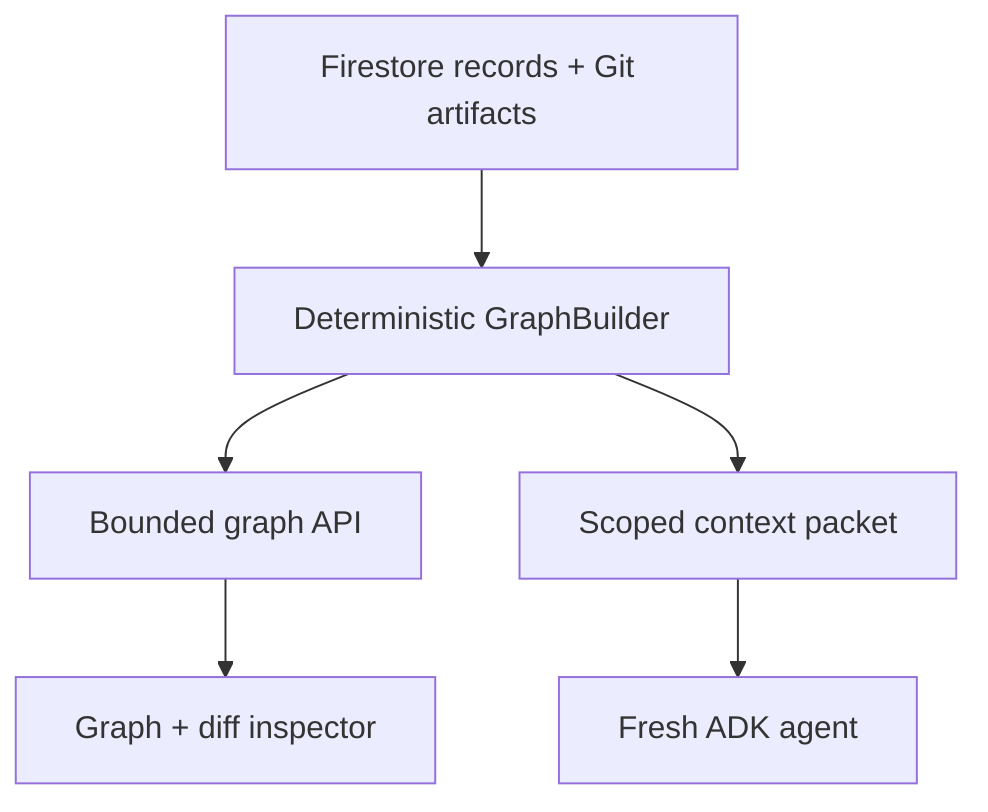

# ReviewLatch — Post-Phase-0 Graph MVP Ultra Execution Plan

Status: binding post-Phase-0 implementation brief  
Repository: `Alex-lop/AllThingsAgenticHackathon`  
Primary submission track: **The Collaborative Partner**  
Secondary architectural proof: **a governed future-agent handoff primitive**  
Official deadline: **August 31, 2026 at 5:00 PM PT**

## 0. Command to the Ultra root agent

You are the root implementation agent. Begin implementation immediately; do not return another broad plan.

1. Read `ULTRA_MVP_EXECUTION.md` first, then this file.
2. Treat this file as the binding post-Phase-0 extension wherever it conflicts with the older brief.
3. Assume Alex reports Phase 0 complete, but verify the local branch, contracts, tests, and working tree before building on them. The public `main` may lag local work.
4. Do not redo ideation, branding, market research, or Phase 0 unless a required contract is genuinely absent.
5. Create exactly **five persistent Ultra subagents** with the roles and ownership below. They may not spawn children.
6. If the environment cannot run all five concurrently, preserve all five identities and schedule them in waves. Do not collapse roles or spawn replacements.
7. The root alone owns shared contracts, integration, Git staging/commits, dependency changes, deployment, and final truth claims.
8. Continue the event-driven implementation loop until the Definition of Done passes, a real external blocker requires Alex, or the feature-freeze rule fires.
9. Never fabricate a Gemini run, graph edge, test result, approval, persistence result, or cloud proof.
10. Do not push, deploy, spend cloud credits, or open a pull request without authorization in the active implementation session.

## 1. Decisive product call

The two ideas reinforce each other, but they must not be presented as two equal hackathon promises.

ReviewLatch is currently a strong **Collaborative Partner**: it captures exact human feedback, asks one meaningful clarification, turns the correction into approved scoped memory, and uses that memory in a fresh session.

It is not yet a complete **Fortified Enterprise Fleet**. A graph alone does not prove a scalable cross-department network, multi-week orchestration, production-data connectors, data sovereignty, or enterprise administration. The official hackathon asks entrants to pick a track, so the submission category remains Collaborative Partner.

The MVP borrows one fleet-shaped capability:

> An approved correction becomes a server-scoped context packet that a separately cataloged fresh agent can consume, while an unrelated agent is deterministically denied that context.

This gives the graph two real directions:

- **Backward for the human:** Why was this file or line changed? Which agent, correction, memory, test, and approval produced it?
- **Forward for the next agent:** Which exact memory revision, related files, policies, tools, and path boundaries may this new agent receive?

The graph is useful only if it changes the actual fresh-agent invocation. A graph drawn after the model call is decorative and fails the MVP.

## 2. Locked pitch and demo loop

### One-sentence pitch

> ReviewLatch turns a developer correction into approved repository memory, shows exactly how that memory connects to code and proof, and gives each fresh coding agent only the graph slice it is authorized to use.

### Golden loop

```text
Agent A changes auth code and misses a required test
→ user selects the exact hunk and gives a correction
→ ReviewLatch asks one scope clarification
→ human approves immutable memory revision 1
→ server builds a bounded context packet from trusted graph records
→ fresh cataloged Agent B receives the exact packet and memory revision
→ Agent B changes the next auth setting and adds the required test
→ premature completion is denied
→ tests pass and the human promotes the exact bound candidate
→ graph shows the complete backward and forward evidence path
```

### Required negative proof

An unrelated `billing-observer@1` profile or an out-of-scope path requests context and receives:

```json
{
  "memories": [],
  "related_files": [],
  "decision": "denied_out_of_scope"
}
```

This is a deterministic authorization test, not another expensive model run.

## 3. Scope changes from the original Ultra brief

This file intentionally overrides only these earlier decisions:

| Earlier decision | New binding decision |
|---|---|
| At most three implementation subagents | Exactly five persistent, non-overlapping Ultra subagents |
| No graph UI | Restore one bounded context-and-evidence graph as the central product surface |
| One undifferentiated agent identity | Two real cataloged runtime profiles plus one negative-scope catalog fixture |
| Proof rail only | Keep the ordered proof rail as an accessible fallback, but make the focused graph the primary explanation |

All other aggressive cuts remain in force.

### Build now

- Existing controlled Python auth fixture and two frozen tasks.
- Exact feedback capture and one server-owned scope clarification.
- Immutable approved memory revisions.
- Two real cataloged profiles: `platform-maintainer@1` for the origin run and `auth-maintainer@1` for the fresh adapted run.
- One negative-scope `billing-observer@1` catalog fixture used only for deterministic denial testing.
- Deterministic context-and-evidence graph projection.
- Exact file and hunk anchors backed by canonical Git patch bytes and hashes.
- One-hop Python import relationships inside the controlled fixture, marked advisory and used only if the central loop is already green.
- Server-owned context packet persisted before Agent B's first model call.
- Existing fail-closed test, approval, and promotion receipt.
- One focused bubble graph with an exact-diff inspector.
- Firestore reconstruction after a new process/store instance.

### Still cut

- Dual-track submission language.
- Five runtime product agents or agent-to-agent chat.
- Whole-repository or multi-repository knowledge graphs.
- Neo4j, graph databases, embeddings, vector search, GraphRAG, or LLM-inferred edges.
- Symbol, call, or line-as-node graphs.
- Physics simulation, 3D graphs, free-floating layouts, or animation-first polish.
- Arbitrary repositories, production Git writes, and production-data connectors.
- General organizations, accounts, RBAC, SSO, or cross-company tenancy.
- Claims of multi-week execution or complete data-sovereignty compliance.
- Multi-vendor adapters, MCP, terminal TUI, repair engine, blast-radius repair, and statistical A/B evaluation.
- Model-authored scope, graph facts, test outcomes, approval, or memory activation.

## 4. The graph is a projection, not a new database

Keep Firestore's existing runs, memories, candidate artifacts, test receipts, decisions, and promotion receipts as authoritative records. Build the graph deterministically from those records plus the canonical Git diff.



The graph may be cached as a versioned snapshot for fast display, but it is never the source of authorization or promotion truth. Promotion must reread the authoritative records.

No graph mutation endpoint exists. Gemini cannot submit nodes or edges.

## 5. Canonical graph contract

### Node envelope

```json
{
  "id": "stable server-issued or deterministic ID",
  "kind": "agent_run | changeset | file | hunk | feedback | memory_revision | context_packet | policy_check | test_receipt | human_decision | promotion_receipt",
  "label": "server-generated label",
  "repo_id": "reviewlatch-demo",
  "run_id": "optional run ID",
  "provenance": "server_observed | server_derived | human_attested | model_proposed",
  "source_ref": "authoritative record reference",
  "digest": "sha256",
  "status": "kind-specific status",
  "created_at": "server timestamp"
}
```

### Required node data

| Kind | Minimum required data |
|---|---|
| `agent_run` | Catalog profile/version, task ID, base SHA, effective path scope, tool allowlist, session ID, fresh-session flag |
| `changeset` | Candidate revision, base SHA, canonical patch hash, changed-file count, lifecycle state |
| `file` | Canonical path, before/after blob hashes, language |
| `hunk` | File path, old/new line ranges, exact hunk digest, candidate revision |
| `feedback` | Exact human correction digest, selected hunk reference, selected scope; never model-rewritten |
| `memory_revision` | Immutable ID/revision, exact text, approval state, repo/path/task scope, supersession state |
| `context_packet` | Consumer profile/version, graph revision/hash, selected node IDs, memory revisions, effective scope, packet hash |
| `policy_check` | Server policy version, pass/deny, deterministic reason codes, bound patch and context hashes |
| `test_receipt` | Fixed test profile, exit code, output digest, base SHA, patch hash |
| `human_decision` | Authenticated actor, purpose, decision, bound memory or candidate hash, timestamp |
| `promotion_receipt` | Base SHA, patch/tree hashes, memory revision, context packet, test receipt, decision, final commit metadata |

### Required edges

| From | Edge | To | Trust basis |
|---|---|---|---|
| Agent A run | `PRODUCED` | Changeset A | Observed tool/run record |
| Changeset | `CONTAINS` | Hunk | Canonical Git patch |
| Hunk | `MODIFIES` | File | Canonical Git patch |
| File | `IMPORTS` | File | Server-derived Python AST; advisory only |
| Hunk A | `TRIGGERED` | Feedback | Human-selected anchor |
| Feedback | `LEARNED_AS` | Memory revision | Server lifecycle record |
| Human decision | `APPROVED` | Memory revision | Authenticated decision |
| Memory revision | `PACKED_IN` | Context packet | Server selection record |
| Context packet | `INJECTED_INTO` | Agent B run | Persisted pre-model receipt |
| Agent B run | `PRODUCED` | Changeset B | Observed tool/run record |
| Test receipt | `VALIDATED` | Changeset B | Fixed server-owned test command |
| Policy check | `DENIED` or `ALLOWED` | Changeset B | Deterministic gate |
| Human decision | `AUTHORIZED` | Changeset B | Authenticated promotion action |
| Changeset B | `PROMOTED_AS` | Promotion receipt | Atomic promotion record |

Every displayed edge must resolve to a stored source reference. Unsupported import syntax yields `unknown`; it never produces an invented edge.

### Exact code integrity

The graph does not store code inside bubbles. Each hunk node points to an immutable, size-capped candidate artifact containing:

```json
{
  "path": "app/auth/limiter.py",
  "old_start": 12,
  "old_lines": 3,
  "new_start": 12,
  "new_lines": 4,
  "before_blob_sha": "...",
  "after_blob_sha": "...",
  "canonical_patch_sha256": "...",
  "exact_hunk_sha256": "..."
}
```

Clicking a hunk loads the exact unified diff from the authoritative candidate artifact. Do not regenerate code from a model summary. For the hackathon fixture, full sanitized diff content may be retained. The architecture must not imply that unrestricted production source is safe to persist.

## 6. Agent catalog and context packet

### Minimal catalog record

```json
{
  "agent_profile_id": "auth-maintainer@1",
  "owner_team": "engineering-security",
  "purpose": "Make bounded authentication changes",
  "model_policy": "verified eligible Gemini model",
  "framework": "Google ADK",
  "repo_ids": ["reviewlatch-demo"],
  "allowed_paths": ["app/auth/**", "tests/test_security_policy.py"],
  "allowed_tools": ["read_file", "write_file", "run_fixture_tests"],
  "memory_access": ["authentication", "security"],
  "data_classification": "sanitized_fixture",
  "policy_revision": 1,
  "status": "active"
}
```

Catalog scope is server-owned. The model cannot change its identity, department, tools, paths, or memory policy.

### Context packet

Before Agent B's first model call, deterministic application code computes:

```text
effective scope = predefined task scope ∩ catalog profile scope
```

It then persists this packet:

```json
{
  "packet_id": "ctx_...",
  "consumer_agent_profile_id": "auth-maintainer@1",
  "task_id": "change_window_seconds",
  "repo_id": "reviewlatch-demo",
  "base_sha": "...",
  "allowed_paths": ["app/auth/**", "tests/test_security_policy.py"],
  "allowed_tools": ["read_file", "write_file", "run_fixture_tests"],
  "approved_memories": [
    {
      "memory_id": "mem_auth_review",
      "revision": 1,
      "exact_text": "Auth changes require a regression test in tests/test_security_policy.py covering the changed security behavior."
    }
  ],
  "related_files": [
    {
      "path": "app/auth/limiter.py",
      "reason": "task target"
    }
  ],
  "required_test_profile": "auth-fixture-v1",
  "source_graph_revision": 1,
  "source_graph_hash": "...",
  "selected_node_ids": ["..."],
  "packet_sha256": "..."
}
```

Persist the packet before invoking ADK. Agent B receives no conversation history from Agent A and no free-form graph query tool. The actual invocation records the exact packet and memory revision injected.

### Hard graph and packet limits

- Default traversal depth: 1; hard maximum: 2.
- Maximum visible response: 25 nodes and 40 edges.
- Maximum related files: 8.
- Maximum hunks: 12.
- Maximum approved memory revisions: 3.
- Maximum origin runs: 1 per memory.
- Maximum canonical patch: 100 KB of text.
- Reject binaries, traversal, and symlink escape.
- Apply path and catalog scope before traversal.
- Return `truncated: true` and omitted counts whenever capped.
- Never imply that a bounded graph is a complete codebase map.

## 7. One-screen graph experience

Use `@xyflow/react` only if it can be added without destabilizing the existing frontend. Use deterministic positions; never use a force simulation.

### Focused constellation layout

- Center: selected changeset or hunk.
- Upper left: originating agent, feedback, and approved memory.
- Upper right: context packet and fresh agent.
- Right: touched files with small attached hunk bubbles.
- Bottom: policy denial, test receipt, human decision, and promotion receipt.
- Optional one-hop import file appears muted and labeled **advisory**.

### Required behavior

- Circular or rounded bubble nodes with type, short label, status, and provenance badge.
- Directional, labeled edges.
- Stable positions across refreshes.
- Filters for current run, path prefix, and node kind.
- `Show memory origin` toggle.
- Visible node-limit/truncation notice.
- Clickable drawer with exact diff, line ranges, hashes, agent scope, tool allowlist, memory text, test evidence, or approval binding.
- Ordered HTML proof list beneath the canvas for keyboard and screen-reader access.
- No code inside bubbles and no raw chain-of-thought anywhere.

The judge should answer these in under ten seconds:

1. What code changed?
2. Which agent changed it?
3. Which human correction became memory?
4. What exact context did the fresh agent receive?
5. Which test and human decision allowed promotion?

## 8. Minimal backend surfaces

Add only these read endpoints:

```text
GET /api/runs/{run_id}/graph
GET /api/runs/{run_id}/graph/nodes/{node_id}
GET /api/runs/{run_id}/context-packet
GET /api/agent-catalog
```

Existing feedback, memory decision, run execution, test, and promotion actions trigger graph rematerialization or invalidate the cached projection. Do not add WebSockets; refetch or poll after state changes.

The graph response includes:

```json
{
  "revision": 1,
  "graph_hash": "sha256(canonical JSON)",
  "nodes": [],
  "edges": [],
  "truncated": false,
  "omitted_counts": {}
}
```

Canonical sorting must make the same authoritative records produce the same graph hash after restart.

## 9. Root plus five Ultra subagents

All six agents share the working tree. Subagents do not change branches, stage files, commit, merge, rebase, push, or edit outside their ownership. The root alone controls Git.

Before spawning work, the root records actual paths in `IMPLEMENTATION_STATUS.md`. If the Phase 0 repository shape differs from the logical paths below, map them once and freeze the ownership ledger.

### Root agent

Owns:

- Scope, architecture, and acceptance gates.
- Existing Phase 0 contracts and all shared schema changes.
- `app.py`, shared models/store interfaces, route composition, manifests, lockfiles, Dockerfile, configuration, CI, deployment, top-level README, and commits.
- Integration, conflict resolution, cloud/model verification, final demo, and truth audit.
- `IMPLEMENTATION_STATUS.md`, `DECISIONS.md`, and the accepted evidence index.

The root writes the additive graph/catalog/context contracts before implementation agents edit code.

### Ultra 1 — Graph Core

Exclusive logical ownership:

```text
backend/reviewlatch/graph/**
tests/unit/graph/**
```

Deliver:

- Deterministic `GraphBuilder` over authoritative records.
- Canonical node/edge IDs and graph hash.
- Exact diff/hunk extraction and lazy evidence lookup.
- Bounded graph query/filter logic.
- Optional one-hop Python import extraction, clearly advisory.
- Unit tests for determinism, caps, unsupported syntax, and no invented edges.

### Ultra 2 — Catalog, Collaboration, and Context

Exclusive logical ownership:

```text
backend/reviewlatch/context/**
tests/unit/context/**
```

Deliver:

- Three server-owned catalog fixtures and validation.
- Existing clarification/correction flow adapter without model rewriting.
- Immutable memory-to-context selection.
- Effective-scope intersection.
- Persisted context packet and exact injection receipt.
- Positive Agent B retrieval and negative Billing/path denial tests.

### Ultra 3 — Runtime Provenance and Enforcement Adapter

Exclusive logical ownership:

```text
backend/reviewlatch/execution/**
tests/unit/execution/**
```

Deliver:

- Instrument the existing ADK runner and scoped tools with server-observed records.
- Bind Agent A and Agent B invocations to catalog profile/version and session IDs.
- Persist context packet before Agent B's first model call.
- Feed candidate, test, denial, approval, and promotion references to GraphBuilder inputs.
- Preserve the existing fail-closed promotion contract; do not redesign it.
- Tests proving the model cannot declare scope, graph facts, test success, or approval.

### Ultra 4 — Graph Experience

Exclusive ownership:

```text
frontend/**
```

Deliver:

- Focused constellation graph against a frozen API fixture first.
- Exact diff/evidence drawer.
- Filters, legend, provenance/status badges, loading/error/empty/truncated states.
- Ordered accessible proof-list fallback.
- Frontend tests ensuring every rendered edge comes from the API and no UI relationship is invented.

### Ultra 5 — Verification, Security, and Demo

Exclusive logical ownership:

```text
tests/integration/**
tests/adversarial/**
demo/**
evidence/**
```

Initially inspect read-only. After the root publishes the contract hash, deliver:

- Clean-reset end-to-end golden test.
- Process/store restart reconstruction test.
- Forged graph/scope/approval rejection tests.
- Stale/tampered patch, memory, packet, test, decision, and base-SHA tests.
- Demo reset, demo runner, exact expected graph fixture, and evidence bundle.
- Defect reports routed to the owning agent; do not patch another agent's production files.

## 10. First assignments after the Phase 0 audit

The root sends exactly one bounded first task to each subagent:

1. **Ultra 1:** Return a read-only mapping from existing authoritative records to the proposed graph contract, then implement only after the root freezes the contract.
2. **Ultra 2:** Return the catalog/context scope table and positive/negative retrieval cases, then implement only after contract freeze.
3. **Ultra 3:** Identify the exact pre-model and post-tool instrumentation points in the current runner, then implement only after contract freeze.
4. **Ultra 4:** Build the graph screen against a checked-in static response matching the frozen contract; do not wait for the backend.
5. **Ultra 5:** Write the acceptance matrix and adversarial cases first; begin integration fixtures only after contract freeze.

The root uses their read-only feedback to make one contract decision. Subagents do not independently redesign schemas.

## 11. Event-driven long-running orchestration loop

Keep the same five agents alive and reuse them with follow-up tasks. Never spawn a sixth agent and never allow grandchildren.

```text
LOOP until Definition of Done, hard blocker, or feature freeze:
  1. INSPECT
     - Read agent messages, IMPLEMENTATION_STATUS.md, git diff, and latest tests.
     - Identify the earliest failing dependency gate.

  2. ASSIGN
     - Give each idle agent one bounded objective.
     - Include accepted contract hash, base SHA, owned paths, acceptance tests,
       dependencies, and explicit non-goals.

  3. WAIT
     - Use the platform's blocking agent-wait primitive for 10–20 minutes.
     - Do not shell-sleep, busy-poll, or repeatedly ask for status.
     - Continue root-owned integration or verification only when it is independent.

  4. DRAIN AND REVIEW
     - Consume all available reports.
     - Inspect actual changed files and rerun relevant tests.
     - Reject out-of-ownership changes or unsupported claims.

  5. ACCEPT OR REWORK
     - ACCEPT only evidence-backed work that matches the contract.
     - Otherwise send a precise follow-up task to the same owner.
     - Route Ultra 5 defects back to the subsystem owner.

  6. INTEGRATE
     - Root wires accepted modules, runs the cross-system suite, updates decisions,
       and creates a small checkpoint commit.

  7. IMPROVE
     - Before first green vertical slice: fix only blockers to that slice.
     - After green: run at most three improvement cycles limited to P0/P1 reliability,
       graph clarity, demo speed, accessibility, and honest documentation.

  8. REPEAT
     - Send the new accepted base SHA and contract hash to all five agents.
```

An agent that is blocked sends one `BLOCKED` report and waits. The root must answer or reassign; the agent must not silently expand scope.

### Required subagent report

```yaml
report_type: READY | CHECKPOINT | BLOCKED | REVIEW_READY | DEFECT | DONE
agent: ultra-N
cycle: 1
objective: concise objective
base_sha: exact accepted SHA
contract_hash: exact contract hash
owned_paths:
  - path/glob
changed_paths:
  - exact path
completed:
  - concrete result
tests:
  - command: exact command
    result: PASS | FAIL
    evidence: log or artifact path
risks:
  - concrete remaining risk
blockers:
  - blocker and required root decision
requests:
  - interface or ownership request
next_action: one bounded next step
```

Defects add severity, reproduction, expected behavior, actual behavior, suspected owner, and security impact.

### Severity

- **P0:** scope leak, secret/source leak, fabricated evidence, model self-approval, corrupted promotion, or golden loop cannot complete.
- **P1:** graph, context handoff, persistence, diff fidelity, or primary UI is incorrect.
- **P2:** polish or a non-demo edge case.

## 12. Post-Phase-0 gates

### Gate 1 — contract and ownership freeze

Maximum target: 90 minutes.

- Run the Phase 0 suite from the actual implementation branch.
- Record baseline SHA and commands/results.
- Freeze additive graph, catalog, context packet, and evidence-reference schemas.
- Freeze catalog profiles, exact tasks, allowed paths/tools, graph caps, and negative retrieval case.
- Create `IMPLEMENTATION_STATUS.md` and ownership ledger.
- Spawn exactly five agents and receive their first read-only reports.

Pass: every agent acknowledges the same contract hash and no shared file has multiple owners.

If Phase 0 is red, repair only the regression before parallel implementation. Do not restart ideation.

### Gate 2 — independent components

- Ultra 1 builds deterministic graph projection and exact hunk evidence.
- Ultra 2 builds catalog/context packet and scope denial.
- Ultra 3 instruments the real runner and promotion references.
- Ultra 4 builds the frontend against the frozen fixture.
- Ultra 5 builds the end-to-end and adversarial harness.

Pass:

- Same records produce the same graph hash.
- Exact hunk ranges/digests match the canonical patch.
- Human correction text is exact.
- Fresh Agent B packet includes approved revision 1.
- Billing/out-of-scope retrieval returns no context.
- UI renders only contract-provided nodes and edges.

### Gate 3 — first local vertical slice

The root wires the accepted modules in this exact order:

1. Open recorded Agent A origin run.
2. Select the exact missing-test hunk.
3. Submit correction and answer the scope clarification.
4. Approve immutable memory revision 1.
5. Materialize graph revision 1.
6. Build and persist Agent B context packet.
7. Destroy Agent A session state.
8. Start fresh Agent B with the exact packet.
9. Produce bounded candidate and required test.
10. Materialize changeset/file/hunk nodes.
11. Automatically attempt completion and persist the expected denial.
12. Run fixed tests, approve, reconstruct, retest, and promote.
13. Rebuild the graph and inspect the final receipt path.

Pass: one clean integration test completes the full loop and every displayed relationship resolves to authoritative evidence.

No graph animation, catalog UI expansion, or optional import edge work proceeds before this gate.

### Gate 4 — real Gemini and durable restart

- Run Agent B through the verified eligible Gemini model and Google ADK.
- Record exact model ID, profile ID/version, new session ID, packet hash, memory revision, file writes, tests, and candidate hashes.
- Recreate the store/application instance and reconstruct the same graph hash and diff.

Pass: three consecutive real golden runs succeed after task/prompt freeze, and one process/store restart reproduces the graph and evidence.

### Gate 5 — adversarial and clarity audit

Ultra 5 attacks:

- Cross-repo, Billing, and out-of-path retrieval.
- Path traversal, symlink escape, and oversized patch.
- Unapproved, stale, rejected, or superseded memory.
- Forged nodes/edges, model-declared scope, test state, or approval.
- Stale base SHA, changed patch bytes, packet substitution, test-receipt substitution, and stale decision.
- Graph depth/node-cap bypass and hidden truncation.
- Restart immediately before promotion.

Pass: security-relevant failures fail closed, unsupported relationships show `unknown`, and the UI never implies completeness when truncated.

### Gate 6 — demo freeze

- Ten consecutive deterministic clean-reset integration runs.
- Three consecutive real Gemini runs.
- One restart reconstruction run.
- Zero open P0 defects and no demo-blocking P1 defects.
- A new viewer answers the five graph questions in under ten seconds.
- Graph explanation occupies no more than 30 seconds of the final four-minute video.
- README, architecture diagram, limitations, cloud proof, and reproducible commands match observed reality.

After this gate, stop feature work and preserve the release candidate.

## 13. High-value acceptance tests

1. A candidate creates exact changeset, file, and hunk nodes whose ranges and hashes match Git byte-for-byte.
2. Same canonical records reproduce the same graph hash after restart.
3. There is no graph mutation endpoint and forged graph fields are ignored or rejected.
4. Model output cannot define scope, identity, tool permission, test success, evidence, approval, or promotion.
5. Pending, rejected, superseded, stale, wrong-repo, wrong-path, or wrong-task memory never enters a packet.
6. Agent B receives a new session ID, a different profile ID, and no Agent A conversation history.
7. Agent B's persisted packet contains the exact approved memory revision and selected graph node IDs used in the actual invocation.
8. `billing-observer@1` and an unrelated path receive zero memory and zero related files.
9. Agent B changes only allowlisted files and adds the required regression test.
10. The new test fails on the base fixture and passes on the candidate.
11. Premature completion returns a real denial and creates no promotion receipt.
12. Tampering with one patch byte invalidates the test/decision bindings and denies promotion.
13. Promotion succeeds only when base SHA, patch/tree hashes, packet, memory revision, test receipt, run revision, and human decision match.
14. Clicking a hunk reproduces the exact unified diff and original line ranges.
15. Every UI node and edge maps to one backend record; the frontend invents none.
16. Graph caps, filters, truncation flags, and omitted counts behave honestly.
17. Seeded secrets and unrestricted source never appear in graph payloads, logs, or browser fixtures.

## 14. Kill rules

- If there is no graph-backed local vertical slice within 12 focused hours after contract freeze, cut advisory import edges, catalog list UI, graph filters, and animations immediately.
- If the graph delays the existing memory-to-fresh-session loop, ship a fixed 10–12-node focused graph. Do not build a general explorer.
- If `@xyflow/react` causes integration instability, replace only the canvas with deterministic SVG/CSS; preserve the API and inspector.
- If real Gemini is flaky, simplify the controlled task, prompt, and tool schema. Do not add planners, critics, retries beyond one controlled retry, or a runtime swarm.
- If durable graph snapshots drift, rebuild them from authoritative records. Do not make the cache authoritative.
- If one-hop imports are ambiguous, label them `unknown` or remove them. They never authorize context or promotion.
- If the implementation window reaches 50% without a green end-to-end run, cut all P2 work.
- After three post-green improvement cycles, stop iterating even if more polish is possible.
- During the final two hours before a recording/submission freeze, fix only P0 and demo-blocking P1 defects.

Interrupt a subagent if it repeatedly edits outside ownership, changes shared contracts without root approval, adds a cut dependency or feature, fabricates evidence, permits model self-approval, exposes credentials/source, or makes no measurable progress over two checkpoints.

## 15. Four-minute demo cut

| Time | Visible proof |
|---|---|
| 0:00–0:20 | “Coding agents forget what you teach them.” Show Agent A's recorded auth diff and missing regression test. |
| 0:20–0:50 | Click the exact hunk, give the correction, answer one scope question, and approve memory revision 1. |
| 0:50–1:15 | Open the focused graph: Agent A → hunk → feedback → approved memory. Click the hunk to show exact lines/hashes. |
| 1:15–1:35 | Show Agent B's catalog scope and persisted context packet. Briefly show Billing receives no context. |
| 1:35–2:25 | Start genuinely fresh Agent B live. Show packet/memory injection, bounded writes, and the required test. |
| 2:25–2:45 | Attempt completion automatically; show the real fail-closed denial and red policy node. |
| 2:45–3:15 | Run tests, approve the exact candidate, reconstruct/retest, and promote. Graph adds test, decision, and receipt nodes. |
| 3:15–3:40 | Show Cloud Run, Firestore persistence, new session/model metadata, and restart-safe graph hash. |
| 3:40–3:55 | Honest limitation: controlled fixture and fleet handoff primitive, not a production enterprise fleet. Repeat the pitch. |

Do not spend more than 30 seconds explaining the graph. The graph is visual proof of the product loop, not the product demo by itself.

## 16. Definition of Done

- [ ] Existing Phase 0 contracts and fail-closed promotion behavior still pass.
- [ ] Exact human correction and one clarification create immutable approved memory.
- [ ] Agent A and Agent B are actual, server-owned catalog profiles with explicit versions, scopes, and tools.
- [ ] Agent B starts with a fresh session and receives no Agent A conversation history.
- [ ] The server persists the exact bounded packet before Agent B's first model call.
- [ ] Agent B's actual invocation records the packet hash, graph revision, selected node IDs, and memory revision.
- [ ] Billing/out-of-scope retrieval returns no context.
- [ ] Graph nodes and edges are deterministic projections of authoritative records.
- [ ] Clicking a hunk shows exact canonical diff bytes, ranges, and hashes.
- [ ] Agent B creates the required test and touches no unrelated files.
- [ ] Premature completion is denied and cannot create a promotion receipt.
- [ ] Human-approved promotion binds base, candidate, packet, memory, test, run revision, and decision.
- [ ] Firestore/new-process reconstruction produces the same graph hash and evidence.
- [ ] Ten deterministic clean resets and three consecutive real Gemini runs pass.
- [ ] No P0 or demo-blocking P1 defects remain.
- [ ] The submission is described as Collaborative Partner with one honest fleet-readiness primitive.
- [ ] The demo remains below four minutes and states the controlled-fixture limitation.

## 17. Initial IDE prompt

```text
Work in Alex-lop/AllThingsAgenticHackathon on the current implementation branch. Read ULTRA_MVP_EXECUTION.md and POST_PHASE0_GRAPH_MVP_ULTRA_PLAN.md; treat the latter as the binding post-Phase-0 extension. Verify the reported Phase 0 baseline, then begin Gate 1 immediately. Create exactly five persistent Ultra subagents with the ownership defined in the plan, prohibit grandchildren and overlapping edits, and run the event-driven wait/review/integrate loop until the Definition of Done or a genuine external blocker. Do not restart ideation, submit to two tracks, build a general code graph, or restore any other cut feature.
```

## 18. Official source note

The [official All Things Agentic Devpost page](https://allthingsagentichackathon.devpost.com/) says entrants should pick one of the three tracks and requires the solution to use Gemini, Google ADK, and Google Cloud. It lists the deadline as August 31, 2026 at 5:00 PM PT. This plan therefore keeps Collaborative Partner as the submission category while treating cataloged, scoped agent handoff as supporting architecture rather than a second track claim.
