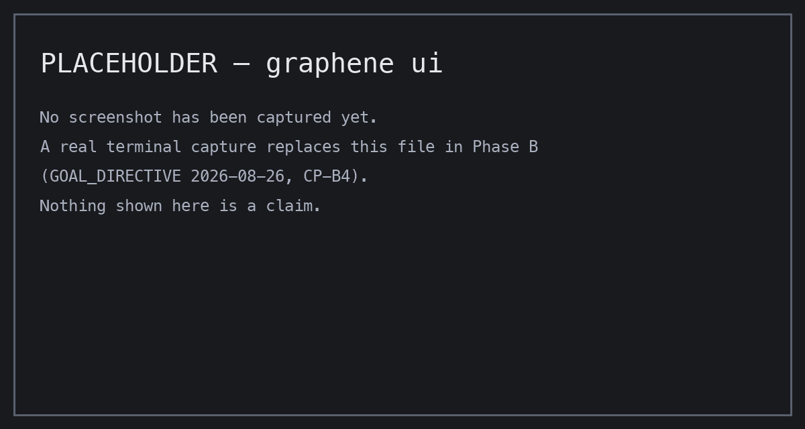

<p align="center">
  
</p>

# Agents write. Graphene decides what survives.

**Repository publication control for parallel coding agents: bounded writes, exact candidates, traceable history.**

[](https://github.com/Alex-lop/Graphene/actions/workflows/ci.yml)

**What it never does:** push, merge, deploy, or modify the checkout you point it at — not on success, not on failure, not by configuration. **What it does instead:** you point two to five coding agents at one repository; Graphene holds every proposed change outside your working tree, refuses the ones that fall outside the approved plan, assembles exactly one candidate, verifies it, and — only after approval, either a human decision or an explicit up-front policy authorization — writes it as a single commit on its own Git ref you can inspect, cherry-pick, or delete. (Proven today on scripted workers — see What it does not do.)

The exact contract, in the project's own words: Graphene binds one approved plan revision to its base SHA and SHA-256 digest. Parallel workers may propose changes, but only scoped artifacts carrying the current fence can enter the exact candidate Graphene verifies; stale attempts cannot publish. `why` preserves traceable history, and policy-authorized finalization creates an isolated Git ref. Graphene never pushes, merges, deploys, or mutates the supplied checkout.

## Run the verified path

Needs [uv](https://docs.astral.sh/uv/getting-started/installation/) and Python 3.13.

```bash
git clone https://github.com/Alex-lop/Graphene.git && cd Graphene
uv sync --frozen
uv run --frozen graphene mission replay taskmaster --no-open --exit-after-replay
```

Real output, observed 2026-08-30 on macOS (the port is chosen at run time):

```
VERIFIED MISSION REPLAY — GENERATED SCRIPTED FIXTURE; NO LIVE AGENT, HUMAN ATTESTATION, NEW TEST EXECUTION, GEMINI, OR CLOUD
Mission Control: http://127.0.0.1:52547/mission-control/mission_status_reports
```

The replay is SHA-256 checked, read-only, and credential-free. Drop both flags to keep Mission Control open in a browser, or read the same mission as one terminal screen with `uv run --frozen graphene ui --replay taskmaster --once`.



## What it does

| Capability | Command or module | Test that proves it |
|---|---|---|
| Refuse a plan before any worker runs: cycles, two tasks writing one path, reads outside policy scope, criteria nothing can verify | `graphene mission start` | [`tests/unit/orchestration/test_validation.py`](tests/unit/orchestration/test_validation.py) |
| Lease one task to one worker and refuse the stale one: concurrent claims conflict, leases expire, fences rise | `graphene.orchestration.sqlite_mission_store` | [`tests/unit/orchestration/test_store.py`](tests/unit/orchestration/test_store.py) |
| Measure what actually changed on disk against the declared write lease | `graphene.orchestration.workspace_audit` | [`tests/unit/orchestration/test_workspace_audit.py`](tests/unit/orchestration/test_workspace_audit.py) |
| Run the frozen verification command inside a macOS Seatbelt profile, as a process Graphene owns and can cancel | `graphene.orchestration.worker_runtime` | [`tests/unit/orchestration/test_host_check_runner.py`](tests/unit/orchestration/test_host_check_runner.py) |
| Land the approved candidate as one commit under `refs/graphene/results/`, with `pushed`, `pull_request_created`, and `deployed` all false | `graphene mission approve-result` | [`tests/unit/lineage/test_local_commit.py`](tests/unit/lineage/test_local_commit.py) |
| Answer "why is this file like this?" with the attempt, inputs, checks, and approval behind it | `graphene why PATH --mission ID` | [`tests/unit/cli/test_why_cli.py`](tests/unit/cli/test_why_cli.py) |
| Export a redacted mission capsule and cold-verify every hash chain in it without the mission store | `graphene mission capsule export` | [`tests/unit/orchestration/test_capsule.py`](tests/unit/orchestration/test_capsule.py) |
| Drive the whole loop from your own controller over MCP stdio | `graphene-mcp` | [`tests/unit/integrations/test_mission_mcp.py`](tests/unit/integrations/test_mission_mcp.py) |

<!-- RELEASE-LINK: agent-plan-lint -->

## Where Graphene fits

Use the agent runtime you already trust. Graphene governs the repository handoff after agents propose changes.

| Project | Primary job | Control boundary | Where Graphene fits |
|---|---|---|---|
| **Graphene** | Repository publication control | Approved plan → scoped attempts → accepted artifacts → exact verified candidate | The SHA-256-bound decision layer, with fences and traceable history |
| [Graft](https://github.com/trailhq/Graft) | Current codebase context and blast-radius mapping | Keeps a local repository map available to coding agents | Use Graft to understand the code; Graphene to govern the candidate result |
| [LangGraph](https://github.com/langchain-ai/langgraph) | Durable, stateful agent orchestration | Defines, runs, pauses, and resumes the workflow | Keep LangGraph as the runtime; add Graphene where work becomes repository artifacts |
| [Microsoft Agent Framework](https://github.com/microsoft/agent-framework) | Agent and multi-agent workflows | Coordinates agents and functions with checkpoints and human input | Keep Agent Framework as the runtime; add Graphene for repository admission and exact-candidate verification |

These are complementary layers. See the [primary-source comparison notes](docs/reports/2026-08-28-readme-comparison-research.md).

## Connect a controller

The committed [`.mcp.json`](.mcp.json) launches the source server; installed packages expose `graphene-mcp` over stdio. Call `start_goal`, read `get_digest`, relay it through `approve_plan`, poll `mission_status`, then inspect `why` and `graphene mission result show`. The [nine-tool command map](docs/COMMANDS.md) has the full loop.

## What it does not do

- **It does not run your agents.** Graphene starts where their output tries to become a commit.
- **It has never completed a credentialed live model mission.** The `gemini-adk` driver requires explicit success criteria and credentials, and there is no silent fallback to a fixture; the credential-free paths in this README are labeled fixtures.
- **Its check executor is macOS-only today.** It requires `/usr/bin/sandbox-exec`; on Linux the replay and the fail-closed boundaries are proven, the live check executor is not.
- **It is not deployed anywhere.** Cloud Run and real Firestore are not deployed, and the Docker executor has no responsive-daemon smoke.
- **It does not expire data or replan.** Retention is metadata; a replan request pauses work without producing a replacement revision.
- **It makes no performance claim.** The benchmark is deferred; no token, speed, cost, or quality comparison exists.

## Proven / waiting

| Status | Evidence boundary |
|---|---|
| `VERIFIED_LOCAL` — replay and terminal UI | SHA-256-checked generated fixture; no live agent or new test run |
| `VERIFIED_LOCAL` — scheduler, policy, recovery, and exact candidate | Scripted/fake local coverage, including isolated auto-finalization |
| `VERIFIED_LOCAL` — MCP and reconnect | Official Python MCP client plus scripted controller flow; approval is `server_derived` relay evidence, not human attestation; no Codex, Claude Code, or Gemini CLI run |
| `NOT PROVEN` — live execution | Current credentialed Gemini Orders mission, real model kill/recovery, and Codex controller |
| `NOT PROVEN` — external proof | Exact-SHA proof needs a SHA-named external manifest or CI result; cloud is not deployed; Docker, benchmark, and film remain unproven |

The benchmark remains deferred: there is no token-efficiency claim, and no speed or cost comparison. See [Proof boundaries](docs/PROOF.md) for the full evidence ledger and [Known limitations](docs/KNOWN_LIMITATIONS.md) for every open row.

## License

Apache-2.0 — see [LICENSE](LICENSE). Also: [Documentation](docs/README.md) · [Command map](docs/COMMANDS.md) · [Product contract](docs/PRODUCT.md) · [Machine-readable truth](contracts/product_proof.json)
