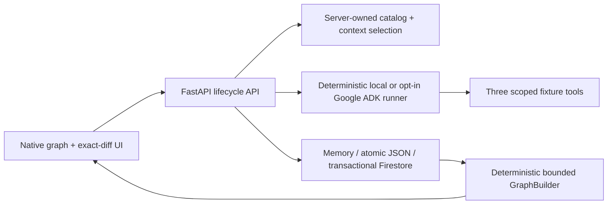

# ReviewLatch

> ReviewLatch turns a developer correction into approved repository memory, shows exactly how that memory connects to code and proof, and gives each fresh coding agent only the graph slice it is authorized to use.

ReviewLatch is a **Collaborative Partner** hackathon MVP for one controlled Python authentication fixture. A human anchors exact feedback to a diff hunk, approves immutable scoped memory, and hands it to a fresh cataloged agent through a persisted context packet. Deterministic policy then denies premature completion and promotes only the candidate whose patch, test, packet, memory, graph, run revision, and human decision all match.

## Verified today

- The complete deterministic-local loop passes from clean reset through feedback, memory approval, fresh-session handoff, completion denial, restart, promotion, and restart-safe graph reconstruction.
- The native SVG/HTML interface operates that loop and renders only API-provided nodes and edges, with an exact-diff drawer and accessible ordered proof list.
- Firestore has a transactional bounded-demo adapter and local contract test. Google ADK 2.5.0 has an opt-in real execution path with scoped tools and server-side validation.
- The container builds and serves the frontend, health endpoint, and catalog as an unprivileged user on `0.0.0.0:$PORT`.

Real Gemini, a real Firestore project, and Cloud Run are **not verified in this checkout** because no Google credentials, project, or `gcloud` installation was available. Health and generated evidence preserve those labels.

## Run locally

Requirements: Python 3.13, `uv`, Git, and optionally Docker. Node 22+ is needed only for the dependency-free frontend tests.

```bash
uv sync --frozen
export REVIEWLATCH_DEMO_TOKEN='choose-a-long-random-demo-token'
uv run uvicorn reviewlatch.app:app --host 127.0.0.1 --port 8080
```

Open `http://127.0.0.1:8080`, enter the runtime token, and follow the six numbered actions. The token remains only in JavaScript memory and every mutation requires the `X-ReviewLatch-Token` header.

Run the reproducible local proof without a browser:

```bash
uv run python demo/graph_mvp.py --evidence evidence/local-golden.json
```

Run all checks:

```bash
uv run pytest -q -p no:cacheprovider
node --test frontend/test/*.test.mjs
node --check frontend/src/app.mjs frontend/src/graph.mjs frontend/src/workflow.mjs
```

## Architecture



The graph is a projection, never an authorization database. All relationships resolve to stored records or canonical Git artifacts. There is no graph mutation endpoint, model approval tool, general shell, arbitrary prompt, or arbitrary-repository execution.

## Execution and persistence modes

The safe default is the fully verified deterministic fixture path:

```bash
REVIEWLATCH_EXECUTION_MODE=deterministic-local
REVIEWLATCH_STORE_BACKEND=memory
```

For restartable local demos:

```bash
REVIEWLATCH_STORE_BACKEND=json
REVIEWLATCH_STORE_PATH=demo/runs/reviewlatch.json
```

The real ADK path is intentionally opt-in. It still derives candidate hashes, fixed-test receipts, policy checks, graph evidence, and promotion truth on the server:

```bash
GOOGLE_CLOUD_PROJECT=your-project
GOOGLE_CLOUD_LOCATION=global
GOOGLE_GENAI_USE_VERTEXAI=true
REVIEWLATCH_MODEL=gemini-3.5-flash
REVIEWLATCH_EXECUTION_MODE=google-adk
REVIEWLATCH_STORE_BACKEND=firestore
REVIEWLATCH_NAMESPACE=hackathon
```

Verify that the frozen model ID is eligible in the target project before enabling it; this repository never silently substitutes another model. The Firestore adapter keeps the bounded demo namespace in one transactional document for atomic compare-and-set behavior. Split it into collections before approaching Firestore's 1 MiB document limit.

## Container

```bash
docker build -t reviewlatch:local .
docker run --rm -p 8080:8080 \
  -e REVIEWLATCH_DEMO_TOKEN='choose-a-long-random-demo-token' \
  reviewlatch:local
```

The image follows the [Cloud Run container contract](https://docs.cloud.google.com/run/docs/container-contract). For a real deployment, provide the mutation token through Secret Manager, use Application Default Credentials with least-privilege Firestore access, set the explicit ADK/Firestore environment above, and deploy this one image with a request timeout longer than the 15-second fixture test timeout. See the official [Google ADK runtime guide](https://adk.dev/runtime/) and [Firestore Python reference](https://docs.cloud.google.com/python/docs/reference/firestore/latest).

## Frozen trust boundaries

- Profiles: `platform-maintainer@1`, `auth-maintainer@1`, and negative fixture `billing-observer@1`.
- Mutable paths: `app/auth/limiter.py` and `tests/test_security_policy.py` only.
- Tools: `read_file`, `write_file`, and fixed `run_fixture_tests` only.
- Graph limits: depth 2, 25 nodes, 40 edges, 12 hunks, 8 related files, 3 memories, and a 100 KiB canonical patch.
- Promotion fails closed on stale or substituted base, patch, tree, packet, graph, selected nodes, memory revision, test receipt, run revision, or decision.

The canonical graph contract is [`contracts/graph_mvp.json`](contracts/graph_mvp.json), SHA-256 `eec06d1cfdfacd7c3656a8bda6025434db5fd693be1475e0574e0717694e8bed` over canonical JSON.

## Honest limitation

This hackathon build demonstrates approved, scoped memory and a fail-closed promotion receipt in one sanitized Python workflow. It does not claim causal attribution, arbitrary-repository isolation, unrestricted production-source storage, multi-vendor capture, or a complete enterprise fleet.
