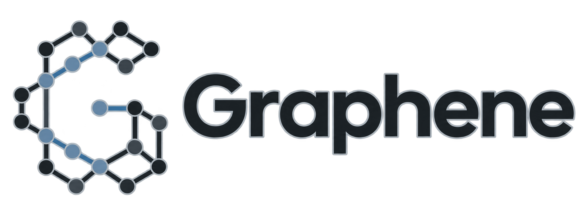

<p align="center">
  
</p>

# Graphene

**See what a coding agent actually did, what evidence backs it, and what a human approved.** Graphene is a terminal-first lineage layer for committed, scoped coding-agent operations—not a screen recorder, repository crawler, or inferred knowledge graph.

## One-command demo

Supported path: macOS, Python 3.13, Git, `uv`, executable `/usr/bin/sandbox-exec`, and this repository's sanitized Auth fixture.

```bash
uv sync --frozen
uv run --frozen graphene demo --driver scripted-local
```

Graphene creates a fresh owner-private runtime, starts the loopback read-only viewer on a free port, and opens it. The terminal shows a bounded evidence packet and asks for a real decision at each gate: correction scope, memory approval, and final promotion. Pressing Enter accepts the clearly displayed safe demo default. No database export, copied ID, second terminal, provider credential, or model call is needed.

The default keeps the private runtime after Ctrl-C. Add `--cleanup` only when you want it deleted, `--no-open` when you want the URL without launching a browser, and `--speed N` to change pacing.

## 30-second story

1. Agent A reads Auth code, makes a bounded edit, runs the fixed tests, and is denied completion pending human review.
2. A human anchors a correction to the exact hunk, chooses its scope, and approves one immutable memory revision.
3. A Billing handoff is denied with zero model dispatch; an Auth handoff receives only the authorized evidence and brief.
4. A genuinely fresh consumer opens the evidence, rereads source, makes the bounded change, adds the required regression test, and retests.
5. A human promotes the verified candidate; `why`, `inspect`, replay, and the viewer explain only explicit committed relationships.

## Visualization

- **Bubbles:** runs, scoped tools, files/evidence, human decisions, memory, policy, handoffs, tests, and promotion.
- **Color:** semantic kind or cluster—not correctness or importance.
- **Size:** capped logarithmic **activity** from observed verified interactions.
- **Lines:** explicit evidence/source relationships; width is a capped observed edge activity count.
- **Status:** the top strip shows the driver, verified head, connection, omissions, and exact truth label. Browser rendering is observational and never lineage authority.

## Demo truth

| Mode | Runner | Model | What it proves |
|---|---|---|---|
| `SCRIPTED LOCAL` | Not used | None; Gemini calls: 0 | Production v2 services, SQLite evidence, human gates, fixed local tests, handoff, and promotion |
| `ADK COMPONENT DEMO` | Real Google ADK 2.5.0 | Deterministic fake; Gemini calls: 0 | ADK adapter/Runner composition only; not Gemini proof |
| `VERIFIED REPLAY — NO LIVE AGENT` | None | None | Deterministic playback of verified v2 fixture events; simulated gates are not human proof |
| Real Gemini | Not shipped as a demo driver | Credential/spend gated | Future gate; no fallback and no claim without observed model identity |

Only `scripted-local` is exposed by `graphene demo` today. The repository has component tests for the ADK fake seam, but the one-command ADK/replay drivers are intentionally not claimed until they are integrated into the same viewer lifecycle.

The hidden process-test seam records gate events as `truth_kind=simulated_fixture`, `authority=simulated_fixture`, and `source_ref.kind=simulated_fixture`; it never records `human_attested`. Normal interactive decisions retain `human_attested` provenance.

## Architecture

```text
scripted local / MCP / Google ADK adapter
                  |
                  v
       ScopedApplicationService
                  |
                  v
   committed + verified SQLite events ---> private artifacts
                  |
                  v
 deterministic read-only projection ---> loopback stream ---> Cytoscape viewer
```

Cytoscape.js provides a mature offline Canvas renderer for Graphene's arbitrary lineage. Bubblemaps is a token-holder product/API and cannot represent this domain; Graphene borrows only its visual grammar. The browser receives bounded sanitized projection data and cannot mutate lineage, artifacts, checkouts, feedback, memory, handoffs, or promotion.

## Current status

This working tree is based on `41a5686236ec6dba60e413b30a8512be31f3c00a`. The one-command path is exercised by [`tests/process/test_demo_cli.py`](tests/process/test_demo_cli.py); projection/privacy and frontend reducer behavior have focused tests under `tests/unit/viewer` and `tests/frontend`.

| Boundary | Status |
|---|---|
| Sanitized local v2 flow | Supported on macOS with private SQLite/artifacts and fixed-test isolation |
| Read-only v2 viewer | Deterministic, bounded, privacy-filtered, loopback-only observation |
| Google ADK | Real Runner + fake LLM component proof; not real Gemini proof |
| Real Gemini / Firestore / Cloud Run | Not authorized or claimed |
| Linux / Docker fixed tests | Unsupported and fail closed |
| Promotion | Local evidence receipt/checkpoint, not a hosted Git commit |

Graphene captures only its six closed operations: `search_repo`, `read_file`, `open_evidence`, `write_file`, `run_fixed_test`, and zero-argument `request_completion`. Shell/editor activity outside them is unknown. Exact source, diffs, prompts, test stdout, and private artifacts never enter public viewer payloads. See [`docs/data_residency.md`](docs/data_residency.md) and [`docs/EXECUTOR_THREAT_MODEL.md`](docs/EXECUTOR_THREAT_MODEL.md).

## CLI reference

The demo owns its database. All other commands use an absolute owner-private `GRAPHENE_LINEAGE_DB`. `--json` emits canonical JSON/NDJSON, handled errors go to stderr, and `NO_COLOR=1` disables color.

| Command | Purpose |
|---|---|
| `graphene demo --driver scripted-local` | Create and guide the complete local visual story |
| `graphene run TASK --profile PROFILE` | Bootstrap or exactly replay one frozen v2 run |
| `graphene watch RUN [--after-seq N] [--snapshot]` | Follow a verified committed suffix |
| `graphene inspect EVIDENCE --run RUN` | Resolve an item authorized by that run |
| `graphene why PATH --run RUN` | Show explicit evidence relationships and unknowns |
| `graphene replay RUN --speed N` | Pace verified committed events without executing work |
| `graphene review RUN` | Derive the exact changeset, hunks, and test receipt |
| `graphene feedback HUNK --event EVENT --run RUN --message TEXT` | Anchor a private correction |
| `graphene answer QUESTION --choice CHOICE` | Record the operator's scope choice |
| `graphene memory approve|reject MEMORY` | Decide one immutable memory revision |
| `graphene handoff RUN --to PROFILE --task TASK [--start]` | Compile a denial or included-only brief |
| `graphene promote CONSUMER_RUN` | Retest, checkpoint, and record local promotion |

## Advanced/manual integration

`graphene-mcp` is the official STDIO server for the same six production v2 operations. The manual multi-terminal procedure remains useful for integration work, not the primary demo:

1. Export an absolute private `GRAPHENE_LINEAGE_DB` and run `graphene run`.
2. Start `graphene watch` in a second terminal.
3. Attach `graphene-mcp --task ... --profile ...`, or resume with `graphene-mcp --run ...`.

See the [MCP client template](docs/mcp_client_config.example.json) and [redacted transcript](docs/demo_transcript.md). The frozen legacy HTTP demo still uses `Authorization: Bearer <GRAPHENE_DEMO_TOKEN>`; it is compatibility-only and not v2 authority.

## Developer gates

```bash
uv lock --check
uv sync --frozen
uv run --frozen pytest -q tests/unit tests/integration tests/process tests/adversarial
uv run --frozen graphene --help
node --test tests/frontend/*.mjs
node --check backend/graphene/viewer/static/reducer.mjs backend/graphene/viewer/static/viewer.mjs
git diff --check
```

The CI workflow separates the supported macOS process gate from Ubuntu fail-closed isolation tests and uses no cloud credentials, model calls, or deployment permissions.

## Roadmap

- **Now:** visual observer over verified commits.
- **Next:** complete and prove the v2 Google ADK/Gemini execution path.
- **Then:** provide an agent only a bounded, authorized graph-derived context brief and evaluate continuation quality.
- **Later:** Linux isolation, durable cloud artifacts, retention, and scale only after evidence warrants them.

For the shortest explanation and troubleshooting, read [`simplreadme.md`](simplreadme.md).
