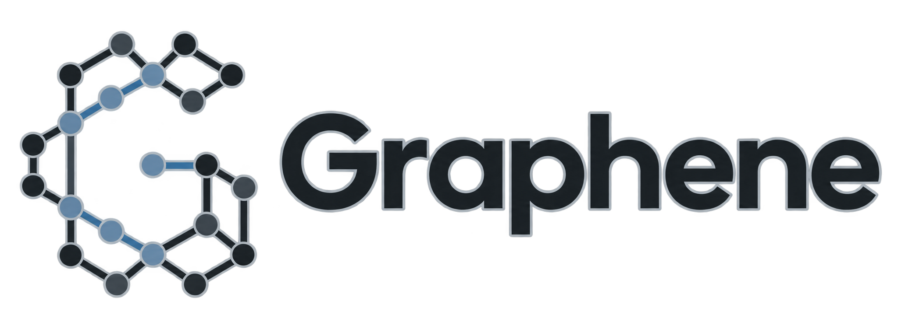

<p align="center">
  
</p>

# Graphene Taskmaster

[](https://github.com/Alex-lop/Graphene/actions/workflows/ci.yml)

Graphene is a local-first mission control for bounded multi-agent coding work. Give it one engineering outcome; it validates a dependency-aware work graph, dispatches only policy-allowed isolated work, adapts to bounded failures, assembles accepted artifacts, verifies the result, and creates an isolated local commit only after explicit approval.

**[What the latest implementation changed](docs/IMPLEMENTATION_REPORT.md)** · [Product](docs/PRODUCT.md) · [Architecture](docs/ARCHITECTURE.md) · [Documentation index](docs/README.md)

## See Mission Control in 30–60 seconds

```bash
uv sync --frozen
uv run --frozen graphene mission replay taskmaster
```

> **VERIFIED MISSION REPLAY — GENERATED SCRIPTED FIXTURE; NO LIVE AGENT, HUMAN ATTESTATION, NEW TEST EXECUTION, GEMINI, OR CLOUD**

The checked-in replay is SHA-256 verified, opens at checkpoint zero, and pauses at the fixture's pending final-candidate checkpoint. **Continue with recorded simulated approval** depicts a fixture branch with `human_attestation=false`; it runs nothing new and is not V2 bundle proof. No screenshot or GIF is presented because the in-app capture surface was unavailable. See [`demo-capture.json`](docs/assets/demo-capture.json).

## Live Gemini — proven on one mission, labelled exactly

```bash
uv run --frozen graphene mission demo

uv run --frozen graphene mission start \
  --repo PATH \
  --goal GOAL \
  --success-criterion CRITERION \
  --driver gemini-adk
```

The credential-gated path requests `gemini-3.5-flash`, proposes a typed DAG, and runs two to five bounded ADK workers after exact plan approval. Credential-free tests exercise the same orchestration with deterministic fake models, isolated workspaces, concurrent siblings, trusted checks, accepted-only fan-in, exact verification, and an unchanged source checkout.

On 2026-08-23 the North Star mission ran live against the `demo/north_star` target through Vertex AI (location `global`; `us-central1` does not serve this model for the project): two workers, three work attempts, assembly, exact verification, a registered `FinalResultBundleV2`, a bundle-bound approval, and an isolated local result commit — with every worker call bound into evidence as a sanitized provider receipt and the two renderer calls overlapping for 25–28 s on three independent bases. **What that run does not prove:** approvals were operator-delegated (`truth_kind: server_derived`) under a recorded standing instruction, not TTY-attested; the live failure laboratory and the cold capsule verification are separate claims. Every identifier, digest, and count is in [`evidence/north_star/2026-08-23-north-star-live.md`](evidence/north_star/2026-08-23-north-star-live.md); missing credentials still fail closed with no silent fallback. See [`docs/NORTH_STAR_RUNBOOK.md`](docs/NORTH_STAR_RUNBOOK.md) for the live-contact fixes this run required.

## Product loop

- Turn a goal, criteria, and deny-by-default `ProjectPolicy` into a validated immutable DAG.
- Dispatch only ready, non-conflicting tasks under owner-scoped leases and monotonic fences.
- Publish only independently measured, V2-enveloped artifacts; assemble and verify the exact tree.
- Pause on an immutable pre-decision bundle ID; rejection creates no commit, while approval creates only an isolated local result.

```text
goal + policy -> proposal -> deterministic validation -> durable mission store
                                                        |
                        Mission Control <- committed projection
                                                        |
              fenced work -> accepted artifacts -> assembly -> verification
                                                                  |
                                           reject OR isolated local result
```

The durable DAG is execution authority. Mission Control is a projection; authenticated commands delegate to the same canonical store.

## Proof and support

| Path | Status | What it establishes |
|---|---|---|
| `graphene mission replay taskmaster` | `VERIFIED_LOCAL` | Hash-checked fixture projection, replay, and UI semantics; not live execution |
| `scripted-local` mission | `VERIFIED_LOCAL` on macOS | Durable scheduler, overlapping fixture workers, retry, V2 publication fan-in, exact verification, bundle-bound decision, isolated result |
| Credential-free core | `VERIFIED_LOCAL` | SQLite authority/tamper checks, ownership/fencing, workspace audit, fake-ADK runtime, Mission Control commands, bounded 50-task/five-worker soak |
| Official Firestore emulator | `VERIFIED_LOCAL` | Production create/approve/readiness/claim/heartbeat/completion and sharded materialization/reconcile path |
| Live Gemini | `VERIFIED_LIVE` (2026-08-23) | Two `gemini-3.5-flash` workers on Vertex AI (`global`) completed the North Star mission `mission_start_5291caad50a8ee7a222a9221`: evidence-bound provider receipts, overlap on the store clock, the runtime call window, and the provider's own clock, exact verification, bundle-bound approval, isolated local result. Approval was operator-delegated (`server_derived`), not human-attested. [Evidence](evidence/north_star/2026-08-23-north-star-live.md) |
| Docker executor | `NOT PROVEN` | Requires a responsive-daemon smoke |
| Cloud Run + real Firestore | `NOT DEPLOYED — NOT PROVEN` | Packaging/emulator proof is not authenticated deployment proof |
| Benchmark/video/media | `NOT PROVEN` | Harness/runbook/capture metadata exist; results and media do not |
| Shadow Agent, ndjson path | `VERIFIED_LOCAL` on a synthetic fixture | Canonical events, isolated store, fail-closed adapter, reconstruction, six lint rules, self-verifying capsule |
| Shadow Agent, real Claude Code session | `NOT PROVEN` | Requires a real transcript; the claude-code adapter is not implemented and fails closed |
| Mission capsule | `VERIFIED_LIVE_COLD` (2026-08-23) | Capsules of the completed live mission and the live failure-lab mission verify from a fresh clone with no mission store (11 checks each); not producer authenticity, same laptop |
| North Star | `PARTIALLY VERIFIED_LIVE` | Two real workers and the `why` chains: proven live. Surviving a worker's death: proven live up to the accepted fenced retry (`mission_start_38129f17add65609de1c3388`: registry-identified SIGKILL, `-9` receipt, sibling untouched, retry under fence 2 accepted, `why` names the killed attempt); completion *after* that recovery `NOT PROVEN` live — rehearsal only. [Evidence](evidence/north_star/2026-08-23-north-star-live.md) |

Machine-readable truth lives in [`contracts/product_proof.json`](contracts/product_proof.json).

## Shadow Agent

> **"Your agent said the tests passed. Graphene knows whether they actually ran."**

Code review for agent sessions Graphene did not run. Point it at a finished transcript: Graphene reconstructs the session as inferred segments with a read-after-write graph, lints it for claims without checks, edits without checks, overlapping writes, scope drift, unverified deletes, and network or install activity, and exports a redacted capsule that verifies from its own bytes.

```bash
graphene shadow ingest PATH --format ndjson [--repo PATH]   # -> shadow_id
graphene shadow report SHADOW_ID [--json]
graphene shadow lint   SHADOW_ID [--rule RULE ...] [--json]
graphene shadow graph  SHADOW_ID --json|--dot
graphene shadow export SHADOW_ID --output DIR               # -> SHADOW_ID.graphene-shadow capsule
```

`graphene shadow list` and `graphene shadow verify SHADOW_ID` enumerate and re-verify stored sessions. Shadow data lives in its own `shadow.sqlite3` with its own schema ledger: `graphene shadow` never opens the mission store, and nothing in the mission trust chain ever cites a shadow record. Every reconstruction is labeled `inferred`, and there is no trust score. See [Shadow Agent](docs/SHADOW.md) and the [adapter specification](docs/SHADOW_ADAPTER_SPEC.md).

Shadow Agent v0: credential-free tests pass on the synthetic ndjson fixture; the claude-code adapter is NOT PROVEN until it is built against a real transcript.

## Safety boundary

- `graphene init` writes a narrow policy template; review every scope and exact argv-form command.
- A Git worktree provides edit isolation. **It is not a security sandbox.** Unsupported execution fails closed.
- Workers have no arbitrary shell, installer, ambient credential, user-checkout mount, or autonomous push/PR/merge/deploy path.
- Public state excludes raw prompts, source, diffs, command arguments/output, environment variables, secrets, and chain-of-thought.
- Skills are not resource-isolation units. Stateless MCP is sessionless, not processless.
- Cancellation targets only strongly identified Graphene-owned processes; unreceipted external effects become `outcome_unknown`, never silently repeated.

See [Security and sovereignty](docs/SECURITY_AND_SOVEREIGNTY.md) and the [Taskmaster product contract](docs/TASKMASTER_PRODUCT_CONTRACT.md).

## Scripted fixture and final result

The executable fixture requires macOS, Python 3.13, Git, `uv`, and `/usr/bin/sandbox-exec`.

> **SCRIPTED LOCAL MISSION FIXTURE — NOT GEMINI, ARBITRARY-REPOSITORY, OR CLOUD PROOF**

```bash
uv run --frozen graphene init --repo /path/to/disposable-repo
uv run --frozen graphene mission start --repo /path/to/disposable-repo \
  --goal "Add redacted JSON and Markdown status reports." --driver scripted-local
uv run --frozen graphene mission approve-plan MISSION_ID --revision 1
```

The default scripted start commits a validated proposal. An interactive TTY may attest approval; `--auto-approve` is always `simulated_fixture`. Execution stops at `awaiting_result` after registering a canonical pending `FinalResultBundleV2`.

Use `graphene mission result show MISSION_ID` to verify the candidate. Use `graphene mission approve-result MISSION_ID --bundle-id FINAL_RESULT_ID` or `graphene mission reject-result MISSION_ID --bundle-id FINAL_RESULT_ID`; both bind the exact bundle. `graphene mission result export ...` and `graphene bundle create/verify` write only create-new mode-`0600` review artifacts and never mutate the checkout. `graphene mission capsule export MISSION_ID --output DIR` writes a private `MISSION_ID.graphene-capsule` directory holding the hash-chained mission events, every attempt's evidence chain, trusted check and sanitized worker receipts, publication envelope digests, plan revisions, and the registered final bundle, with no prompts, source bytes, diffs, or command output, and `graphene mission capsule verify CAPSULE_DIR` recomputes every digest and chain link from those files alone without opening the mission store.

## Command map

Taskmaster entrypoints: `graphene init`, `graphene doctor`, `graphene plan`, `graphene status`, `graphene bundle`, `graphene cancel`, `graphene mission`, `graphene request-replan`, `graphene retry`, `graphene run`, `graphene task`, `graphene watch`, `graphene why`. The compatibility-only Auth tour commands remain: `graphene inspect`, `graphene replay`, `graphene review`, `graphene feedback`, `graphene answer`, `graphene memory`, `graphene handoff`, `graphene promote`, `graphene demo`.

```bash
graphene plan GOAL --repo PATH --success-criterion CRITERION
graphene plan show MISSION_ID
graphene plan diff MISSION_ID PREVIOUS_REVISION REVISION
graphene plan lint MISSION_ID
graphene run MISSION_ID
graphene task input MISSION_ID TASK_ID --gate GATE_ID --file INPUT_FILE
graphene bundle verify FINAL_RESULT_ID
```

Mission commands: `graphene mission start`, `graphene mission status`, `graphene mission watch`, `graphene mission open`, `graphene mission pause`, `graphene mission resume`, `graphene mission cancel`, `graphene mission retry`, `graphene mission request-replan`, `graphene mission approve-plan`, `graphene mission decide-gate`, `graphene mission approve-result`, `graphene mission reject-result`, `graphene mission result`, `graphene mission capsule`, `graphene mission db`, `graphene mission replay`, `graphene mission demo`, and `graphene mission executor`.

`graphene plan show/diff` reads verified revisions; `request-replan` pauses dispatch but generates no linked replacement revision. `graphene task input` accepts 1–4096 private UTF-8 bytes from a regular file or stdin and commits only their evidence reference. The browser-input seam is tested but hidden in one-command live mode because no safe staged-input cleanup API is wired. Automatic expiry and purge are not implemented. Current mission-plan validation rejects `legacy_auth_v2`. Cloud streaming uses per-client polling; there is no shared listener or fan-out.

The outbound surface is `graphene mission executor connect --repo PATH --mission MISSION_ID --coordinator-url URL --audience AUDIENCE --workers 2`. It touches local workspaces; Cloud Run does not.

## Documentation

[Product](docs/PRODUCT.md) · [Architecture](docs/ARCHITECTURE.md) · [Agent runtime](docs/AGENT_RUNTIME.md) · [Security](docs/SECURITY_AND_SOVEREIGNTY.md) · [Firestore/cloud](docs/FIRESTORE_AND_CLOUD.md) · [Alex cloud setup](docs/ALEX_CLOUD_SETUP.md) · [Mission Control](docs/MISSION_CONTROL.md) · [Demo guide](docs/DEMO_GUIDE.md) · [Known limitations](docs/KNOWN_LIMITATIONS.md) · [Development](docs/DEVELOPMENT.md)

CI lives in [`.github/workflows/ci.yml`](.github/workflows/ci.yml). Final commands, counts, skips, and proof distinctions live in the [implementation report](docs/IMPLEMENTATION_REPORT.md).
