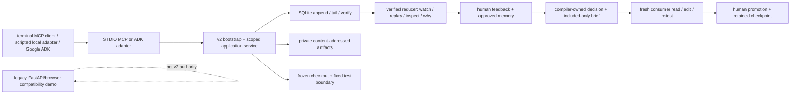

<p align="center">
  
</p>

# Graphene

Graphene is a terminal-first lineage layer that commits evidence for scoped coding-agent operations, lets a human approve a reusable lesson, and gives a fresh agent only the authorized briefing it needs.

## Current status

This implementation snapshot was verified on **2026-08-13** from uncommitted work based on `7d19fdbd5084ad106ab5208a02504ebea89752cc` (`main`, `origin/main`). The exact changed-file hashes and commands are recorded in [`evidence/claim_ledger.json`](evidence/claim_ledger.json) and the latest [`evidence/checkpoints`](evidence/checkpoints).

| Level | Status |
|---|---|
| Local deterministic process | Working on macOS: v2 bootstrap, live watch, official STDIO MCP, human correction/memory, Billing denial, fresh Auth consumer, evidence explanation, fixed retest, checkpointed promotion, restart/replay |
| Google ADK | Installed ADK 2.5.0 is covered with a real `Runner` and fake LLM; this is component proof, not Gemini proof |
| Firestore | Transactional adapter parity is covered against an adversarial local fake; private artifacts are not cloud-durable |
| Real Gemini / Firestore / Cloud Run | Externally blocked: no project credentials, deployment authority, or spend authorization was used |
| Linux / Docker fixed tests | Unsupported and fail closed because the safe executor currently requires macOS `sandbox-exec` |
| Hosted commit | Not implemented; promotion records a local evidence receipt, not a pushed commit |

The legacy FastAPI/browser demo is frozen compatibility code with its own legacy store. It is not the v2 authority and is excluded from the terminal quickstart and proof claims below.

## The 30-second flow

```text
scoped operation -> committed event -> private exact evidence
                 -> human correction -> approved scoped memory
                 -> included-only brief -> fresh consumer rereads source
                 -> bounded edit + fixed retest -> human promotion + retained checkpoint
```

The graph and `why` output are deterministic explanations over verified references. They do not infer causality, correctness, impact, or activity outside Graphene.

## Capture boundary

Graphene observes only operations routed through its six scoped MCP/ADK/common-service tools. It is not a shell recorder, filesystem watcher, editor plugin, or whole-repository crawler. Arbitrary shell commands, package installation, network tools, and unrestricted repositories are outside this MVP.

## Clean local quickstart

Requirements: macOS with executable `/usr/bin/sandbox-exec`, Python 3.13, `uv` 0.11.29 or compatible, and Git. Use only the frozen sanitized fixture in this repository.

```bash
uv sync --frozen

graphene_tmp="$(cd "${TMPDIR:-/tmp}" && pwd -P)"
graphene_runtime="$(mktemp -d "$graphene_tmp/graphene.XXXXXX")"
graphene_runtime="$(cd "$graphene_runtime" && pwd -P)"
chmod 700 "$graphene_runtime"
export GRAPHENE_LINEAGE_DB="$graphene_runtime/lineage.sqlite3"

created="$(uv run graphene --json run baseline_max_attempts --profile platform-maintainer@1)"
printf '%s\n' "$created"
graphene_run_id="$(printf '%s' "$created" | uv run python -c 'import json,sys; print(json.load(sys.stdin)["run_id"])')"
```

In a second terminal, export the same absolute `GRAPHENE_LINEAGE_DB` and start the live verified tail:

```bash
uv run graphene --json watch "$graphene_run_id"
```

In a third terminal, attach the official STDIO MCP server to that bootstrap identity:

```bash
uv run graphene-mcp --task baseline_max_attempts --profile platform-maintainer@1
```

The server writes protocol frames only to stdout and fixed diagnostics to stderr. An active `watch` acknowledges each flushed committed result before MCP returns that accepted result. Without a watcher, commit-before-response still holds.

See the redacted [terminal transcript](docs/demo_transcript.md) and its executable process proof in [`tests/process/test_mcp_stdio.py`](tests/process/test_mcp_stdio.py).

## CLI

Set `GRAPHENE_LINEAGE_DB` to the absolute private database path for every command. `--json` emits canonical JSON/NDJSON on stdout; handled diagnostics go to stderr. `NO_COLOR=1` disables human-mode color. Success is exit `0`, invalid configuration/workflow/evidence is exit `1`, argument errors are exit `2`, and interrupted `watch`/MCP is exit `130`.

| Command | Behavior |
|---|---|
| `graphene run TASK --profile PROFILE` | Create or exactly replay the frozen local v2 bootstrap |
| `graphene watch RUN [--after-seq N] [--snapshot]` | Follow verified committed events, or read one finite snapshot |
| `graphene replay RUN --speed N` | Inert verified replay paced by committed timestamp deltas; delay is capped at one second |
| `graphene review RUN` | Derive exact changeset, hunks, and fixed-test receipt from observed work |
| `graphene feedback HUNK --event EVENT --run RUN --message TEXT` | Store a private correction and ask the frozen clarification |
| `graphene answer QUESTION --choice all_auth|rate_limiter_only` | Record the human scope answer and materialize exact feedback/memory proposal |
| `graphene memory approve|reject MEMORY` | Bind the human decision to the immutable proposed revision |
| `graphene handoff RUN --to PROFILE --task TASK [--start]` | Compile a storage-derived decision/brief; Billing denies without runtime, Auth may create a fresh consumer |
| `graphene inspect EVIDENCE --run RUN` | Resolve only evidence authorized by that verified run |
| `graphene why PATH --run RUN` | Traverse explicit source/consumer evidence relations and report unknowns/omissions |
| `graphene promote CONSUMER_RUN` | Reconstruct, rerun the frozen test, retain a checkpoint, then append final promotion; exact retry replays |

`watch` ends on `ACCESS_DENIED`, `NEEDS_HUMAN`, `FAILED`, `INTERRUPTED`, or `PROMOTED`. It fails visibly if the database identity or verified prefix changes.

## MCP setup

`graphene-mcp` exposes exactly these closed schemas:

1. `search_repo(query)`
2. `read_file(path)`
3. `open_evidence(evidence_id)`
4. `write_file(path, content)`
5. `run_fixed_test()`
6. `request_completion()`

The installed official Python MCP `ClientSession` over OS STDIO is the verified client. A generic MCP-client entry for an initial task looks like this; replace every path with an absolute path. The same template is checked in as [`docs/mcp_client_config.example.json`](docs/mcp_client_config.example.json).

```json
{
  "mcpServers": {
    "graphene": {
      "command": "/absolute/path/to/Graphene/.venv/bin/graphene-mcp",
      "args": ["--task", "baseline_max_attempts", "--profile", "platform-maintainer@1"],
      "env": {"GRAPHENE_LINEAGE_DB": "/absolute/private/runtime/lineage.sqlite3"}
    }
  }
}
```

After `handoff --start`, attach a genuinely fresh terminal-agent process with `graphene-mcp --run CONSUMER_RUN_ID`. The server reconstructs the committed brief, prompt hash, checkout, scopes, evidence allowlist, and terminal state; clients cannot submit those authority fields. A clean EOF with uncertain invocation state commits interruption and quarantines that checkout.

## v2 architecture



SQLite is the authoritative local lineage spine. Exact file, hunk, test, feedback, memory, brief, and receipt bytes live in a private content-addressed table; public events contain bounded metadata, references, and digest chains. Firestore is currently a metadata adapter, not a complete cloud composition root.

## Evidence matrix

| Claim | Level | Local state | Evidence |
|---|---|---|---|
| append/verify and restart-stable projection | COMPONENT / PROCESS | green | `lineage-local-ordering`, `deterministic-projection-replay` |
| live display before accepted MCP result | PROCESS | green | `live-tail-before-run-end`, `mcp-stdio-process` |
| exact feedback, approved memory, Billing denial, fresh brief | PROCESS | green | `complete-cli-control-loop`, `compiler-owned-candidate-completeness`, `billing-zero-runtime-dispatch` |
| fresh consumer reread and version-bound write | PROCESS | green | `fresh-agent-process-reread` |
| evidence-backed `why` and authorized `inspect` | PROCESS | green | `evidence-backed-why` |
| local checkpointed promotion receipt | PROCESS | green | `temporary-promotion-receipt` |
| ADK Runner with fake LLM | COMPONENT | green | `adk-runner-fake-llm` |
| real Gemini / Firestore cold restart / Cloud Run | REAL_MODEL / REAL_CLOUD | externally blocked | `real-gemini`, `real-firestore-cold-restart`, `cloud-run-full-loop` |
| Linux/container fixed-test executor | PROCESS | not implemented | `linux-container-executor` |

Machine-readable definitions, commands, negative cases, and file hashes are in [`evidence/claim_ledger.json`](evidence/claim_ledger.json). `LOCAL_GREEN` never means real model or real cloud.

## Security, privacy, and trust

- The supported boundary is an honest dedicated macOS account and the frozen sanitized Auth fixture—not arbitrary confidential repositories or hostile administrators.
- Runtime directories must be owner-private `0700`; the database is verified as a regular owner-only `0600` file. Symlinks, path escapes, unexpected checkout bytes, stale reads, blind writes, and terminal-state calls fail closed.
- Public events exclude source, diffs, prompts, model output, and test stdout. Authorized tool results may return bounded private bytes to the active client/model. See [`docs/data_residency.md`](docs/data_residency.md).
- Hostile model-written pytest runs in a minimal file view with stdin, network, fork, raw process/sysctl, and ambient checkout reads denied on macOS. See [`docs/EXECUTOR_THREAT_MODEL.md`](docs/EXECUTOR_THREAT_MODEL.md).
- Graphene stores no chain-of-thought and does not infer it. Provider credentials and provider-side retention remain outside this repository.
- The legacy HTTP demo requires `Authorization: Bearer <GRAPHENE_DEMO_TOKEN>` on every route except `/healthz`. It is one shared demo credential, not RBAC; it has no expiry, rotation, per-user roles, or rate limiting.

## Explicit limitations

| Limitation | Impact | Current workaround | Next gate |
|---|---|---|---|
| Scoped capture only | Shell/editor actions outside six tools are invisible | Route the fixture agent through MCP/ADK | Native integration with the same service contract |
| Frozen sanitized fixture only | No arbitrary/private repository safety claim | Use `demo/fixture` and frozen tasks/profiles | Separate threat model and isolation proof |
| macOS executor only | Linux/Docker cannot complete the fixed-test workflow | Unsupported hosts fail closed | Implement and attack a Linux isolation boundary |
| Local artifacts only | Firestore cannot independently verify private evidence after cold restart | Use the private SQLite composition root | Durable, privacy-reviewed cloud artifact ledger |
| No real model/cloud proof | Fake LLM and fake Firestore cannot establish Gemini/Cloud behavior | Deterministic local process path | Explicit credentials, project, spend, and deploy authorization |
| Local promotion receipt | No durable or hosted Git commit is created | Treat `PROMOTED` as an evidence/checkpoint state | Authorized commit/push workflow if desired |
| Evidence graph semantics | Relations mean observed/bound references, not causal importance or coverage | `why` reports unknowns and omission counts | Human comprehension study; add only explicit evidence edges |
| No TTL/GC/delete API | Local artifacts, checkouts, quarantine, and orphan rows persist | Operator removes the private runtime directory | Reviewed retention and reachability collector |
| Legacy browser is separate | Its old mutations are not v2 evidence | Use terminal v2 path for all claims | Read-only v2 viewer or removal |

## Developer gates

```bash
uv lock --check
uv sync --frozen
uv run --frozen pytest -q tests/unit tests/integration tests/process tests/adversarial
uv run --frozen pytest -q tests/process/test_mcp_stdio.py
uv run --frozen graphene --help
node --test frontend/test/*.test.mjs
node --check frontend/src/app.mjs frontend/src/graph.mjs frontend/src/workflow.mjs
git diff --check
```

| Platform | Gate | Meaning |
|---|---|---|
| macOS 15 CI / local macOS | complete Python and MCP process suites | Supported sanitized-fixture executor path |
| Ubuntu 24.04 CI | explicit fixed-test fail-closed regressions | Negative portability proof only |
| Node 22 CI | dependency-free frontend tests/syntax | Legacy browser logic only; no v2 authority claim |

The workflow is in [`.github/workflows/ci.yml`](.github/workflows/ci.yml). It has not yet run on GitHub-hosted runners, uses read-only repository permission, and has no credential, model, cloud, or deploy step.

## Roadmap and non-goals

Highest-value next gates are a safe Linux executor, durable cloud artifacts plus authorized Firestore cold restart, one authorized Gemini receipt, and a small human-comprehension exercise. A hosted commit remains opt-in and requires explicit repository authority.

Non-goals for this MVP: graph database, embeddings, whole-repository crawling, arbitrary shell/network/package tools, WebSockets/fullscreen TUI, autonomous push/deploy, multi-model orchestration, inference of unseen work, and broad browser rewriting.
