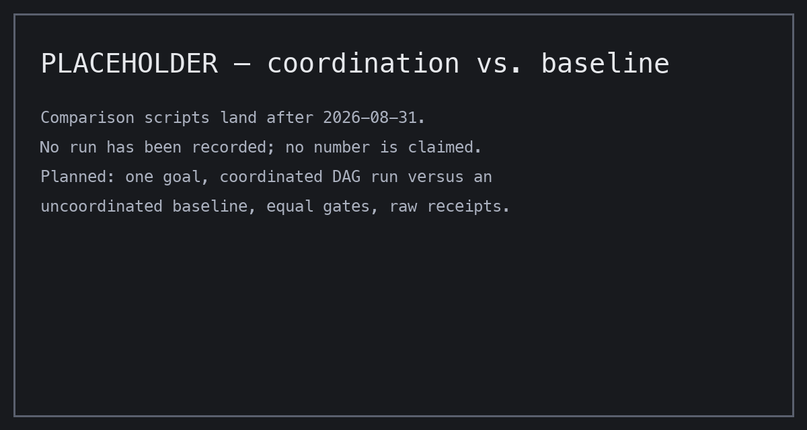
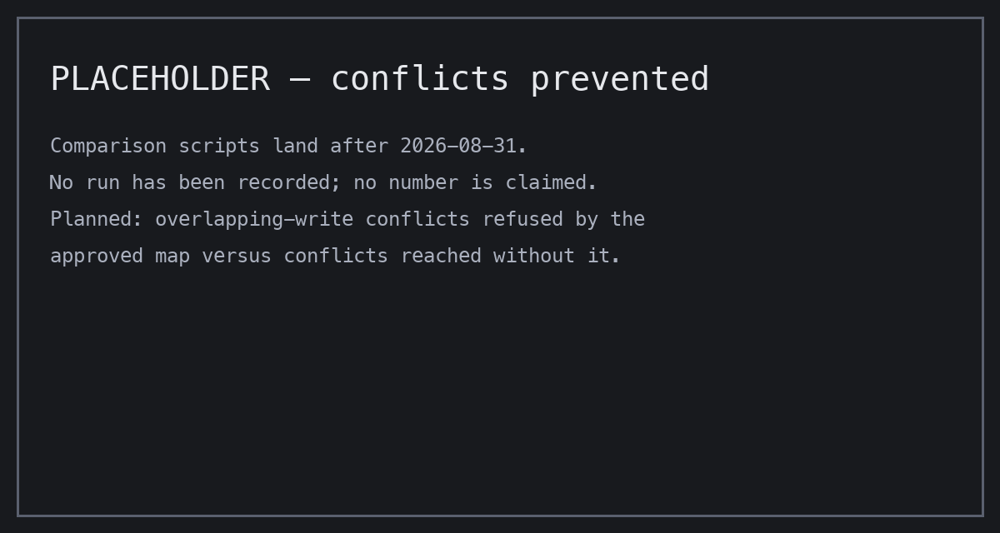
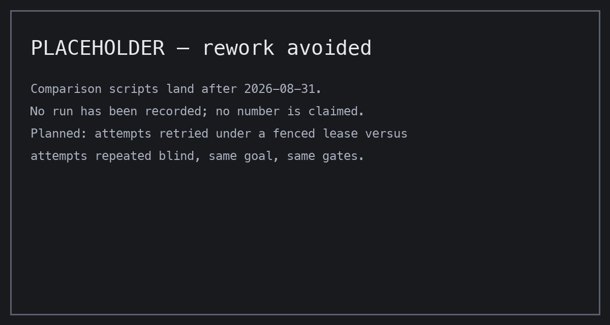

<p align="center">
  
</p>

# Graphene

**Draw the route. Sign the map. Watch your agents keep to it.**

[](https://github.com/Alex-lop/Graphene/actions/workflows/ci.yml)

## What Graphene does

Graphene is a terminal-native workflow control plane for coding agents: a coordination-and-provenance layer, not an agent and not a harness. You give it a goal. It compiles the goal into a small typed graph of broad nodes, each with its own scope, checks, and budget. You read the map, reshape it if you want, and sign one exact revision; nothing runs until you do. Your connected agent then works only inside that map, and you watch it move node by node in your terminal. When it finishes you get a what-was-done summary, and `graphene why` answers what happened to any file with the lineage that produced it. The map is the contract, and your signature is what makes it binding.

## Quickstart (30 seconds, no credentials)

```bash
git clone https://github.com/Alex-lop/Graphene.git && cd Graphene
uv sync --frozen
uv run --frozen graphene mission replay taskmaster
```

That replays a checked-in, SHA-256-verified mission in Mission Control. Nothing runs live and nothing needs a key. Verified cold on 2026-08-26 in a fresh `python:3.13-slim` container; see [`docs/PROOF.md`](docs/PROOF.md) for the timing.

## Connect your agent

The server is `graphene-mcp` over stdio. Each block below was checked against that tool's official docs on 2026-08-26; the label says how far each path is proven.

**Claude Code** — *the server is protocol-tested in CI with the official MCP client; this bare launch form, the committed `.mcp.json`, and the `goal` prompt land 2026-08-28. Until then the server needs the lineage-database arguments in [`docs/mcp_client_config.example.json`](docs/mcp_client_config.example.json).*

```bash
claude mcp add --scope project graphene -- uv run --directory /path/to/Graphene --frozen graphene-mcp
```

A project-scope `.mcp.json` will ship in this clone, so Claude Code offers the server as soon as you open the directory and asks you to approve it once. Graphene's prompts then appear as `/mcp__graphene__<prompt>`.

**Codex CLI** — *documented against the current docs, not yet tested here; same 2026-08-28 date.* In `~/.codex/config.toml` (or `codex mcp add graphene -- uv run --directory /path/to/Graphene --frozen graphene-mcp`):

```toml
[mcp_servers.graphene]
command = "uv"
args = ["run", "--directory", "/path/to/Graphene", "--frozen", "graphene-mcp"]
```

**Gemini CLI** — *documented against the current docs, not yet tested here; same date.* In `~/.gemini/settings.json`, then a command file so `/graphene <goal>` works:

```json
{ "mcpServers": { "graphene": { "command": "uv",
    "args": ["run", "--directory", "/path/to/Graphene", "--frozen", "graphene-mcp"] } } }
```

```toml
# ~/.gemini/commands/graphene.toml
description = "Run the Graphene loop toward a goal."
prompt = "Run the Graphene loop toward this goal: {{args}}"
```

## The terminal view

`graphene ui` draws the signed map in your terminal — every node, its state, and the digest you approved in the banner — and follows the mission live, read-only, as agents move through it; select a node for its attempts, checks, receipts, and lineage, or press `s` for the what-was-done summary. Try it without credentials: `uv run --frozen graphene ui --replay taskmaster`.


## How it compares

Comparison scripts land after 2026-08-31. Until they produce equal-gate data there is no leaderboard here, no token-efficiency claim, and no speed or cost comparison — the harness and its written deferral are in [`benchmarks/`](benchmarks/DEFERRAL.md). The frames below are placeholders that name the planned comparison and nothing else.





## Proven vs. not

| Path | Status | In one line |
|---|---|---|
| Verified mission replay | `VERIFIED_LOCAL` | Hash-checked fixture; the quickstart above. Runs nothing new |
| Scripted local mission | `VERIFIED_LOCAL` on macOS | Real scheduler, fixture workers, retry, exact verification, isolated result |
| Live Gemini workers | `VERIFIED_LIVE` 2026-08-23 | Two `gemini-3.5-flash` workers finished a mission with evidence-bound receipts; approvals were operator-delegated, not human-attested; missing credentials fail closed with no silent fallback |
| Terminal UI (`graphene ui`) | `VERIFIED_LOCAL` 2026-08-26 | Replay and a scripted-local mission on macOS, read-only, snapshot-tested; not a live model mission, not filmed |
| Docker executor · Cloud Run · benchmark · film | `NOT PROVEN` / `NOT DEPLOYED` | Nothing filmed, nothing deployed, no comparison measured |

The full table, every identifier, and what each row does not prove: [`docs/PROOF.md`](docs/PROOF.md). Machine-readable truth: [`contracts/product_proof.json`](contracts/product_proof.json).

## Platform and links

macOS is where the live paths are proven (the scripted fixture needs `/usr/bin/sandbox-exec`). On Linux, CI proves the replay; `plan`, `why`, and capsule verification are the same pure-Python code but are not run there separately.

[Command map](docs/COMMANDS.md) · [Documentation index](docs/README.md) · [Session reports](docs/reports/README.md) · [Known limitations](docs/KNOWN_LIMITATIONS.md) · [License](LICENSE)
