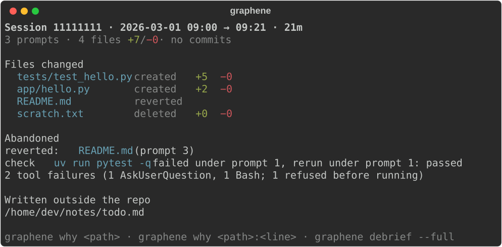
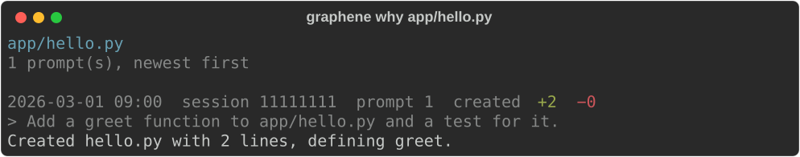
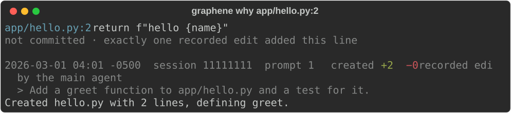

# Graphene


Why did my coding agent change this line? Graphene answers that from Claude Code's own records,
across sessions, and prints a short card of what happened when you come back to a repo.

I run Claude Code on a repo, come back hours later or the next morning, and can't account for the
changes. The diff doesn't tell me which request produced which change, or what the agent tried and
then abandoned. Graphene does.



## Install

Today, from GitHub:

```
uv tool install git+https://github.com/Alex-lop/Graphene
```

Once the package is on PyPI (it is not yet, so this line fails today):

```
uv tool install graphene-map
```

Then, once per repo, inside it:

```
graphene init
```

This adds Graphene's hook to the repo's `.claude/settings.local.json` (yours, not the team's
`settings.json`; if an earlier version put it in `settings.json`, it is upgraded there). It is step
two, not an extra, for two reasons. Claude Code deletes transcripts after 30 days by default, and
a session the hook recorded stays in the store after its transcript is gone. And the hook sees
what a transcript may no longer hold by the time you look: the working directory of every call,
when each subagent started and stopped, and, when Claude Code records it, its own list of the files
a shell command changed. `init` also prints the one line only you can add to your own
`~/.claude/settings.json` to make Claude Code record that list in every session; without it a file
an agent writes through the shell traces to its commit at best. Without `init` Graphene still reads
the transcripts that exist.

## Use

Run Claude Code on the repo as you normally do. When you come back, inside the repo:

```
graphene
```

Graphene reads the transcripts Claude Code keeps for the repo (the first time takes a couple of
seconds; after that only what changed) and prints the card for the latest session that did
something, or for every such session that ended since the last time you ran it. In a repo where
Claude Code has not run yet it says so, and where it looked.

Every card carries a coverage line, and it is never one number:

```
12 committed files · 9 traced to a recorded write (6 edit, 3 shell) · 2 only to an agent's commit · 1 to nothing
```

Of the files the session's commits changed (every path, no exclusions): how many trace to a write
Claude Code recorded (an edit payload, or its list of what a shell command changed), how many only
to a commit an agent is recorded making, and how many to nothing at all. When a record is missing,
Graphene says so instead of staying quiet.

```
graphene ui
```

The map of a run in your browser, served to this machine only: agents as lanes (subagents and
Workflow groups under the agent that spawned them, each with the task it was given), the repo as
rows, commits and checks on the lane that ran them, and the files nothing accounts for drawn as
such. `graphene ui --export FILE` writes the same page as one file that opens offline; it carries
paths, counts, commit subjects, your prompts, each agent's task, what it was told and what it said
when it stopped, and no file contents, diffs or tool output. Read it before you send it.

```
graphene why src/app/auth.py
```

Which prompts changed this file, newest first, each with what it did to the file.



```
graphene why src/app/auth.py:42
```

Which prompt wrote this line.



`graphene why` also names the agent that made each change, the task it was given, and how the
change is known (a recorded edit, Claude Code's list of what a shell command changed, or the
recorded command itself). For a file that git shows changed during a session but no record
explains, it says that: "changed in 2 commits during session 9e5f295d; no recorded write". For a
file no session touched it names git's last commit of it, and for a path that does not exist it
says so.

When you want more: `graphene --json` is the structure behind the card and `graphene ui --json`
the graph behind the map. `graphene --since 6h` covers a window, `graphene --session ID` one
session, and `graphene sessions` lists what is recorded, with each session's coverage
(`graphene sessions --all` includes sessions that made no calls). Times are local, with the offset.

Changed in 0.2.0: the package is `graphene-map` (the command is still `graphene`). `--explain` and
`--model` are gone, so no model is called for anything; `--full`, `--md` and `--html` are gone, the
map replaces them; `graphene debrief [SESSION]` still works for scripts that call it, hidden from help.

## How it works

Graphene reads Claude Code's transcript files for the repo, or the events its hook recorded live,
and groups every tool call under the prompt whose turn it ran in. Claude Code's own payloads carry
the file before and after each edit, so the diff per prompt and file is computed directly; only a
file's first or last state in a session, when a shell command wrote it, is read from git.
"Abandoned" means files restored to their session-start content and checks that failed and were
rerun; the card also puts one line under it counting the tool calls that failed or were refused. No model is involved at any point. The heuristics and their failure modes are spelled out in
[docs/HOW_IT_WORKS.md](docs/HOW_IT_WORKS.md).

## What it doesn't do

- It does not run agents.
- It does not orchestrate anything.
- It does not push, commit, or touch your git history.
- It does not phone home: nothing leaves your machine, and it calls no model.

## Privacy

- The store is `.graphene/` inside the repo: local, created `0700`, and it ignores itself in git
  (a `.gitignore` inside it), so your own `.gitignore` is never edited. The only other file Graphene
  writes is `.claude/settings.local.json`, on `init`.
- Transcripts can contain secrets, so files outside the repo are recorded by path only: their content
  is dropped before it reaches the store.
- The store no longer keeps what it never used: the content a `Read` call returned is not stored,
  and any output or input string over 8 KB is kept as its first and last 4 KB.
- Delete `.graphene/` to forget everything. Graphene rebuilds what the transcripts still hold next
  time; a session only the hook recorded, whose transcript Claude Code has since deleted, is gone.

## Requirements

macOS or Linux, [uv](https://docs.astral.sh/uv/) to install it, Python 3.12 or later (uv fetches it if
needed), and Claude Code. Run it inside the repo you ran Claude Code in.

## Where this is going

This release is the record and the first map of it. Next the map goes live while a run is going,
then come rules a person sets on the map, enforced through the same hooks and landing in the same
record. Graphene never runs an agent and nothing on the map will edit an agent's plan. The reasons
are in [docs/PRODUCT_THESIS.md](docs/PRODUCT_THESIS.md).

## License

Apache-2.0.
