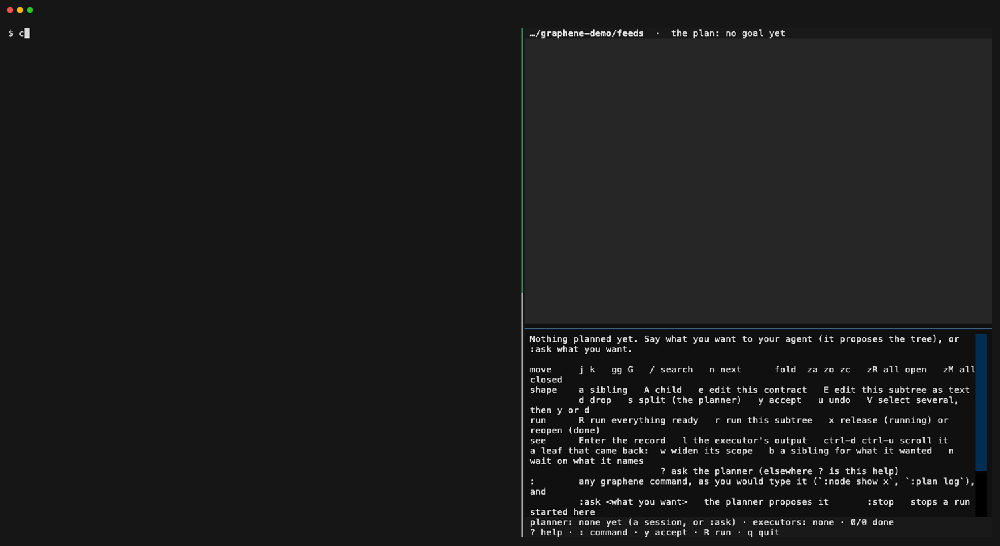

# Graphene


Paragraph in, tree out, prune, run.

You tell your coding agent what you want, the way you always have: a paragraph. Before it writes a
line of code it shows you what it understood, as a tree. The goal sits at the top, then the
pieces of work under it, each with the files it may change and the command that shows it is done.
You read that, cut what you did not mean, and press `R`. Agents do the leaves in parallel, each in a
worktree of its own. A leaf that finds it needs more than you gave it comes back with the fix
already written: one key to take it.

I let agents work on my repos for hours. However many tokens you give an agent, it still has to
guess what you meant, and I found out what it guessed from the diff at the end. Graphene is where I
see the guess before anything is spent, and correct it with a keystroke instead of a restart.
Agent work gets cheaper every few months. My attention does not.

Two kinds of agent are involved. The **planner** is the session you talk to (or `graphene ask`); it
proposes the tree and writes no code. The **executors** are what `graphene run` starts, one per leaf;
each is held to its leaf's files and its check.



## Graphene on Nemotron

The claim: **Graphene makes a cheap open model safe to hand real work.**

The chart that tests it goes here: the same paragraph and the same model, with the tree and without
it, measured in correctness, the person's attention and dollars. It comes from the evidence run,
which has not happened yet, so there is no number here.

Nemotron 3 Ultra plans the tree through Nebius Token Factory. Nemotron Nano does the leaves, each in
a Token Factory Sandbox forked from one checkpoint of your repository, and Super takes a second
attempt. The check, which Graphene runs itself, decides what lands.

So far this path has run only against a scripted stand-in for Token Factory and a Docker stand-in for
Sandboxes. [docs/HACKATHON.md](docs/HACKATHON.md) is the submission: how Graphene uses Token Factory,
Sandboxes and Nemotron, and how to test it.

## You are here

```
graphene                     where the work stands in this repository, and what waits on you
graphene watch               the tree on one screen: j k to move, y accept, d drop, R run, ? for the rest
graphene run --parallel 4    what is ready, at once, a worktree each, landed here as each passes
graphene node show <id>      why a leaf failed or came back, and what was really done for it
graphene plan edit           the whole plan as text, in your editor
```

Graphene works on the repository you are standing in, and every command that changes the plan
says which one.

## The first ten minutes

You need git and a repository with some work to do in it (one of your own). Install and set up the
repository once, on either of two paths. `graphene init` asks once which planner and which executor
this repository uses. It lists what it finds here (`claude` or `codex` on the PATH, a Token Factory
key), each with what it needs, and none comes first. `--with` names another for a single command.

### With the agent you have (no key)

Claude Code or Codex plans and executes, started as you, with your permissions:

```
uv tool install git+https://github.com/Alex-lop/Graphene
cd ~/src/your-repo
graphene init
```

### On Nemotron through Token Factory (a key)

```
uv tool install 'graphene-map[sandbox] @ git+https://github.com/Alex-lop/Graphene'
export NEBIUS_API_KEY=…            # tokenfactory.nebius.com; for Sandboxes, NEBIUS_PROJECT_ID too
cd ~/src/your-repo
graphene init
```

Nemotron 3 Ultra plans the tree. A Nemotron Nano does each leaf, and a Super takes over when Nano's
attempt is refused. Each leaf runs in a Token Factory Sandbox forked from the same checkpoint of
your repository (in a worktree of its own when Sandboxes are not set up), and the leaf's check
decides. Ask for what you want with `:ask` in `graphene watch` or `graphene ask "…"` at the shell.

### Then, on either path

With Claude Code as the planner, open two panes in WezTerm: your agent on the left, the plan on the
right (it reads best at 80 columns or more, so give the window room). In the pane you are in:

```
wezterm cli split-pane --right --percent 50 --cwd "$PWD" -- graphene watch
claude
```

(To have it on a key, add this to the `keys` in your `~/.wezterm.lua`:
`{ key = 'g', mods = 'CMD|SHIFT', action = wezterm.action.SplitPane { direction = 'Right', size = { Percent = 50 }, command = { args = { 'graphene', 'watch' } } } }`.)

Now say what you want, on the left, in a paragraph. On the 22nd I typed this about a small loader:

> Look at this repo. I want the new Northwind XML feed to load the same way csv and json already
> do: same load command, same JSONL out. Prices in that feed are already in cents. The summary line
> at the end is not a product. A price of 0 means skip it, for every supplier. Don't touch vendored
> or legacy files that aren't ours this week.

`graphene init` turned **plan first** on: whatever you ask for in the session is proposed before
any code, and the agent writes nothing until a leaf of it is accepted and taken. On the right, a
tree appears, every line marked `?`: a proposal. The agent also says what it could not settle. That
run flagged that the legacy importer skips the zero-price rule, which I had just told it not to
touch. That is a misunderstanding caught before any code, and exactly what the tree is for.

A one-line ask ("fix the typo in the header") costs nothing more: the agent proposes it as one leaf,
which is yours at once because you asked for it, takes it, and does it. The status line says whether
plan first is on; `P` turns it off and on (or `graphene plan first off`), and with it off what you
ask for is done at once and recorded as a leaf. Nothing reads your words to decide: not their
length, not "just do it".

Prune it on the right:

- `j` `k` move, `za` folds, `Enter` shows everything about a node. The goal is the first row.
- `d` drops a leaf you did not mean. `e` opens its contract in your editor. `E` opens a whole
  subtree as text. `a` adds a line, and `s` asks the planner to split a leaf.
- `y` accepts (on the goal, everything proposed). `V`, a few `j`, then `y` accepts several. On a
  leaf waiting for your sign-off, `y` signs it off.
- `R` runs everything that is ready.

Every row reads the same: what it is, its id, and one word for where it stands (proposed, ready,
waiting, running, came back, review, done, yours). The colour says whose move it is: cyan, the
agent's guess for you to prune; magenta, it waits on you; yellow, an executor is on it; green, done.

Leaves light up as executors take them. The node pane shows which executor, in which worktree, what
it did last and how many seconds ago; `l` shows its output. Each leaf lands on your branch as a merge
when its check passes and it touched nothing outside its files. If a leaf comes back, the node pane
says why and what it wanted outside its scope, and offers the fix:

```
came back: USAGE lives in cli/main.py (line 18), outside scope. Enabling xml in config makes
tests/test_contract.py fail until USAGE names xml, so the done check cannot pass without cli/main.py.
  w  widen wire-xml's scope to cli/main.py   graphene node widen wire-xml
  b  a sibling leaf for cli/main.py; wire-xml waits on it   graphene node sibling wire-xml
  ?  ask the planner, when none of these is right (an agent, which spends)
```

Press one of them, then `R` again. When it is all done, `git log --graph` reads as the tree: one
merge per leaf, with its why in the message.

Everything the keys do is a command you can type yourself; the bottom line of the screen says which
command each key just ran. Agents and scripts use the same commands. `graphene watch --once` prints
the plan instead of taking the screen.

## What works today

Each of these was run for real on the feeds task. The executors were Claude Code agents, not
tests of Graphene's own:

- **A paragraph becomes a tree before any code.** The paragraph above, typed into a Claude Code
  session in a fresh copy of that repository with the hooks installed: 35 seconds, four leaves under
  three sub-goals, `needs` set between them, and no file touched. Before Graphene asked for the tree
  at the prompt, the same paragraph got its code written straight away, in 48 seconds. (One run of
  each, 23 September.) With plan first as a setting and no rule about length, the same paragraph
  gave four leaves in 30 seconds, and a one-line ask before it was proposed as one leaf, accepted as
  mine, done and checked in 25 seconds, with nothing to press. (One run each, 24 September.)
- **The tree runs in parallel and lands.** Accepted as proposed, `graphene run --parallel 4` did all
  four leaves in 50 seconds, each a merge on the branch. The result passes 18 of the task's 20 hidden
  acceptance checks (the 2 it misses want something the paragraph never said) and 12 of its 12
  held-out checks, against 10 and 0 for the repository as it was. (One run.) The fair comparison is
  a plain paragraph to the same agent, and in the stand-in test of 23 September that also passed 20
  and 12, with less of the person's (modelled) time; a tree did not show a measured gain there
  (`docs/test/results-2026-09-23.md`).
- **`graphene ask "<what you want>"`** plans without a session. The planner has read-only tools and
  none of your MCP servers, and what it prints becomes the proposal. On the same paragraph: 44 seconds, seven nodes, first try.
- **Ctrl-C hands back what the run started**, in place and in worktrees, and stops its executors
  and their checks; a leaf that had already passed waits in review, and says so. A closed terminal
  does the same. The next run takes those leaves again.
- **Hand-backs offer their fix** (`w`, `b`, and waiting on the leaves the reason names).
- **The plan as text round-trips.** `graphene plan edit` applies what you changed and nothing else,
  in one transaction. A line it cannot read is refused by its number, with what to do. 54 adversarial
  agents tried to break it: what they found is fixed, and each finding has a test.

What it is not yet: the Nemotron planner and executor have run only against a scripted stand-in for
Token Factory and a Docker stand-in for Sandboxes, not against the services themselves (the tests in
`tests/test_executor.py` and `tests/test_escape.py` are that evidence). The hooks are for Claude Code
only (the plan, `run` and the worktrees work with any executor that has a shell); the page
(`graphene ui`) shows the tree and is otherwise as it was.
[docs/DIRECTION.md](docs/DIRECTION.md) has what was decided, why, and what comes next.

## What does not bind

A control you cannot trust is worse than none, so here is where each one ends. First, who is held
before a write, and how:

| Executor | Before the write | While it runs | At `done` |
| --- | --- | --- | --- |
| Nemotron, in a sandbox | its edit and write tools refuse a path outside the scope | its commands run as a user who can write only the scope; what a command makes outside it never comes back | Graphene's check, in a fork of the sandbox, and git |
| Nemotron, local | the same tools refuse | nothing: a command can write (and read) where your user can | the check, and git |
| Claude Code, with the hooks | the hook denies a write tool or a shell write it can read, outside the scope | nothing more | the check, and git |
| Codex, or any command | nothing | its own sandbox, if you give it one | the check, and git |
| You | nothing | nothing | the check, and git |

- In a sandbox, the user a Nemotron leaf runs as can create a file in any directory where its scope
  names a file. POSIX grants that per directory, not per name. Such a file never reaches your
  checkout: it is refused, logged, removed before the next command, and the check never sees it.

- With plan first on, the agent judges what is a tree and what is one leaf. One leaf it proposes
  after your prompt is accepted at once as yours, and the log says so ("by their prompt").
- Tools that write through an MCP server are seen neither by plan first nor by a leaf's scope: the
  hooks read Claude Code's own write tools and the shell. That includes a filesystem MCP server
  writing files in this repository; `done` asks git, so under a held leaf such a write is caught
  there, and with no leaf held nothing catches it.
- A shell command can write a file in a way nothing reads beforehand (a script that opens files
  itself). The hook refuses the forms it can parse (`>`, `>>`, `tee`, `sed -i`, `mv`, `cp`, `rm`).
  The rest is caught at `done`, by git; until then the stray change is on disk.
- A file made outside the scope and moved out of the repo before `done` is invisible to git. It is
  caught when it comes back, as a change no node owned, and the next node will not start over it.
- Claude Code lets a session end after about 8 refused stops in a row. The node then stays `running`
  on the plan, where you see it. `graphene run` has no such ceiling.
- A hook that crashes or times out lets the call through. That is the vendor's rule. The boundary
  does not depend on the hook.
- "Only a person" rests on the environment: an agent's shell carries its vendor's marks, and whoever
  carries none is taken for you. An agent that strips its marks, or one from a vendor that sets none,
  passes for a person; the log marks every act made with no terminal (except the commands you type
  in `graphene watch`, which it vouches for).
- A request typed into a session is taken as yours. An agent that starts another agent, a subagent
  included, writes its prompt; the log names every leaf made or accepted by a prompt. With plan
  first off, a leaf made from a one-line prompt with no `--scope` may touch anything (never the
  plan's store or the hooks' settings): it is a record, not a fence.
- A commit is the repository moving, and the plan follows it: only uncommitted changes that no leaf
  made count as loose. An agent that writes outside every leaf between leaves and commits it is not
  seen at the next start.
- What a leaf's check creates is not its executor's change (a `__pycache__` in a repository with no
  `.gitignore`): at `done`, new untracked files outside the scope are set aside while the check runs,
  and what the check makes again stays and is not counted. An untracked file of yours that the
  executor deleted outside its scope is not caught; a tracked one is.
- During `graphene run --parallel`, an uncommitted change in the checkout it merges into (yours, or
  a one-line ask your session did there) can keep a leaf from landing. It waits in review, its pane
  says which file is in the way, and `y` signs it off once you have merged its branch; nothing is
  lost.
- The plan's store is a file in your repo that git ignores. The hook refuses commands that name it;
  a script that opens it directly is neither stopped nor noticed.

## Install

```
uv tool install git+https://github.com/Alex-lop/Graphene
```

`[sandbox]` adds ConTree's SDK, which Token Factory Sandboxes need; without it, Nemotron leaves run in
worktrees on your machine. `uv tool install graphene-map` installs the last release on PyPI, 0.2.0,
which is the record only: no plan, no watch, no run. Then, once per repository, inside it, `graphene init`. That adds
Graphene's hook to `.claude/settings.local.json` (yours, not the team's `settings.json`) and keeps
the file out of `git add` through `.git/info/exclude`. The hook holds agents to the plan and keeps
the record; the agent waits about 40 ms for it on each tool call. Graphene never edits your own
`~/.claude/settings.json`.

## The record

`graphene node show <id>` prints a node's contract and then what was really done for it:
- who held it and when;
- what git says changed and whether that was inside its scope;
- what was refused;
- what Graphene's own run of the check said;
- the commits made while it was held.

Every line names the record it was read from. A count that nothing supports says `not computed`, and
why. `graphene ui` is the plan and that record as a page in your browser, served to this machine
only; how each number is computed is in [docs/HOW_IT_WORKS.md](docs/HOW_IT_WORKS.md).

## Privacy

- With Nemotron as planner or executor, Graphene sends Token Factory the prompts about your
  repository and the files the model reads, and in a sandbox it sends Sandboxes the leaf's checkout.
  The key is read from your environment at each call and written nowhere; a command the model runs,
  and every check, gets an environment without it. With Claude Code or Codex, Graphene itself sends
  nothing anywhere: `graphene run` and `graphene ask` start the executor or planner you name, with the
  permissions you give it.
- What a Nemotron leaf cost is Token Factory's own token count at its list price: in the leaf's
  record, on `graphene watch`'s status line, and on the run's last line.
- Graphene reads no Claude Code transcript. What it knows of a session is what its hooks recorded
  while the session ran, in `.graphene/`.
- The store is `.graphene/` inside the repo: local, created `0700`, and it ignores itself in git.
  Graphene never pushes. It commits and merges only in `graphene run --parallel`, on
  `graphene/<leaf>` branches of its own, merged into the checkout you started it from when the merge
  is clean.
- Delete `.graphene/` to forget everything, the plan included.

## Requirements

macOS or Linux, [uv](https://docs.astral.sh/uv/), Python 3.12 or later (uv fetches it), and git. The
screen (`graphene watch`) is [Textual](https://textual.textualize.io/) and works in any modern
terminal; it was checked in WezTerm at 80 columns. Nemotron needs a Token Factory key, and
Sandboxes the `sandbox` extra and a project with the beta; the Docker stand-in the tests use needs
Docker. The hooks are for Claude Code.

## License

Apache-2.0.
