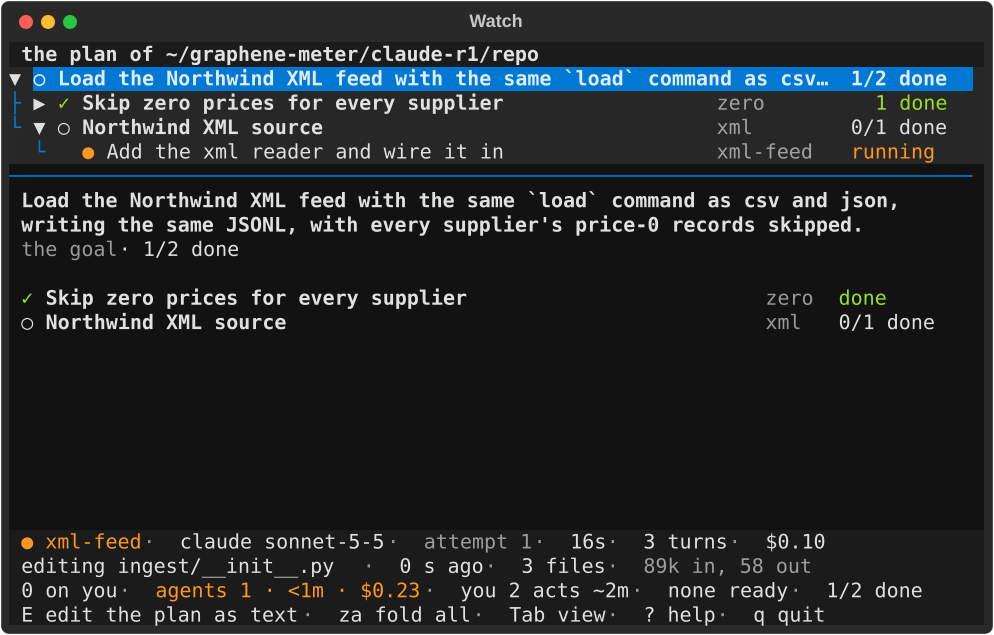

<div align="center">

<picture>
  <source media="(prefers-color-scheme: dark)" srcset="docs/assets/graphene-mark-ivory.svg" />
  
</picture>

# Graphene

See your coding agents' plan and change it before any code.

`uv tool install git+https://github.com/Alex-lop/Graphene`

<sub>then <code>graphene demo</code> to watch a recorded run, no API key needed</sub>

<br>


</div>

## Why I built this

What I believe is that whether it comes from new models, better harnesses or something off the LLM frame entirely, the limit on building software won't be tokens or cost. It'll be the human direction it takes to actually get the software out. I know that sounds a little wild. But no matter how many tokens you have, if you don't say which direction the application should go, the agent has to infer most of it, and you find out what it inferred in the diff, after the time and money are spent. Graphene tries to bridge that: the agent shows you what it understood, as a plan, and you shape it before anything runs.

## What it looks like

A real run from tonight on `feeds`, a small test repo I built: csv and json load, a new supplier's XML doesn't yet, and there are acceptance checks the agents never see. Claude Code (on Sonnet) planned and did the work. Trimmed where you see `…`:

```
$ graphene ask "Look at this repo. I want the new Northwind XML feed to load the same way csv and json …"
the planner says:
  I left these alone: vendor/, legacy/, normalize/money.py (its `to_major` is flagged as owned by a
  ticket), tests/test_contract.py (marked as not to be edited), and scripts/nightly.sh (stale, but it
  only runs csv).

$ graphene plan accept && graphene run --parallel 2
run: 2 done · agents <1 min, $0.3009 at list price · you 0 acts, 0 min

$ graphene plan --view tree
   Load the Northwind XML feed with the same `load` command as csv and json…
                       ┌───────────────┴───────────────┐
                    ✓ zero                           ✓ xml
          Skip zero prices for every…        Northwind XML source
                       │                               │
                  ✓ zero-rule                     ✓ xml-feed
        Reject price 0 in… $0.13 · <1m     Add the xml… $0.17 · <1m
2 sub-goals · 2 leaves

$ git log --graph --oneline
*   6944ab4 Add the xml reader and wire it in (xml-feed)
|\
| * 6449b2a Add the xml reader and wire it in
|/
*   807669b Reject price 0 in validation (zero-rule)
…
```

It asked me nothing this time. It said what it would leave alone, which is exactly what I'd have checked first, and it was right. Against the hidden checks it passed 18 of 20 (the 2 misses are a change of mind I never sent) and 12 of 12 held-out, and the six files I'd put off limits weren't touched. Honestly though, in the three comparisons so far a plain paragraph to the same agent did just as well for less ([the latest](dev/test/results-2026-09-23.md)). What I'm betting on is *when* you find out what it understood: before the work, not after.

## What's different

- It's held by git and the check, not by the agent promising to behave.
- It runs whatever executor you like: Claude Code, Codex, Nemotron, or any command.
- Your history reads like the plan: every leaf lands as its own merge.

## The meter

While the agents work, `graphene watch` shows what each one is doing and what it has spent, and every run ends with one line: the agents' minutes and dollars, next to your own acts. Not claiming it makes the work any better (it just makes it visible), but honestly, the second number is the one I care about.



## Try it on your repo

```
uv tool install git+https://github.com/Alex-lop/Graphene
cd your-repo && graphene init        # picks a planner and an executor: claude or codex
graphene ask "what you want, in a paragraph"
graphene watch
```

In `watch`: `y` accepts the plan, `d` drops a leaf you don't want, `R` runs what's ready. `?` shows the rest.

## Where it's at

Honestly, it's early, and I'm building it in the open. If you try it on a real repo, what I most want to hear is where the plan misread what you meant, because that's the whole game. Bugs and ideas go in [Issues](https://github.com/Alex-lop/Graphene/issues).

[How it works](docs/HOW_IT_WORKS.md) · [Nemotron on Token Factory](docs/HACKATHON.md) · [my site](https://alex-lop.github.io/Alex_Lopez_Website/) · Apache-2.0
