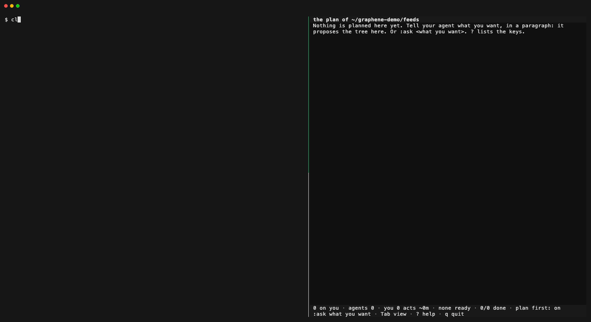

<div align="center">

<picture>
  <source media="(prefers-color-scheme: dark)" srcset="docs/assets/graphene-mark-ivory.svg" />
  
</picture>

# Graphene

**Many agents. One plan.**

Graphene shows you what your coding agents understood, as a tree you can prune, before they write a line.

<br>

`uv tool install git+https://github.com/Alex-lop/Graphene`

<sub>then <code>graphene demo</code> to watch a recorded run, no API key needed</sub>

<br>

[](https://github.com/Alex-lop/Graphene/actions/workflows/ci.yml)


<br>



<sub>An earlier run of the same paragraph as the one below.</sub>

</div>

<br>

Agent work gets cheaper every few months. My attention doesn't.

The conversation is still mostly "who has the better model?" and "what's the best harness?" I think that's becoming the wrong question. For most of what people build, the models we already have can write the code, debug it and fix it, once they know what you want. Whether the next jump comes from a model, a harness or something else entirely, the doing keeps getting cheaper. So the limit on building software is moving onto the person: knowing where the work should go, and having the drive to see it through.

And the person gets the thinnest interface in the whole loop: a paragraph at the start and a diff at the end. However many tokens you give an agent, it can't know what you didn't say, so it infers. I let agents work on my repos for hours, and I kept finding out what they'd inferred from the diff, after the time and money were spent. That's the most expensive place to find out. And it gets worse as agents get cheaper, because then you run several at once: one paragraph can't tell five agents who does what, and five diffs at the end is five times the reading.

I think the plan should be the interface: a tree you can read in a few seconds, shape before anything runs, and hold the agents to afterwards. Graphene is my attempt at that:

- **See what it understood, before the work.** You say what you want in a paragraph, like always. Before a line is written, the planner (your own Claude Code or Codex, reading the repo with read-only tools) hands back a tree: the goal, the pieces, and for every leaf the files it may touch and the check that proves it done. Cutting a wrong branch costs a keystroke, not a restart.
- **Questions, and guesses you can see.** What your words leave open and the repo can't answer comes back as a question, with the default it would take. Whatever it assumes anyway is written into the leaf, where you read it before anything runs.
- **A plan that holds.** A plan an agent can drift from is just a longer prompt. Each leaf is held to its files, and "done" isn't the agent's word for it: Graphene runs the check itself and asks git what changed.
- **Many agents, one plan.** A tree already says which work can happen side by side. Each leaf runs in its own worktree and lands as its own merge, so your history reads like the plan.

I'm not going to tell you it saves 397% of your tokens, and I haven't shown yet that a tree beats a good paragraph (the honest numbers are under the run below). It's a bet: as the doing gets cheap, direction becomes the scarce thing, and Graphene's job is to help you and the agent land on the thing you actually had in mind from the start.

<br>

## A real run

Made on 1 October for this README, on `feeds`: a small test repo I built, a Python price-feed loader where csv and json load and a new supplier's XML doesn't yet, with acceptance checks the agents never see (in a clone, `docs/proof/try.sh` builds it for you). Claude Code planned, Codex did the leaves, and the Claude Code session that wrote this page sat in my seat at the keyboard. Every block is real output, wrapped to fit and trimmed only where you see `…`. The paragraph is the one I typed on 22 September:

> Look at this repo. I want the new Northwind XML feed to load the same way csv and json already do: same load command, same JSONL out. Prices in that feed are already in cents. The summary line at the end is not a product. A price of 0 means skip it, for every supplier. Don't touch vendored or legacy files that aren't ours this week.

```
$ graphene ask "Look at this repo. I want the new Northwind XML feed to load…"
asking the planner (claude)…
the planner says:
  No leaf writes to vendor/, legacy/, scripts/nightly.sh (whose stale `--format` flag is
  unrelated), `money.to_major` (a ticket already owns it) or tests/test_contract.py (it
  says it must not be edited).
…
```

The planner read the repo for two minutes and wrote nothing. Then it put one question on the board:

```
$ graphene board
the board: 1 open
questions
  ◇ "A price of 0 means skip it" — should that also apply to legacy    zero-legacy  open
    `import_prices`, which a nightly job in another repo calls? It
    calls normalize but never calls check.
      default: no: the rule goes in validate/rules.py, so only `load` drops price-0
               records and legacy output stays exactly as it is now
      1: yes: normalize returns None when price_cents is 0, so legacy drops those
         records too and its load-bearing `skipped` count goes up
      about zero-price
…
```

This is why I built it. My paragraph says two things that pull against each other, "for every supplier" and "don't touch legacy", and the old importer sits right between them. It caught the same thing the first time I typed this, on the 22nd. A guess there would have been a surprise in the diff, or in someone else's nightly job. Here it's a question with a default, and nothing has been spent yet.

This is the tree it proposed. Every `?` is waiting on you, and `←1` says `zero-price` waits on one other leaf:

```
$ graphene plan --view tree
Load the Northwind XML feed with the same `load` command and the same…
                                   │
                              ? northwind
           Northwind XML goes through the existing pipeline
                   ┌───────────────┴───────────────┐
              ? xml-feed                    ? zero-price ←1
    Read, wire and enable the XML…     Drop price-0 records for…
1 sub-goal · 2 leaves · 3 proposed
```

Every leaf is a contract: why it exists, the files it may write, and the command that decides it's done. Whatever the planner assumed is written in it, where you can read it before anything runs, and `e` in `graphene watch` opens it in your editor if you disagree.

```
$ graphene node show zero-price
zero-price (revision 1): Drop price-0 records for every supplier
  why:    Northwind XML goes through the existing pipeline (northwind)
  goal:   Tighten the price rule in validate/rules.py so price_cents 0 fails check, and
          cli/main.py then drops the record for every source. tests/test_zero_price.py
          checks that a csv and a json record priced 0 are rejected, and that load() on
          samples/prices.xml leaves out NW-3. I assumed legacy import_prices keeps
          returning price-0 records, because it never calls check.
  scope:  validate/rules.py, tests/test_zero_price.py   (a write anywhere else is
          refused, and blocks `done`)
  needs:  xml-feed   (it cannot start until they are done)
  done:   `python3 -m unittest -q tests.test_zero_price tests.test_xmlfeed
          tests.test_csvfeed tests.test_contract` passes
…
```

Nothing needed cutting this time, and that's an answer too: a few lines of tree are enough to see it understood. So, three commands: take the board's default, which keeps legacy exactly as it is (`graphene board take zero-legacy`), accept the tree (`graphene plan accept northwind`), and `graphene run --parallel 2`, which gives each ready leaf an executor in its own git worktree and branch. `xml-feed` went first because `zero-price` needs it; leaves that don't need each other run at the same time. Two minutes later, with nothing pressed in between, every `?` was a `✓` and git's history had the shape of the tree:

```
$ graphene plan --view tree
Load the Northwind XML feed with the same `load` command and the same…
                                   │
                              ✓ northwind
           Northwind XML goes through the existing pipeline
                   ┌───────────────┴───────────────┐
              ✓ xml-feed                     ✓ zero-price
    Read, wire and enable the XML…     Drop price-0 records for…
1 sub-goal · 2 leaves

$ git log --graph --oneline
*   dd994f0 Drop price-0 records for every supplier (zero-price)
|\
| * 0dea537 Drop price-0 records for every supplier
|/
*   3b05224 Read, wire and enable the XML source (xml-feed)
|\
| * ff8f66a Read, wire and enable the XML source
|/
* 568bc5b feeds: before
```

And the feature works: `python3 -m cli.main load samples/prices.xml --source xml` printed the two products, prices still in cents, `&amp;` turned into `&`, and no summary line. Against the hidden checks it passed **18 of 20** acceptance checks and **12 of 12** held-out ones (the same code on inputs it was never shown), and the six files I'd put off limits weren't touched. The two misses are the task's change of mind, making `--source` optional, which the test only asks for in a second message once the first part works; this run never sent it. No plan catches what you haven't said yet.

> [!NOTE]
> That's one run. It shows the loop working end to end, not that a tree beats a paragraph. In the three comparisons so far (20, 21 and 23 September, models standing in for the person), a plain paragraph to the same agent passed as many checks at lower cost, and the tree came out ahead on no measure ([the latest](docs/test/results-2026-09-23.md)). What I'm betting on is *when* you find out what the agent understood: before the work, not after it.

<br>

## Try it

```
uv tool install git+https://github.com/Alex-lop/Graphene
graphene demo        # a recorded run on the real screen: space pauses, . steps, r again
```

- **On your own repo**, run `graphene init` once inside it, then `graphene watch`. `init` asks which planner and which executor to use (`claude` or `codex` on your PATH). It adds its hooks to `.claude/settings.local.json`, which is yours and not the team's, and never edits `~/.claude/settings.json`.
- **Then say what you want** in a paragraph, in your Claude Code session or with `graphene ask "…"`. In `graphene watch`: `j` `k` move, `Enter` shows everything about a node, `d` drops a leaf, `e` edits its contract, `y` accepts, `R` runs what's ready, and `?` on the goal lists the rest. Every key is a command you could type, and the bottom line says which.
- **When you want more**, `graphene plan edit` opens the whole plan as text in your editor, `graphene direction` keeps the goals above your plans, and `graphene config` holds what you state once: protected paths, read-only globs, when the board shows (`board: auto`).
- **You need** macOS or Linux, git, and [uv](https://docs.astral.sh/uv/), which fetches Python 3.12+. The screen runs in any modern terminal; it's checked in WezTerm at 80 columns.

<br>

## How it works

There are two kinds of agent. The **planner** is the session you talk to, or `graphene ask`: it reads the repo, proposes the tree, and writes no code. The **executors** are what `graphene run` starts, one per ready leaf. A leaf has a goal, a **scope** (the files it may write), a **check** (a command that exits 0 only when it's done), and what it **needs** first. Agents propose. Only a person accepts, signs off or edits a contract, and an agent that tries is refused.

What your words leave open and the repo can't answer goes on the **board**: the planner is asked to put up at most three items, each a question with the default it would take (or a risk, with what it would do about it). You answer with a key, or not at all: whatever you leave open takes its default when you accept the tree, except a default that drops a node, which waits for you. What you decide is written into the contract of every leaf it's about.

A leaf lands only when its check passes and git shows nothing written outside its scope; with `--parallel`, it's then merged `--no-ff` into your branch with its why in the message. That's the one boundary that holds whoever executes. Inside Claude Code, hooks also refuse an out-of-scope write before it happens. A leaf that needs a file outside its scope comes back, says why, and offers the fix: `w` widens its scope, `b` adds a sibling leaf for that file. `graphene node show <id>` is a leaf's record: who held it, what changed, what was refused, what the check said.

<br>

## FAQ

<details><summary>Isn't this just a plan in a markdown file, or a todo list?</summary><br>

A plan in prose is something you read once and hope the agent remembers. A todo list is flat: it doesn't say why an item is there, what it may touch, or what proves it finished. Here every leaf hangs from the goal it serves, names the files it may write and the command that proves it done, and says what it waits on. The executors are held to all of it, and the tree also tells you what can run at the same time.

</details>

<details><summary>Isn't a tree overkill for a one-line fix?</summary><br>

Ask for "fix the typo in the header" and the agent proposes one leaf, which is yours at once because you asked for it, and then does it. Nothing to press. If you'd rather it just act, `P` in `graphene watch` (or `graphene plan first off`) turns plan first off, and what you ask for is done at once and recorded as a leaf.

</details>

<details><summary>What doesn't it catch?</summary><br>

These are honest boundaries, not airtight ones. The hooks that stop a write before it happens are Claude Code's; Codex or any other command is held at `done` instead, by the check and git. A script that opens files itself, or a write through an MCP server, is caught at `done` rather than before, and only while a leaf is held. And "only a person" rests on the environment: Graphene tells an agent from you by the variables its CLI sets (like `CLAUDECODE`), so an agent that unsets them passes for you. [Every limit is written down](docs/HOW_IT_WORKS.md#p5-where-each-mechanism-ends). I'd rather you know where it ends than trust it past that.

</details>

<br>

## Privacy

- With Claude Code or Codex, Graphene itself sends nothing anywhere; the agent you picked talks to its own service as it always does.
- With NVIDIA Nemotron as planner or executor, Graphene sends Nebius Token Factory your prompts and the files the model reads, and in a sandbox it sends Sandboxes the leaf's checkout. The key lives in your environment or the system keychain, never in a file.
- The Nemotron prototypes are the exception, whatever the planner: `plan cover`, `plan note` and `graphene board lookup` ask Nemotron Nano, and `plan precheck` uploads your checkout to Sandboxes when ConTree's credentials are set (and asks Nano about a failing check whose output doesn't say why). None of them runs unless you run it, or set `GRAPHENE_SHAPE` to run them after each `graphene ask`.
- The plan lives in `.graphene/` in your repo, created `0700` and git-ignored, all but `.graphene/direction.txt`, which holds only goals and is yours to commit. Delete `.graphene/` and Graphene forgets everything.
- Graphene never pushes. It commits only during `graphene run --parallel`: on its own `graphene/<leaf>` branches, plus one merge of each passing leaf into your branch.

<br>

## Where it's at

Graphene is early, and I'm building it in the open. If you try it on a real repo, the thing I most want to hear is where the tree misread what you meant, because that's the whole game. Bugs and ideas go in [Issues](https://github.com/Alex-lop/Graphene/issues).

- [How it works](docs/HOW_IT_WORKS.md): every part, and where each one stops.
- [Direction](docs/DIRECTION.md): what's been decided, and why.
- [Nemotron on Token Factory](docs/HACKATHON.md): planning and executing on NVIDIA Nemotron through Nebius Token Factory. As practice on 2 October, Nemotron planned a small feature 5 times: 2 plans ran to the end in Token Factory Sandboxes, neither doing all it was asked, and 3 stopped at the planner ([the record](docs/test/first-light.md)).
- [The website](https://alex-lop.github.io/graphene-site/), where 400 starlings settle into a plan.

Built by [Alex Lopez](https://alex-lop.github.io/Alex_Lopez_Website/), with a lot of help from the agents it's for. Apache-2.0.

<br>

<div align="center"><sub>Tokens and dollars are already getting cheap. The part that still takes a person is knowing where the work should go.</sub></div>
