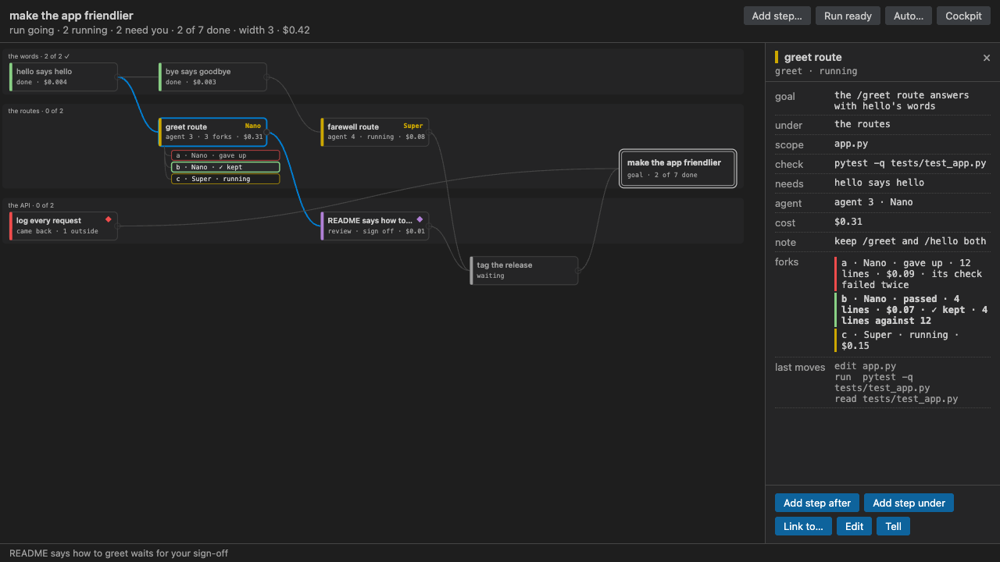
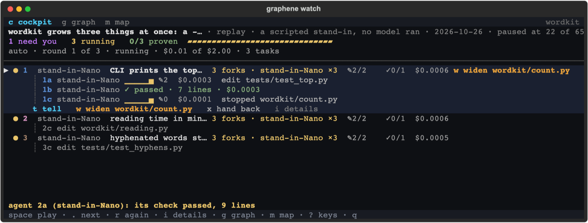
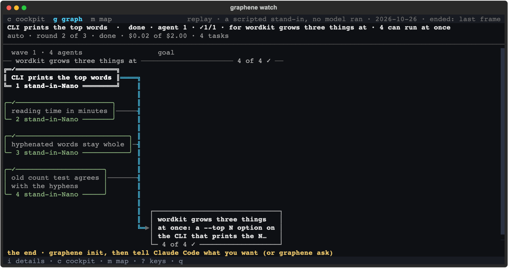
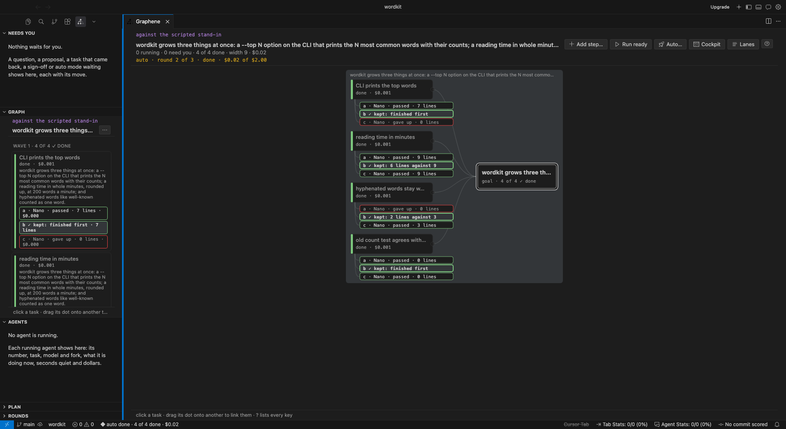

<p align="center"></p>

<h1 align="center">Graphene</h1>

<h1 align="center">As code becomes more abstract, it's becoming increasingly important to understand what your agents are
actually doing.</h1>

**One plan for your coding agents. Clear boundaries. Tested commits.**

Graphene turns a goal into tasks with explicit files, dependencies, and checks. Agents work in separate Git
worktrees; Graphene checks their changes and merges what passes. You can see the plan and steer it from your
terminal or VS Code. Works with Claude Code, Codex, and the built-in NVIDIA Nemotron executor.

<p align="center">
  <a href="https://pypi.org/project/graphene-map/"></a>
  <a href="https://pypi.org/project/graphene-map/"></a>
  <a href="https://github.com/Alex-lop/Graphene/actions/workflows/ci.yml"></a>
  <a href="https://github.com/Alex-lop/Graphene/blob/main/LICENSE"></a>
</p>



*VS Code running Graphene against a scripted model stand-in. No live model calls.*

## What it solves

Running more agents creates more coordination work: overlapping edits, hidden dependencies, and changes that
look finished until you run the tests. Graphene makes that work visible and gives it rules.

- **Keep parallel work separate.** Each task owns its files and worktree. Tasks with dependencies wait.
- **Define “done” before work starts.** Each task has a check that Graphene runs itself in a clean copy.
  Optional forks race the same task; a fixed rule chooses among passing results.
- **Stay in control.** Review the plan, adjust scope, link tasks, send an agent a note, or stop a run.
  Each landed task is a merge commit you can revert.

## Get started with the CLI



*The CLI cockpit tracks tasks, attempts, stopped writes, and cost. Scripted demo.*

Try the scripted replay first. It needs no API key and writes nothing to your project:

```sh
uvx graphene-map demo --auto
```

Requires [uv](https://docs.astral.sh/uv/getting-started/installation/) and Git on macOS or Linux
(Windows via WSL). Graphene requires Python 3.12+.

To use it on your own repository, have Claude Code or Codex installed and signed in, then run these commands
in your terminal:

```sh
uv tool install graphene-map
cd your-repo
graphene init
graphene ask "add a --top N option to the CLI, with tests"
graphene watch
```

`init` asks which planner and executor to use. In the cockpit, press `A` to accept the plan, then `R` to run
ready tasks; it asks first when more than one task could start. Press `g` for the graph, `i` for task details,
and `?` for all keys. Stop a run with `graphene run --stop` from another terminal.



*Press `g` to switch to the task graph. The same scripted demo, after completion.*

With Claude Code, `init` also installs project hooks: your next request proposes a plan before writing.
`graphene plan first off` lets quick changes through. Remove the hooks with `graphene init --remove`;
uninstall with `uv tool uninstall graphene-map`.

<details>
<summary><strong>Let Nemotron plan and run the whole goal</strong></summary>

Install the optional extra and set your Nebius Token Factory key:

```sh
uv tool install --force 'graphene-map[nemotron]'
graphene key set
graphene init --planner nemotron --executor nemotron
graphene auto "add a --top N option to the CLI, with tests" \
  --budget 2 --forks 3 --check "python3 -m pytest -q"
```

Ultra plans, Nano agents race each task, and Graphene checks the merged result. If the goal's check fails,
it plans a fix within your task, round, and budget settings. Add `--plan` to inspect the plan without running it.
Budget checks happen between rounds, so the dollar limit is not a hard spending cap.

[Setup, model roles, and recorded results](https://github.com/Alex-lop/Graphene/blob/main/docs/HACKATHON.md).

</details>

## Use the graph in VS Code or Cursor



*Cursor showing a completed auto run against the scripted stand-in.*

The screenshots and Home workflow show current `main`, ahead of the
[0.8.0 packaged release](https://github.com/Alex-lop/Graphene/releases/latest). To use the current CLI and
editor, build from source with Node 22+:

```sh
git clone https://github.com/Alex-lop/Graphene.git
cd Graphene
uv tool install --force .
npm --prefix editors/vscode ci
npm --prefix editors/vscode run package
code --install-extension editors/vscode/graphene-0.9.0.vsix
# Cursor:
cursor --install-extension editors/vscode/graphene-0.9.0.vsix
```

Click Graphene in the activity bar to open **Home**. Pick your planner and executor, type a goal, click
**Plan it**, review the suggested tasks, then **Start**. Keep approval enabled to review each finished task
with **Open changes**, then **Approve** or **Send back** with a note.

**Graphene: Show Graph** opens the plan in a tab. Click a task to edit its files, check, attempts, or approval;
drag its dot onto another task to add a dependency. **Graphene: Watch the Demo** needs no key. The Explorer
marks which task owns each file; `graphene.advanced` enables the extra task and round views.

Current `main` also installs Codex hooks: run `graphene init` in your project, start a new Codex session,
trust the project, and review its hooks with `/hooks`.

The editor and `graphene watch` read the same local plan, including when Codex executes the tasks.
See the [extension guide](https://github.com/Alex-lop/Graphene/blob/main/editors/vscode/README.md) for Cursor
installation, commands, and settings.

## Know the limits

Graphene is early. Trusted, loaded hooks and the built-in executor block supported writes outside scope;
Codex's hooks require current `main`. Unloaded or failed hooks can let writes through; Git checks tracked
changes again before merging. This is file coordination, not a security sandbox. Checks are only as strong
as your tests;
set `review: every` in `graphene config edit` to require your sign-off before changes land.

Plans and session records stay in `.graphene/`. Your chosen agent or model provider still receives the
context it needs. The bundled auto demo uses a scripted stand-in; live auto mode has not yet been validated.
[Enforcement limits](https://github.com/Alex-lop/Graphene/blob/main/docs/HOW_IT_WORKS.md#where-each-mechanism-ends)
· [Privacy](https://github.com/Alex-lop/Graphene/blob/main/docs/HOW_IT_WORKS.md#privacy).

[How it works](https://github.com/Alex-lop/Graphene/blob/main/docs/HOW_IT_WORKS.md)
· [A real run](https://github.com/Alex-lop/Graphene/blob/main/docs/A_RUN.md)
· [Comparisons](https://github.com/Alex-lop/Graphene/blob/main/docs/COMPARE.md)
· [Changelog](https://github.com/Alex-lop/Graphene/blob/main/CHANGELOG.md)
· [Contributing](https://github.com/Alex-lop/Graphene/blob/main/CONTRIBUTING.md)
· [Feedback](https://github.com/Alex-lop/Graphene/issues/new?template=first-hour.yml)
