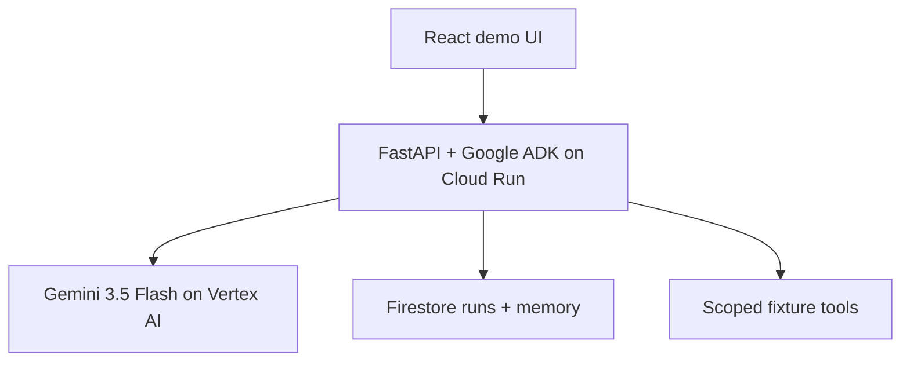

# ReviewLatch — Ultra MVP Execution Brief

Status: binding build brief for the All Things Agentic submission  
Repository: `Alex-lop/AllThingsAgenticHackathon`  
Starting point reviewed: `main` at `64bca65df9bbd90bd7ec69be75e79ed361f7490e`  
Target track: **The Collaborative Partner**  
Official deadline: **August 31, 2026 at 5:00 PM PT**  
Internal P0 deadline: **a deployed golden path by August 14**  

## 0. Instructions to the Ultra root agent

You are the root implementation agent. Execute this brief; do not begin another broad ideation or market-research phase.

1. Read `README.md`, `HACKATHON_TIMELINE.md`, `IDEA_EVALUATION.md`, and `IMPLEMENTATION_PLAN.md`.
2. Treat this file as the scope authority wherever it conflicts with `IMPLEMENTATION_PLAN.md`.
3. Implement only in `Alex-lop/AllThingsAgenticHackathon`. `Alex-lop/AgenticCinemaFramework` is contextual input, not an implementation target.
4. Inspect the repository, current branch, and working tree before editing. Preserve unrelated or user-authored work.
5. Create a focused implementation branch such as `agent/reviewlatch-mvp` unless the user has already chosen a branch.
6. Use at most three subagents with non-overlapping file ownership. The root owns contracts, integration, scope decisions, and the final demo.
7. Build a thin end-to-end slice before polishing any individual layer.
8. Use configured credentials normally, but never print, copy, commit, or repurpose them. Ask Alex only when a real account, billing, project, or deployment decision blocks further progress.
9. Do not claim a cloud run, Gemini result, persisted memory, or security property unless it has been directly verified.
10. Commit in small, reviewable checkpoints. Do not push, deploy, or open a PR unless the user has authorized those actions in the active session.
11. End each phase with the commands run, evidence observed, known limitations, and the next gate.

## 1. Brutal verdict on the current plan

The product insight is strong; the implementation plan is not executable as written.

| Area | Honest assessment |
|---|---|
| Core pain | **8/10.** Developers repeatedly correct long-running agents and cannot quickly explain why a change exists. |
| Differentiation | **7/10** only when lineage changes future behavior. A passive trace graph is already commodity functionality. |
| Current implementation plan | **3/10.** It asks a documentation-only solo repo to build a multi-vendor capture platform, local sync engine, cloud service, graph UI, memory evaluator, invalidation engine, repair system, and security layer in one sprint. |
| Current four-minute story | **4/10.** It contains too many concepts for a judge to remember: proof rails, Memory PRs, A/B evaluation, approval, invocation, blast radius, repair, hash verification, and three agent vendors. |
| MVP after this cut | **8/10 potential.** One correction becomes approved scoped memory, and a fresh Gemini session visibly stops repeating the mistake. |

The most dangerous line in the old plan is its “never cut” list. It protects five separate products before one vertical slice exists. The repository currently has planning documents and a two-line README, so architecture breadth is the enemy.

There is also a product contradiction: `IDEA_EVALUATION.md` recommends a research-decision workflow, while `IMPLEMENTATION_PLAN.md` locks a coding-agent workflow. This brief resolves it decisively: **build the coding workflow** because file diffs, tests, scoped memory, and human approval make the before/after result concrete.

## 2. Locked thesis

**Working-name lock:** use **ReviewLatch** through P0 and do not reopen branding work. The earlier name `Proofline` was rejected because an [existing agent-verification product](https://github.com/sfayka/Proofline) already uses it for an adjacent completion-gating concept.

### One-sentence pitch

> ReviewLatch turns a developer's correction into approved, repository-scoped memory, injects the exact revision into a fresh Gemini session, and refuses to promote work that violates it.

This is not generic prompt memory. The approved revision participates in a deterministic promotion gate: the candidate cannot become completed unless the bound base commit, candidate artifact hash, active memory revision, required regression-test receipt, file scope, and human decision all match.

### The one memorable loop

```text
baseline mistake → anchored correction → exact scoped memory → human approval
→ fresh Gemini session → exact revision injected → corrected diff + passing test
→ automatic completion denied → exact candidate approved → controlled commit
```

### User and pain

- **User:** a developer running long or repeated AI coding tasks.
- **Pain:** the agent forgets repo-specific expectations, so the developer repeats the same review correction.
- **Measured outcome:** on a second related task, the approved rule is retrieved, the required security test is added, the run pauses for review, tests pass, and unrelated files remain unchanged.

### Why Collaborative Partner

The project will show four behaviors this track rewards:

1. The user gives explicit feedback tied to an actual output.
2. The system asks one material scope clarification and guides the user through review.
3. It persists the approved correction as reviewable memory across sessions.
4. The next session retrieves the exact revision and produces a compliant candidate.

If persistent correction-to-behavior change is not working by the P0 deadline, do not disguise the product as a Collaborative Partner. Reassess the track before building more UI.

## 3. Ruthless scope boundary

### P0: build these and nothing else

1. One clean, controlled Python Git repository fixture.
2. One real Gemini 3.5-or-newer path orchestrated with Google ADK.
3. One Cloud Run service that serves the API and built React app.
4. Firestore persistence for runs, memory proposals, human decisions, compact proof records, immutable candidate artifacts, and exact memory revisions injected.
5. One baseline run recorded with the real model and clearly labeled as a recorded baseline.
6. One live fresh-session run that retrieves an approved memory.
7. One visible clarification plus two explicit human decisions: choose the correction's scope, approve the memory proposal, then promote the adapted candidate before completion.
8. One screen that shows the before/after diff, test result, memory card, and compact proof rail.
9. A deterministic test and file-scope check around the model's work.
10. A reproducible README, architecture diagram, demo reset, and Google Cloud proof.

### Explicitly cut from the hackathon MVP

| Cut | Reason |
|---|---|
| Claude Code and Codex adapters | They multiply integration and fixture work without improving the central proof. Mention them only as future adapters. |
| Native CLI hook ingestion | Instrument the ADK runner and scoped tools directly. Do not build a general telemetry product. |
| MCP server | It is not necessary for the golden path or the mandatory stack. |
| SQLite spool and offline synchronization | Firestore is the single durable store for the submitted workflow. |
| Product CLI or rich terminal TUI | Keep only a reproducible demo/reset script; the browser is the sole product surface. |
| Global graph or `@xyflow/react` | Render one compact semantic proof rail with ordinary React/CSS. |
| AST import graph | The fixture uses explicit allowed paths and validation rules. |
| Requirement invalidation and selective repair | Strong future work, but it creates a second product and ruins the four-minute story. |
| Paired multi-run A/B evaluator | The recorded baseline and fresh adapted run are demo evidence, not a causal benchmark. Do not spend six model calls grading a memory proposal. |
| Append-only hash chain or general event DAG | Store a small ordered proof record plus the hashes that bind promotion; do not build an event-sourcing platform. |
| General-purpose arbitrary-repository execution | Use one clean managed worktree from a transparent controlled fixture. Never imply arbitrary safe code execution. |
| Multi-user RBAC, organizations, registry, marketplace | Not needed for the selected track or MVP. |
| Extra Google models for bonus points | They remain out of implementation scope until the complete build and final video already exist. |

Do not revive a cut feature because it is “almost easy.” A cut feature requires Alex's explicit approval after the P0 gate passes.

## 4. Golden demo contract

### Fixture

Bundle a small Python project:

```text
demo/fixture/
├── SECURITY.md
├── app/
│   ├── config.py
│   └── auth/
│       └── limiter.py
├── tests/
│   └── test_rate_limit.py
└── docs/
    └── security.md
```

The only mutable paths in the golden run are:

```text
app/auth/limiter.py
tests/test_security_policy.py
```

### Baseline evidence

Freeze both tasks before implementation:

- **Recorded baseline:** change `MAX_ATTEMPTS` from `5` to `4`.
- **Fresh adapted run:** change `WINDOW_SECONDS` from `60` to `90`.

Both begin from the same clean fixture and use the same eligible Gemini model policy, prompt template, and three tools. Only the task and the approved-memory context differ. Capture one real, dated baseline that omits the repository-specific security regression test. If three honest baseline attempts all add the expected test, revise the fixture or task once and retain the attempt records; do not cherry-pick a convenient failure.

Persist:

- exact model ID;
- task and run ID;
- ordered proof items;
- before/after file hashes and unified diff;
- test result;
- files touched;
- timestamp.

This is a **recorded baseline**, not simulated agent output. Store a sanitized fixture copy for a reliable demo reset.

The adapted run should create `tests/test_security_policy.py`; it is an allowlisted output, not a pre-existing passing test.

### Feedback and memory

The user anchors this correction to the baseline run or changed hunk:

> When security-sensitive authentication behavior changes, add or update `tests/test_security_policy.py` with a regression test covering that behavior.

ReviewLatch asks exactly one material clarification: **“Should this apply to every `app/auth/**` change, or only rate-limiter changes?”** The user chooses from those two server-defined scopes. There is no open-ended planning loop.

Feedback submission then deterministically creates a proposed memory from the human's exact correction, selected evidence hunk, and selected server-owned repository, path, and task scope. Gemini does not generate, rewrite, approve, or reject memory in P0. Minimum fields:

```json
{
  "memory_id": "mem_auth_review",
  "revision": 1,
  "state": "proposed",
  "rule": "Auth changes require a regression test in tests/test_security_policy.py covering the changed security behavior.",
  "repo_id": "reviewlatch-demo",
  "path_globs": ["app/auth/**"],
  "task_tags": ["authentication", "security"],
  "required_test_path": "tests/test_security_policy.py",
  "required_check": "new_test_fails_on_base_and_passes_on_candidate",
  "evidence_run_id": "baseline_run_id"
}
```

Only a human action may transition `proposed → approved` or `proposed → rejected`. Approved content is immutable; edits create a new revision.

### Fail-closed promotion request and receipt

After the adapted run produces a candidate and passes tests, deterministic code persists an application-immutable, size-capped candidate artifact containing the base commit, canonical patch, changed-path set, candidate hash, and test receipt. The validator also copies the newly authored security test onto the base fixture and proves that it fails there but passes on the candidate. Never rely on a Cloud Run process's local files across requests.

The runner then automatically attempts completion without a human decision and persists the expected denial. The authenticated **Approve & Promote** action atomically records the human decision, re-reads all bound state, validates the current server-issued run revision, reconstructs the candidate in a fresh temporary fixture, reruns the fixed tests, and creates the final receipt:

```json
{
  "run_id": "adapted_run_id",
  "base_commit_sha": "git commit sha",
  "candidate_patch_sha256": "sha256 over exact git diff --binary bytes",
  "candidate_tree_sha256": "sha256 over sorted candidate paths and bytes",
  "memory_id": "mem_auth_review",
  "memory_revision": 1,
  "test_receipt_sha256": "sha256 over canonical test-receipt JSON",
  "human_decision_id": "decision_id",
  "expected_run_revision": "current server-issued revision"
}
```

Gemini cannot approve or promote. Human promotion is a universal ReviewLatch invariant, not learned behavior: the approved memory defines the required security test, while base policy causes the review pause. Promotion is denied when any input is absent, stale, or mismatched.

Successful promotion creates a commit only in the reconstructed ephemeral managed worktree, then persists the canonical patch, tree hash, commit metadata, commit SHA, and receipt in Firestore. It never creates a durable branch or pushes to a user's repository. An approved memory may add procedural requirements but may never grant new permissions or weaken the fixture's base policy.

### Fresh-session proof

Each predefined demo task has server-owned `repo_id`, `task_tags`, and `target_paths`. Before Gemini starts, retrieve an approved memory only when repository and task tags match and at least one target path intersects its path glob. Gemini never declares the scope that controls retrieval. `memory.injected` means the exact revision was included in the actual ADK invocation; label it **Memory injected** in the UI rather than claiming exclusive causality.

The run passes only if all are true:

- it records the exact approved memory ID and revision injected;
- it changes only allowlisted files;
- it adds or updates the required security regression test;
- the configured tests pass;
- it enters `waiting_for_promotion` before completion;
- the runner's automatic completion attempt receives a real fail-closed denial;
- a human approves and promotes the exact bound candidate;
- a compact proof rail connects goal, memory, tool changes, test, and decision;
- the second run uses a new session ID, proving cross-session persistence.

### Four-minute video cut

| Time | Visible proof |
|---|---|
| 0:00–0:20 | “Coding agents forget what you taught them.” Show the baseline mistake and the repeated-review cost. |
| 0:20–0:55 | Open the recorded real baseline diff and show the missing repository-specific security regression test. |
| 0:55–1:25 | Submit the anchored correction, answer the one scope question, inspect the proposal, and approve memory revision 1. |
| 1:25–2:20 | Start a fresh Gemini session live. Show `memory.injected`, file changes, the new test, and `waiting_for_promotion`. Keep the actual model execution visibly uncut. |
| 2:20–2:40 | Show the runner's automatic completion attempt fail closed because the human decision is missing. |
| 2:40–3:10 | Approve and promote the bound candidate; show the new commit, passing tests, zero unrelated files touched, receipt hashes, and one proof rail. |
| 3:10–3:40 | Show the `.run` URL, sanitized Cloud Run/app logs with run/model metadata, Firestore state, and the architecture diagram. Show Vertex request logs only if explicitly enabled and verified. |
| 3:40–3:55 | State the honest limitation and repeat the one-sentence value. |

Do not show blast-radius repair, Claude/Codex support, raw chain-of-thought, or a global graph in the video.

## 5. Minimal architecture



### Technical decisions

- Use Python 3.13 and Node 22. Pin the exact `google-adk` version, smoke-test it before building, and install Git explicitly in the slim production image.
- One multi-stage container and one Cloud Run service.
- Google ADK is the only agent framework in the MVP.
- Use `gemini-3.5-flash` after confirming availability for the configured project and record the exact returned model ID. If it is unexpectedly unavailable, inspect the official eligible-model listing and record any substitute decision; never invent or silently substitute an ID.
- Keep deployment and model locations separate: default `CLOUD_RUN_REGION=us-central1` and `GOOGLE_CLOUD_LOCATION=global`, then verify both in the target project.
- Firestore is the only durable database.
- Custom ReviewLatch memory lives in Firestore and is injected through ADK; do not also implement ADK `MemoryService` in P0.
- Create a clean managed Git worktree from the bundled fixture for each run. Ignore dirty-worktree, rename, and untracked-file generality outside this controlled case.
- Use request/response plus short polling. Do not build SSE until the whole golden path works.
- Generate the candidate diff and changed-path set from the controlled worktree; no arbitrary Git-repository support.
- Keep full raw prompts, credentials, and unrestricted tool output out of Firestore and the browser.
- Keep the public deployment read-only by default. Mutation controls accept a high-entropy demo token entered at runtime and retained only in browser memory; provide it through Devpost testing instructions. Never embed it in the frontend bundle or expose an unrestricted public model endpoint. Do not build OAuth, accounts, or RBAC.
- This must be new contest-period work. Earlier ideas may inform the build, but implementation and submitted artifacts must be created from scratch during the contest period.
- Candidate file changes stay isolated. Fixed deterministic application code—not a model tool—may run the small allowlisted set of Git commands needed to create/reset the worktree, inspect the diff, and create the approved local commit. Before waiting for approval, it persists the capped canonical patch and binding hashes. The run may not transition to `completed` until memory injection, scope validation, rerun tests, immutable candidate artifact, and the exact promotion receipt are durably persisted. Do not push or merge into a user's real repository.
- Accept only enumerated demo task IDs, never arbitrary public prompts. Run the fixed tests as an unprivileged user with a sanitized environment, timeout, and output cap. The controlled fixture is not an untrusted-code sandbox.
- Optional low-level status telemetry may fail open; every input to promotion and the promotion receipt itself must fail closed.

### Scoped ADK tools

Expose no general shell tool. Use only:

```text
read_file(relative_path)
write_file(relative_path, content)
run_fixture_tests()
```

Every path must resolve inside the per-run fixture root. Reject traversal, symlinks escaping the root, non-allowlisted writes, oversized content, and unknown commands. `run_fixture_tests` invokes one fixed command with a timeout and capped output.

Deterministic orchestration moves a passing candidate to `waiting_for_promotion`. Human decisions enter only through authenticated API/UI actions and are never model tools.

### State model

Keep the lifecycle small:

```text
Run: queued → running → waiting_for_promotion → promoting → completed
                ↘ failed                         ↘ failed

Memory: proposed → approved
                ↘ rejected
```

Store only the ordered proof items needed for the demo:

```text
memory.proposed
memory.approved
memory.injected
tool.file_written
test.completed
completion.denied
promotion.approved
candidate.committed
run.failed
```

Each proof item has `event_id`, `run_id`, `sequence`, `evidence_event_ids`, `type`, `occurred_at`, and a sanitized payload. This is a short deterministic record, not a general event DAG. The UI renders it in order; Gemini never reconstructs provenance after the fact.

### Minimal API

```text
GET  /healthz
POST /api/demo/reset
GET  /api/runs
POST /api/runs
POST /api/runs/{run_id}/execute
GET  /api/runs/{run_id}
POST /api/runs/{run_id}/feedback
POST /api/memories/{memory_id}/decision
POST /api/runs/{run_id}/promote
GET  /api/runs/{run_id}/proof
```

`POST /api/runs` accepts only an enumerated task ID and returns a queued `run_id`. The UI starts the bounded `/execute` request and polls the run concurrently while that request remains open. Configure an explicit Cloud Run request timeout longer than the smaller model/tool timeout, and fail the run clearly when either expires. Do not use FastAPI background tasks, Celery, an in-memory queue, or detached Cloud Run work. Scope `/api/demo/reset` to one fixed demo namespace so it cannot broadly delete Firestore data.

Use compare-and-set transitions plus idempotency keys for execution, memory decisions, and promotion. Promotion reconstructs and verifies the persisted candidate, commits it, persists the receipt, and then marks the run complete. A failure leaves the run non-completed and safely retryable with the same key. Promotion also requires `expected_run_revision` plus all bound hashes and the memory revision. Do not design a public platform API.

## 6. One-screen product experience

Do not create four separate product areas. Build one responsive screen:

1. **Run switcher:** recorded baseline versus fresh adapted run.
2. **Outcome strip:** status, tests, changed files, unrelated files, and memory revisions injected.
3. **Diff panel:** selected file/hunk with before/after content.
4. **Proof rail:** goal → approved memory → file write → test → human decision.
5. **Memory card:** correction, scope, evidence, revision, and approve/reject action.
6. **Action area:** start the fresh run or **Approve & Promote** the exact waiting candidate.

The judge must answer these questions in under ten seconds:

- What did the agent change?
- What correction did it learn?
- Was the exact memory injected, and did the candidate comply?
- What proof passed?
- What still needs a human?

Use stable layout, readable type, honest loading/error states, keyboard-accessible controls, and an HTML proof list. Spend no time on animations until the deterministic and real-model reliability gates pass.

## 7. Repository shape

The root agent may adjust names slightly, but it must keep one deployable service and clear ownership:

```text
backend/reviewlatch/
├── app.py
├── agent.py
├── tools.py
├── models.py
├── store.py
├── memory.py
├── runner.py
└── security.py
frontend/
├── package.json
└── src/
demo/
├── fixture/
├── recorded_baseline/
├── reset.py
└── run_golden_path.py
tests/
├── unit/
└── integration/
Dockerfile
pyproject.toml
uv.lock
.env.example
README.md
```

Do not add Kafka, a graph database, Redis, Celery, Kubernetes, or a second deployable service.

## 8. Root/subagent orchestration

### Root agent

Own:

- scope and contracts;
- shared models and API schema;
- repository scaffold;
- branch/commit hygiene;
- integration and conflict resolution;
- real Gemini/ADK verification;
- Cloud Run/Firestore deployment verification;
- final acceptance run, README, and demo truth audit.

The root writes shared contracts before spawning implementation work.

The root also owns `Dockerfile`, root configuration, `contracts/**`, credentials, deployment, staging, and commits. Subagents leave changes unstaged and report the files changed and tests run. README ownership transfers only after an explicit root handoff.

### Subagent 1 — backend and cloud

Own only:

```text
backend/**
tests/unit/backend/**
```

Deliver the Firestore-backed lifecycle, ADK runner, scoped tools, ordered proof items, and health endpoint. Start with an in-memory store behind the same interface for tests, then prove Firestore with an integration test.

### Subagent 2 — frontend

Own only:

```text
frontend/**
```

Build the one-screen before/after experience against a checked-in API fixture first, then integrate with the real API. No graph library.

### Subagent 3 — demo and red-team

Initially read-only. Own after contracts stabilize:

```text
demo/**
tests/integration/**
README and demo-script proposals
```

Attack path traversal, out-of-scope writes, duplicate decisions, missing memory revisions, test timeouts, reset reliability, and misleading claims. It may propose patches, but the root decides and integrates cross-cutting changes.

Agents must not edit each other's owned files without messaging the root. The root reviews every subagent result before integration. Phases below describe integration gates, not strictly sequential agent work: after Phase 0, backend, frontend-fixture, and demo/integration work may proceed concurrently, while the root integrates gates in order.

## 9. Execution phases and gates

### Phase 0 — truth and contracts, maximum 3 hours

- Inspect the repository and toolchain.
- Spend at most ten minutes checking whether Alex has requested the $150 Google Cloud credit, created the Devpost draft, and selected Collaborative Partner. Surface any missing account action immediately, but continue all unblocked code work.
- Verify Python, Node, Docker, `gcloud`, and available Gemini access without exposing credentials.
- Verify the exact model ID with an official SDK/API smoke test when credentials are configured.
- Define Pydantic models, API payloads, proof-item types, store interface, fixture allowlist, and the golden test.
- Freeze the initial fixture contents, exact baseline prompt, exact adapted prompt, expected security assertion, fixed test command, allowed paths, and deterministic negative retrieval case. Implementation agents must not revise the demo task independently.
- Create the skeleton, failing tests, `.env.example`, and a short decision log.

Gate: a single document and test suite express the exact loop; no agent has started building an alternative architecture.

If cloud credentials are unavailable, continue with the in-memory store and mocked model boundary. Record the external blocker clearly. Never present mocked output as cloud or model verification.

### Phase 1 — local vertical slice, maximum 9 hours

- Copy/reset the fixture per run.
- Implement the store interface and lifecycle transitions.
- Implement exact feedback → deterministic proposed memory → human decision.
- Implement exact approved-memory retrieval in a new session.
- Run one deterministic fake-agent path only to connect the API and UI contract.
- Return the full baseline/adapted state through the API.

Gate: one automated integration test completes the entire state transition and rejects an illegal transition.

### Phase 2 — real Gemini and ADK, maximum 8 hours

- Replace the fake-agent boundary with one real ADK `LlmAgent` and the scoped tools.
- Record the small ordered proof items directly.
- Enforce file allowlists and fixed tests outside the model.
- Capture a real sanitized baseline.
- Run the fresh-session task with an approved memory.

Gate: the real run records the exact memory revision injected, creates the required test, touches no unrelated files, persists the candidate artifact, passes tests, waits for approval, and completes only after approval.

If one controlled retry still fails, simplify the fixture, prompt, or tool schema. Do not add more agents, self-reflection loops, or a planner/verifier swarm.

### Phase 3 — one-screen UI, maximum 8 hours

- Implement the run switcher, outcome strip, diff, proof rail, memory card, and actions.
- Poll for status; do not add streaming infrastructure.
- Add explicit loading, empty, failure, and approval states.
- Verify at narrow laptop width and with keyboard navigation.

Gate: a new viewer can identify the mistake, learned rule, exact memory injection, test, and approval in under ten seconds.

### Phase 4 — Firestore and Cloud Run, maximum 8 hours plus account blockers

- Add the Firestore store behind the tested interface.
- Build one multi-stage container.
- Use least-privilege service-account access and server-side model credentials.
- Deploy with scale-to-zero, maximum instance caps, budget awareness, and no committed secrets.
- Capture the `.run` URL, revision, logs, and Firestore evidence.

Gate: a new session sees the approved memory after a new process/store instance, and the submitted demo can visibly prove the backend ran on Google Cloud.

### Phase 5 — reliability and submission assets

- Add one-command demo reset and one-command golden run.
- Pass ten consecutive deterministic clean-reset integration runs and three consecutive real-Gemini golden runs after the task and prompt are frozen. Record retries as failures.
- Fix only failures that threaten the golden path, security boundary, setup, or judging clarity.
- Finish README setup/deploy instructions, architecture diagram, exact model/service disclosure, screenshots, limitations, and test commands.
- Record a rough video by August 25; code-freeze by August 27; record the final public YouTube/Vimeo video in English or with English subtitles by August 29; keep it below four minutes; submit by August 31 at noon PT.
- Leave the submitted repository, video, live site, and any promised judge access unchanged until winners are announced, currently expected around October 8. Continue later work only in a separate fork, not another branch pushed into the submitted repository.

Gate: both reliability thresholds pass, a fresh user can follow the README, all URLs work logged out as intended, and every video claim has captured evidence.

## 10. Required tests

P0 does not need hundreds of tests. It needs these high-value checks:

1. Path traversal and symlink escape are rejected.
2. Writes outside the fixture allowlist are rejected.
3. The test tool runs only the fixed command, times out, and caps output.
4. The newly authored security regression test fails against the base fixture and passes against the candidate.
5. A proposed memory cannot affect a run.
6. Only a human decision changes a memory to approved/rejected.
7. Approved memory text is immutable; edits create a successor revision or fail.
8. Retrieval matches the intended repo/path/task and excludes a negative case.
9. A fresh session records the exact memory revision injected.
10. Duplicate execution, memory decisions, and promotion requests are idempotent.
11. Illegal lifecycle transitions fail closed.
12. Sanitization prevents seeded secrets from reaching Firestore/API responses/UI fixtures.
13. Golden integration: second run injects the exact memory revision, adds the required test, touches only allowlisted files, persists the candidate, waits for approval, and completes after approval.
14. Firestore integration: state survives a new store instance.
15. Container smoke test: `/healthz`, frontend, and one read path work.
16. A persistence failure prevents candidate completion rather than silently losing the proof or approval record.
17. Promotion rejects a stale base commit, changed candidate artifact, stale memory revision, mismatched test receipt, missing human decision, or stale run revision; a retry after an interrupted promotion remains safe.

## 11. Kill rules

- If there is no local vertical slice after 12 focused hours, stop UI work and reduce the API/data model.
- If real Gemini integration is not working after 8 focused hours, keep one ADK agent and simplify its tools/fixture. Do not change frameworks.
- If Firestore is blocked by credentials, finish and test the store adapter locally, then surface the exact external blocker to Alex.
- If the live run is flaky, reduce prompt freedom and input surface. Never replace it with fabricated output.
- If the UI is behind, ship a clean single screen. Do not restore multiple routes or a graph canvas.
- If either reliability threshold is not reached by August 25, cut every non-demo endpoint and visual flourish.
- Do not pursue bonus-model integrations until the golden path, README, architecture diagram, and rough video are complete.

## 12. Definition of done

The MVP is done only when all are true:

- [ ] The repo contains functioning code, not only plans.
- [ ] Gemini 3.5+ and Google ADK perform the visible agent work.
- [ ] The backend has run on Cloud Run and the video proves it.
- [ ] Firestore persists approved memory across fresh sessions.
- [ ] A baseline mistake is tied to real recorded evidence.
- [ ] The correction becomes a scoped proposal and cannot self-approve.
- [ ] A fresh live session records that the exact approved revision was injected into the actual ADK invocation.
- [ ] The second task adds the required test, touches no unrelated files, and pauses for promotion.
- [ ] The completion receipt binds the exact base, diff, memory revision, test receipt, and human decision.
- [ ] The judge can trace one changed hunk to goal, memory, tool action, test, and human decision.
- [ ] Ten consecutive deterministic clean-reset integration runs and three consecutive real-Gemini golden runs pass.
- [ ] README setup/deploy steps work for a fresh reviewer.
- [ ] The demo is under four minutes and includes an honest limitation.

## 13. Truthful limitation to state publicly

> The hackathon build demonstrates approved, scoped memory and a fail-closed promotion receipt in one controlled Python coding workflow. It does not claim causal attribution, arbitrary-repository isolation, multi-vendor capture, or automatic blast-radius repair.

That limitation makes the project more credible, not less.

## 14. Official references

- [All Things Agentic overview and judging rubric](https://allthingsagentichackathon.devpost.com/)
- [Binding official rules](https://allthingsagentichackathon.devpost.com/rules)
- [Official FAQ](https://allthingsagentichackathon.devpost.com/details/faqs)
- [Official tracks, credits, and workshops](https://allthingsagentichackathon.devpost.com/resources)
- [Google ADK documentation](https://adk.dev/)
- [ADK configuration](https://adk.dev/agents/config/)
- [Deploy an ADK agent to Cloud Run](https://adk.dev/deploy/cloud-run/)
- [Gemini 3.5 Flash model documentation](https://ai.google.dev/gemini-api/docs/models/gemini-3.5-flash)
- [Cloud Run container contract](https://docs.cloud.google.com/run/docs/container-contract)
- [Cloud Run request timeouts](https://docs.cloud.google.com/run/docs/configuring/request-timeout)
- [Firestore server quickstart](https://firebase.google.com/docs/firestore/quickstart-server)
