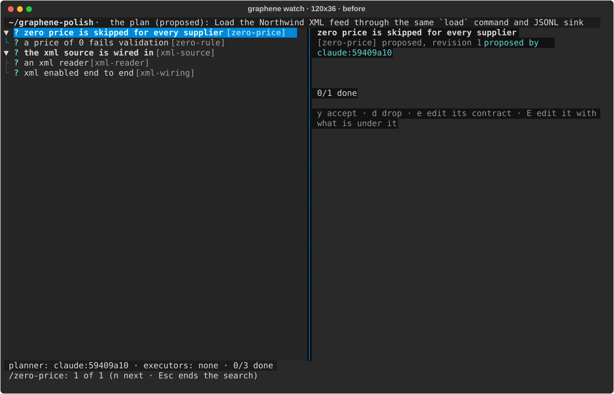
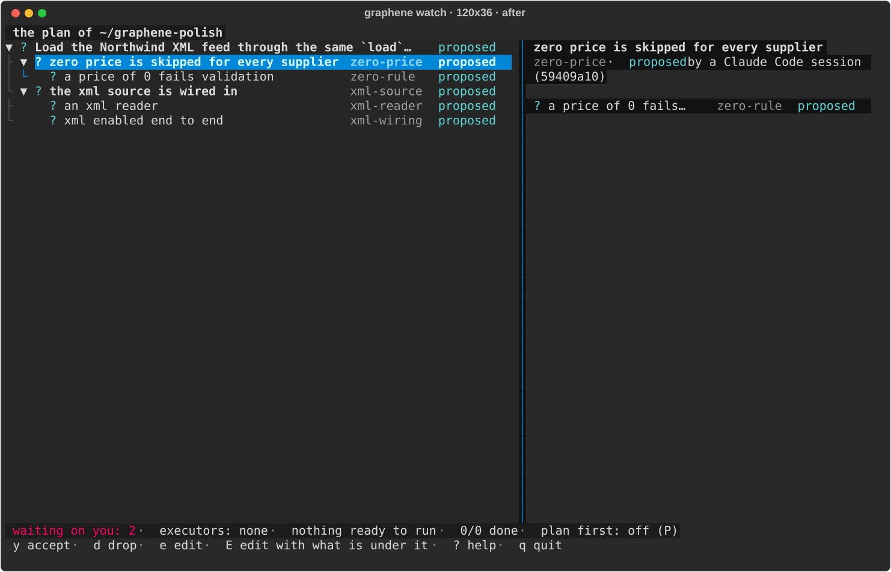
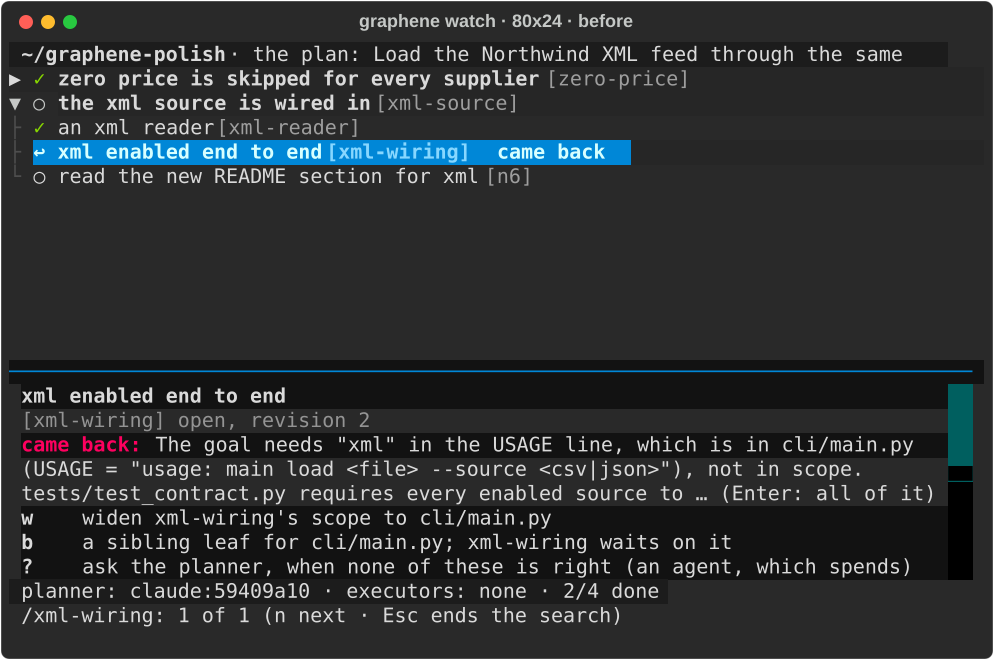
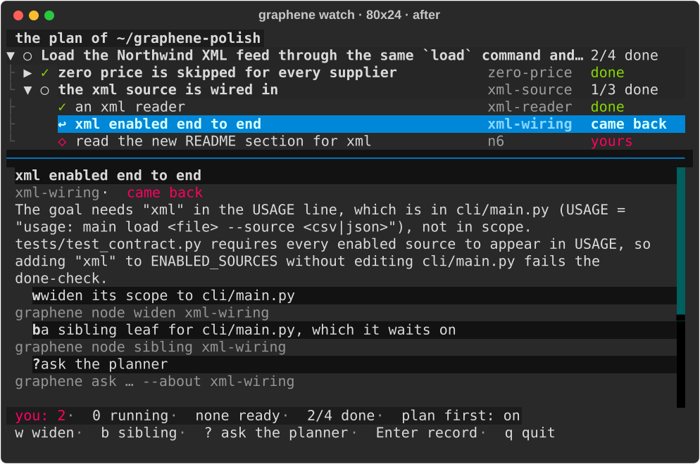
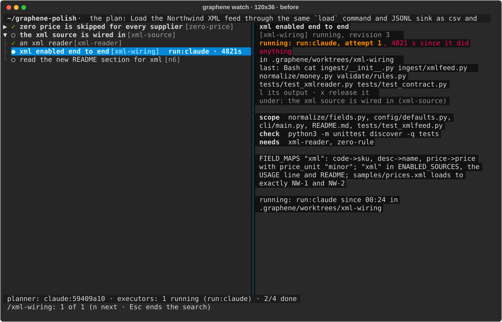
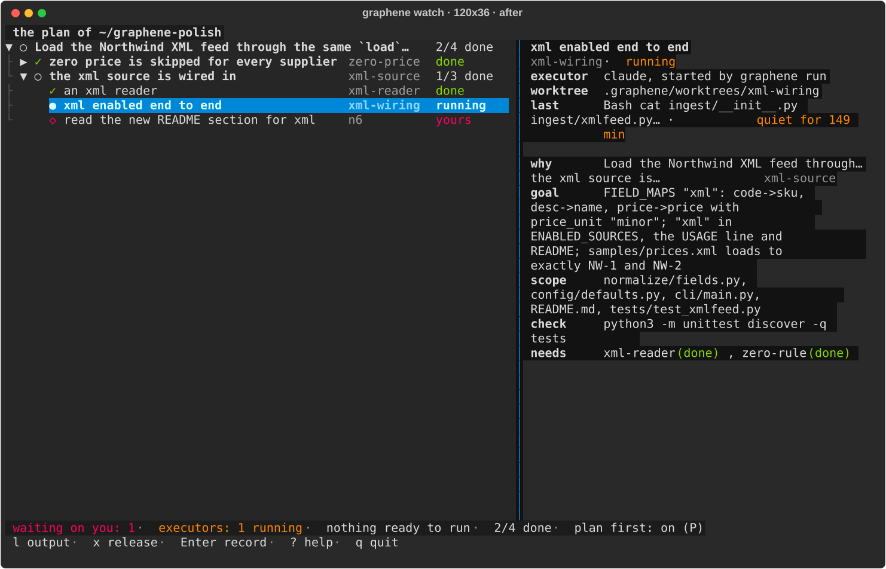

# morning.md — 2026-09-24 — the polish directive

(Current at every milestone of this run. Last run's is `docs/process/morning-2026-09-23.md`.)

**State: done, green, one PR.** Branch `polish`, cut from `origin/main` at `2c86399` (your merge of
PR #27). No mechanism was added except where a rough edge needed one, and each of those is named
below and in `docs/DIRECTION.md` (41 to 52). 695 tests, ruff clean, CI green on every push.

## 1. Before and after

The judge was the screen and the transcript. I built the feeds task with `docs/proof/try.sh`,
typed your paragraph into a real Claude Code session, and ran real executors. I drove
`graphene watch` by keys in an isolated WezTerm mux at 80×24 and 120×36, in every state a node can
be in: proposed, ready, waiting, running, came back, review, done, yours. Then I fixed what read
badly, merged, sat in it again, and fixed what that found.

Every screen, before and after at both sizes: **[polish/screens.md](polish/screens.md)** (SVGs with
the colours; a `.txt` of each beside it). Every message item: **[polish/messages.md](polish/messages.md)**.
Three of the screens:

**The tree, as proposed (120 columns).** It had three ragged columns, a goal cut off in the top bar,
a blank sub-goal pane and `planner: claude:59409a10`. Now one row grammar and the goal as the first
row. The sub-goal's pane lists its leaves, and the status line says what waits on you.




**A leaf that came back (80 columns).** Before, `↩` was the only red on the screen and `b`'s command
was missing. Now three offers of one shape, each with its command (under it where the pane is
narrow), in magenta: it waits on you.

| before | after |
| --- | --- |
|  |  |

**A running leaf (120 columns).** Before, "running" was said twice, as `run:claude`. Now: which
executor, in words; its worktree; the last thing it did and how long ago. `l` shows the tool calls
its hooks recorded while `claude -p` has printed nothing.




The messages, in one line each (the full before and after is in `polish/messages.md`):

- **`parent:`** was read as the node's goal, and the node landed at the root. Now it places the
  node, or is refused by line. `id:` is read; `title:` and `children:` are refused.
- **The check's own leftovers.** `done` refused over `__pycache__/` in a repository with no
  `.gitignore`. Now it passes, and the cache is neither counted nor committed with the leaf.
- **Your commit.** Committing a `.gitignore` refused the next agent's `start` until `plan ack`. Now
  it starts. `ack` means: the uncommitted changes are yours as they stand.
- **A refusal** was four sentences. Now: what, the paths, the commands. The second time it is short.
- **`done` on a leaf that waits** said "`graphene node start` takes it". Now: "not running: it waits
  on sub (running)".
- **`next:`** was a 500-character sentence. Now one line.
- **`reopen` with no note** printed Click's usage box. Now one line, and a prompt at a terminal. So
  does every missing option.
- **Which repository.** The trailer came first on some writes, last on others, and not at all on
  some. Now `  (the plan of ~/repo)` is the last line of every write. The screen's top line says the
  same.
- **`graphene` with no plan** suggested typing the tree with `node add` flags. Now: say it to your
  agent, or `graphene ask`.
- **`graphene plan`** put the id first. Now its rows read as the screen's do. So do the lines
  `node add`, `propose` and `accept` print, and the text form's `#` notes.

**Plan first.** It is now a setting, not a rule about length. It shows on the status line, `P` or
`graphene plan first on|off` turns it on and off, and `graphene init` sets it on. Checked on a real
session in a fresh feeds repository:

- A one-line ask ("Add a sentence to the README saying the CLI's --source flag accepts csv or json.")
  was proposed as one leaf, accepted as yours by the prompt, taken, done and checked. 25 seconds,
  nothing to press.
- Your paragraph, typed next in the same session, gave a four-leaf tree in 30 seconds, and nothing
  was touched.

Nothing reads your words any more, so a "yes" typed into the session no longer accepts; `y` in the
screen does (decision 46).

**Found by sitting in it, not on the directive's list** (each fixed, each with a test that fails
without its fix):

- **Fast typing ran commands.** Keys typed in one burst after `:`, `/`, `a`, `A` or `x` reached the
  tree as commands. `:node signoff x` typed fast started a split, a run, a drop and an undo. The
  headless tests pressed keys one at a time and hid it.
- **A sign-off of work that wasn't here.** A leaf that passed and did not land (the one-line ask's
  README edit was uncommitted) could be signed off mid-merge, conflict open, and it read as landed.
  `signoff` now refuses until the branch is merged, and the pane says which file is in the way.
- **A crash.** Two screens opened at once on a new store crashed on `database is locked`.
- **`:ask add a --dry-run flag`** took the flag for one of ask's own options.
- **Offers lost their commands** at 120 columns.
- **A person's own leaf with no scope** was a "sub-goal" that could never be finished. It reads
  `yours` now, and `y` marks it done.

**The README gif** is recorded again, with real agents, on the new screen:
`docs/assets/watch.gif` (`vhs docs/proof/terminal.tape`).

## 2. What you can run in five minutes

```
cd ~/Desktop/AllThingsAgenticHackathon && git checkout polish && uv tool install --editable . --force
docs/proof/try.sh ~/graphene-try2        # the feeds task, hooks installed, plan first on
cd ~/graphene-try2
wezterm cli split-pane --right --percent 50 --cwd "$PWD" -- graphene watch
claude                                   # then a one-line ask, then the paragraph try.sh printed
```

- **The one-line ask.** It appears on the right as a leaf that is yours. It goes `●`, then `✓`, and
  you press nothing.
- **The paragraph.** The tree appears with every row `?`.
- **The prune.** `gg`, then `E`, then take a path out of a scope.
- **Accept and run.** `y` on the goal row accepts the whole tree. `R` runs it.
- **The hand-back.** The starved leaf comes back `↩` with `w`, `b` and `?`. `/came back` finds it.
  `w`, then `R`.
- **The rest.** `?` for the keys, `Enter` for the record, `P` for plan first.

## 3. What is waiting on you

- **One PR, `polish` into `main`:** https://github.com/Alex-lop/Graphene/pull/28. CI was green on
  every push.
- **The decisions to strike: 41 to 52** in `docs/DIRECTION.md`. Read these first:
  - **46, plan first.** It replaces the 240-character rule, and it withdraws decision 19's "a plain
    yes accepts".
  - **47, what `ack` means now.** Commits are the repository moving, and the hole that opens is
    written down.
  - **48, the check's leftovers.** This is the one small mechanism. Its real fix, a clean worktree
    for the check, is named.
- **Three repositories in your home, made by this run.** I left them so you can look:
  - `~/graphene-live`: the live session. I resolved a README merge conflict there by hand.
  - `~/graphene-polish`: the saved screens' repository.
  - `~/graphene-demo`: the recording's repository.
  `rm -rf` each when you are done. `~/graphene-try` was there before; I did not touch it.

## 4. The map of the code

`src/graphene_debrief/`, 8,500 lines in the modules below. Where this run moved things:

- **`plan.py` (2,300).** The end of the file now holds how a node reads to a person: `reads` gives
  the one word, `look` its glyph and colour, and `came_back`, `said_by`, `where` and `plan_first`
  sit beside them. Also new:
  - `refusal(what, paths, do)` and `first_time(…)`: the refusal shape, said once.
  - `unowned`, which now compares only the working tree.
  - The set-aside of the check's leftovers inside `finish` (`_set_aside`).
  - `unlanded`, and the sign-off that refuses until the branch is merged.
  Tests: `test_plan.py`, `test_tree.py` (`test_one_word_for_each_state…`), `test_parallel.py`.
- **`tui.py` (1,600).** In reading order:
  - `row`: the row grammar.
  - `Pane`: aligned keys, wrapped at words.
  - `PlanTree`: the vim keys, and the keys that open a line act at once.
  - `Watch`: `draw`, `size_panes` (the width rule), `say_status` (the two lines), and the keys.
  - `detail`: one pane per kind of node.
  - `_came_back`: the offers.
  - `record_pane` and `tail_pane`.
  Tests: `test_tui.py`, at 80 and 120 columns. `burst()` sends keys the way a terminal does.
- **`gate.py` (570).** Plan first (`_first`, `_first_said`, `_first_refused`), and `one_line_ask`.
  The paragraph rule and the yes rule are gone. Tests: `test_gate.py`, `test_tuesday.py`,
  `test_hook_budget.py`.
- **`plan_cli.py` (1,090).**
  - `plan_lines`: the plan print, in the row grammar.
  - `next_lines`: one line.
  - `said_where`: the trailer.
  - `value` and `log_line`: the log in words.
  - `one_row`.
  - `plan first`.
  Tests: `test_plan_cli.py`.
- **`cli.py`.** One line for any missing option, and `--help` as paragraphs. **`run.py`**:
  `summary`, the run's last line. **`plan_text.py`**: `parent:`/`id:` in `parse`, and the notes in
  the state words.

To change what a state is called or its colour, change `plan.LOOK` or `plan.reads`: the screen,
`graphene plan` and the text form all follow. To change a key, change `Watch.BINDINGS`, and if it
opens a line, `PlanTree.on_key` too. Its test goes in `test_tui.py`, with `burst()` if typing speed
matters.

## Verified, and not

- **Verified.**
  - Everything in section 1: the screens and messages are captures, and the plan-first runs are
    real sessions.
  - 695 tests and ruff, on every commit I pushed. CI green on Linux and macOS, Python 3.12 and 3.13.
  - The recording, on real agents.
- **Not verified.**
  - **You, at the keys, in WezTerm's own window.** I drove its mux, not the GUI: fonts, the width
    your window really has, the mouse.
  - **Codex as planner or executor.**
  - **The one-line ask on a second vendor, and on a subagent.** A subagent carries its session's
    id, so a leaf it proposes after your prompt would be taken as your ask. That hole is decision
    19's, now decision 46's, and it is written there.

## Questions (only what blocks the next step)

1. **Plan first's default.** It is "on while a plan is in force", and `graphene init` turns it on,
   so this repository, set up before the mode, has it off. Is that what you meant, or on everywhere
   Graphene is installed?
2. **The one-line ask.** It proposes a goal too, when the plan has none, and that sentence becomes
   the plan's goal until your next tree replaces it. Keep it, or give a one-line ask no goal?

## Rollback

Before the first change `main` on GitHub was `2c86399`. This run is the branch `polish`; nothing
touched `main`.

```
git checkout main && git reset --hard 2c86399
```

## State of every branch

- `polish`: this run, pushed, CI green. One PR into `main`: #28.
- `main` (GitHub): `2c86399`, untouched. Local `main`: `6cece1c`, behind GitHub, untouched.
- `worktree-wf_6c44769e-477-1` … `-4`: this run's four build branches, merged into `polish`; their
  worktrees are removed, the branches kept (`git branch -d` drops them).
- Everything else (`terminal`, `tree`, `agent/*`, `codex/*`, `lane/*`, `n*`, …) is as it was.
